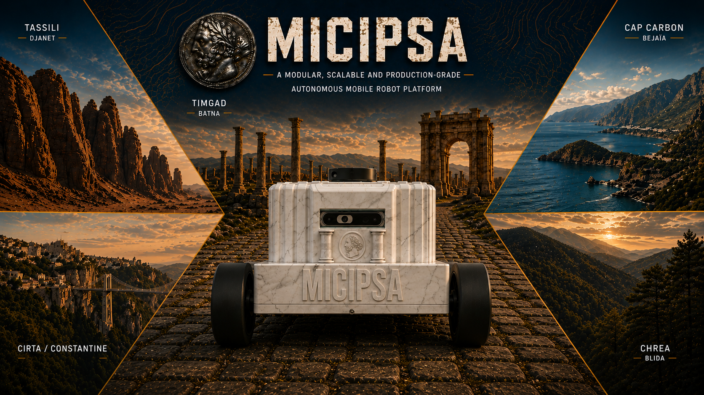
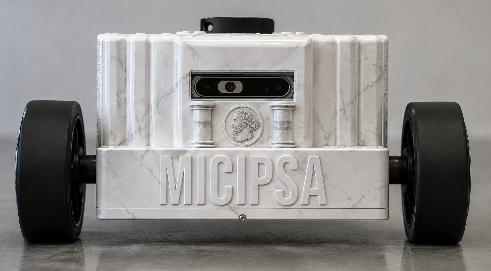
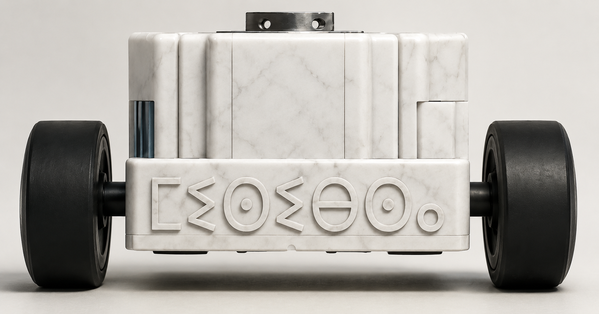
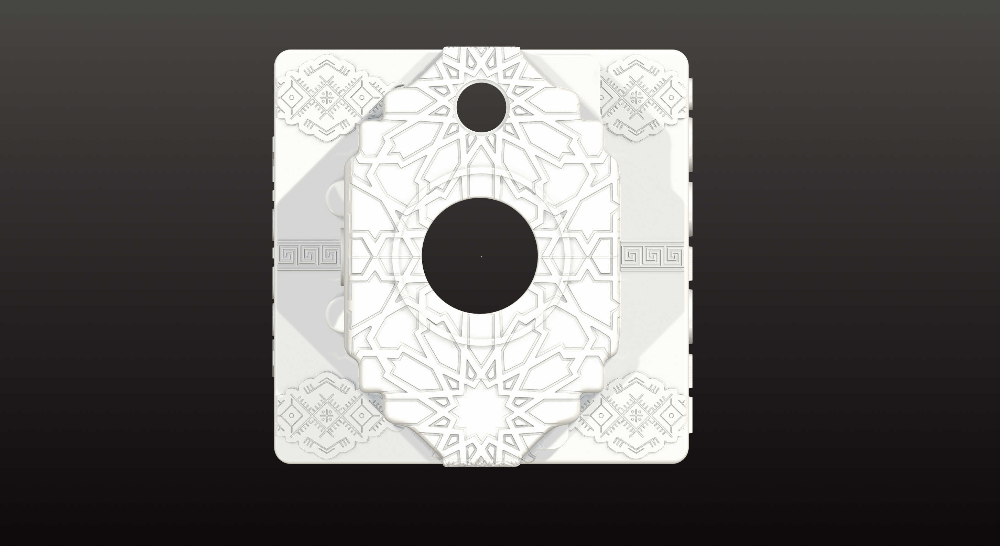
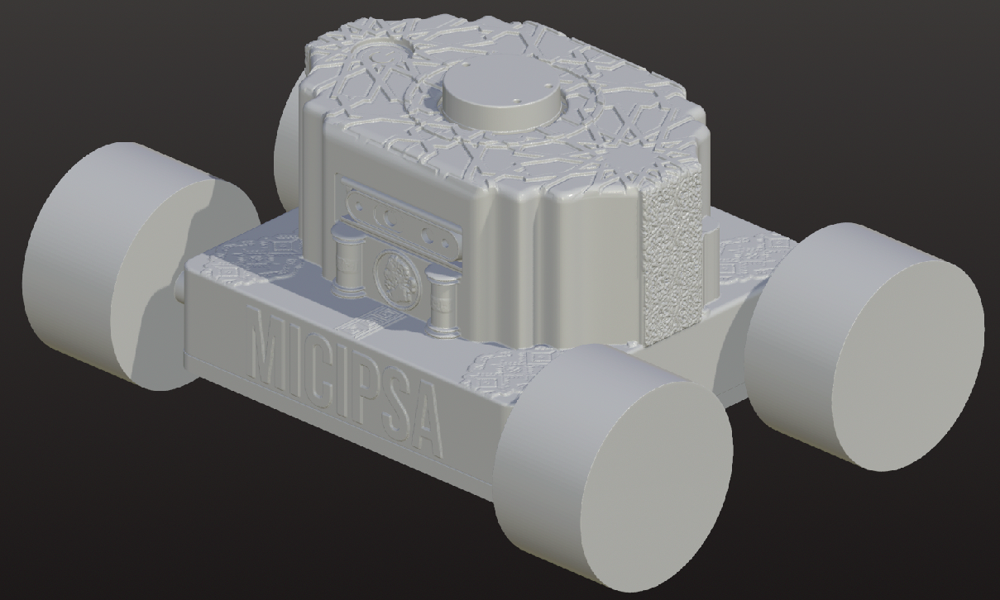

  

    
  

---

## About The Project

`MICIPSA` is an educational autonomous mobile robot **(AMR)** platform that follows production-grade industry practices. It shows how a real robotics stack is organized, deployed, and monitored, and serves as a clean, scalable, and reusable foundation for learning and prototyping.

> [!IMPORTANT]
>
> `MICIPSA DOCUMENTATION`: https://micipsa.netlify.app/
>
> `MICIPSA INFRASTRUCTURE`: https://github.com/Dyris-Robotics/micipsa-infra
>
> `MICIPSA DEMOS`: [Deploy & Simulation Demos](#micipsa-demos)
>

  
  

  
  

---

## Micipsa Demos

### Deploy Demos

<table>
  <tr>
    <td align="center">
      <strong>Description Preview ▶️</strong>  
      
    </td>
    <td align="center">
      <strong>Actuation Preview ▶️</strong>  
      
    </td>
  </tr>
  <tr>
    <td align="center">
      <strong>Localization Preview ▶️</strong>  
      
    </td>
    <td align="center">
      <strong>SLAM Preview ▶️</strong>  
      
    </td>
  </tr>
  <tr>
    <td align="center">
      <strong> Navigation 1 Preview ▶️ </strong>  
    
    </td>
        </td>
    <td align="center">
      <strong>Navigation 2 Preview  ▶️</strong>  
      
    </td>
  </tr>
  <tr>
    <td align="center">
      <strong> Navigation 3 Preview ▶️ </strong>  
      
    </td>
        </td>
    <td align="center">
      <strong>Navigation 4 Preview  ▶️</strong>  
      
    </td>
  </tr>
  <tr>
    <td align="center">
      <strong> Navigation 5 Preview ▶️ </strong>  
      
    </td>
        </td>
    <td align="center">
      <strong>AprilTags Detection Preview ▶️</strong>  
      
    </td>
  </tr>

</table>

### Simulation Demos

<table>
  <tr>
    <td align="center">
      <strong>Description Preview ▶️</strong>  
      
    </td>
    <td align="center">
      <strong>Actuation Preview ▶️</strong>  
      
    </td>
  </tr>
  <tr>
    <td align="center">
      <strong>Localization Preview ▶️</strong>  
      
    </td>
    <td align="center">
      <strong>SLAM Preview ▶️</strong>  
      
    </td>
  </tr>
  <tr>
    <td align="center">
      <strong> Navigation Preview ▶️ </strong>  
      
    </td>
        </td>
    <td align="center">
      <strong>Behavior Preview ▶️</strong>  
      
    </td>
  </tr>
  <tr>
    <td align="center">
      <strong> AprilTags Detection Preview ▶️ </strong>  
      
    </td>
        </td>
    <td align="center">
      <strong>Pointcloud Processing Preview ▶️</strong>  
      
    </td>
  </tr>
</table>
