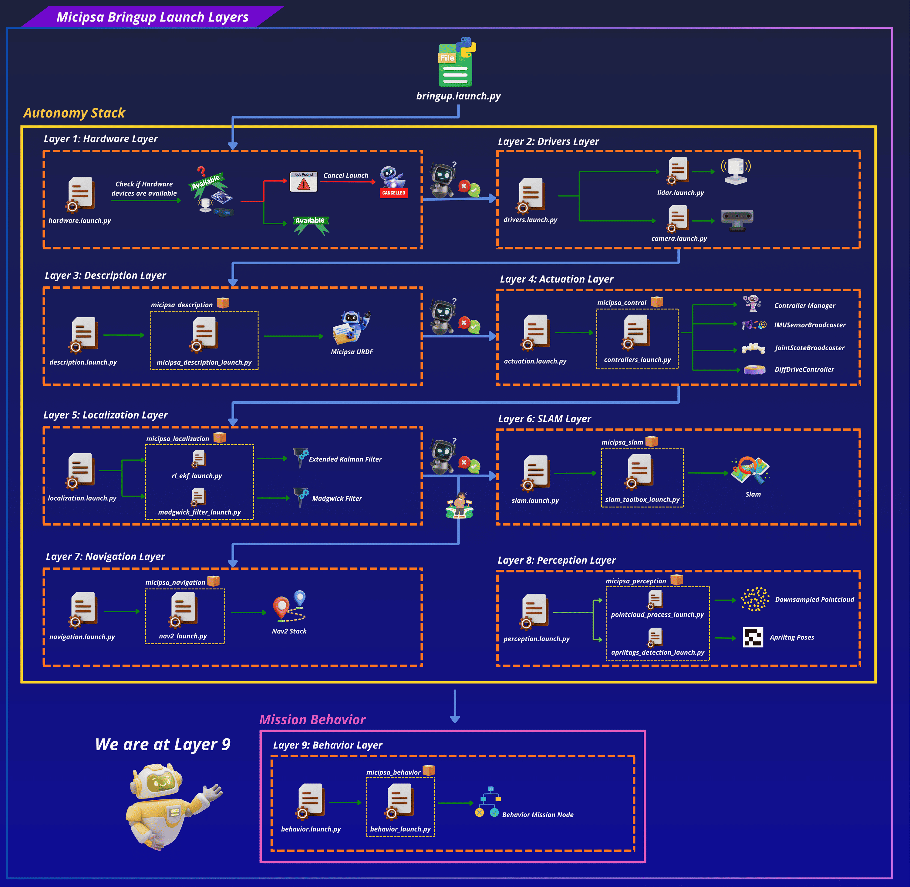
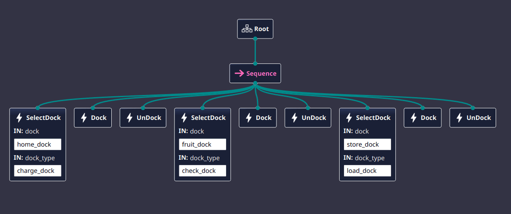

<div align="center">
  <p align="center">
    
  </p>
</div>

<div style="display: flex; justify-content: center; gap: 10px;">
  <p>
    
  </p>
  <p>
    
  </p>
  <p>
    
  </p>
</div>

---

## Overview

`micipsa_behavior` is a ROS 2 package that runs Micipsa's top-level mission logic as a BehaviorTree.CPP v4 tree. It defines a single `behavior_node` executable that loads a behavior tree from an XML file, ticks it at a fixed rate, and drives the robot's high-level actions.

---

## Architecture

`micipsa_behavior` sits at the top of the Micipsa autonomy stack, it is an orchestration layer that sequences calls into actions nodes to perform a specific mission/task

<div align="center">
  <p align="center">
    
  </p>
</div>

`DefaultMission` owns the entire lifecycle: it constructs a single `rclcpp::Node` (`behavior_node`), reads the `behavior_tree_xml` parameter, registers the four custom BT node types with a `BT::BehaviorTreeFactory`, places the shared node on a `BT::Blackboard`, and builds the tree with `factory_.createTreeFromFile()`. If the XML fails to parse or references an unregistered node type, the constructor logs a fatal error and rethrows, the executable will not start with a broken tree.

`run()` then spins a `MultiThreadedExecutor` on a background thread (so action client callbacks are serviced) while the main thread ticks the tree once per loop at 10 Hz via `tickOnce()`. A `BT::NodeStatus::FAILURE` result from the tree root is logged but does not stop the loop, the tree keeps ticking and may recover on a subsequent tick depending on how it's structured.

### BT Node Reference

#### `Spin` (`micipsa_behavior::Spin`)

Wraps the Nav2 `nav2_msgs/action/Spin` action. Input port `angle` (float, radians) is read in `onStart()`; if missing, the node fails immediately without attempting to contact the action server. Calls `action_server_is_ready()` (non-blocking) before sending the goal; if the server isn't up, fails immediately rather than blocking the tick. Reports progress via `RCLCPP_DEBUG_THROTTLE` on `angular_distance_traveled`.

#### `Dock` (`micipsa_behavior::Dock`)

Wraps the Nav2 `nav2_msgs/action/DockRobot` action. Has no input ports of its own, instead it reads `selected_dock` from the blackboard, which must have been set by a prior `SelectDock` tick in the same tree execution. If `selected_dock` is absent, the node fails without contacting the action server.

#### `UnDock` (`micipsa_behavior::UnDock`)

Wraps the Nav2 `nav2_msgs/action/UndockRobot` action. Reads `selected_dock_type` from the blackboard (also set by `SelectDock`). Note that `feedbackCallback` is implemented but intentionally empty, undocking feedback is not currently logged.

#### `SelectDock` (`micipsa_behavior::SelectDock`)

The only synchronous (`BT::SyncActionNode`) node in the package, it returns `SUCCESS`/`FAILURE` in a single tick rather than running asynchronously. Input ports `dock` and `dock_type` (both `string`) are required. On tick, it pushes `dock` to the `dock_frame` parameter on the `/dock_pose_publisher` node via an `AsyncParametersClient`, then, only if that parameter set succeeds, writes `selected_dock` and `selected_dock_type` onto the blackboard for `Dock`/`UnDock` to pick up later in the tree.

> [!WARNING]
> `SelectDock`'s parameter client targets a node literally named `dock_pose_publisher`. If the AprilTag docking node in `micipsa_perception` / `micipsa_navigation` is launched under a different node name, `wait_for_service` will time out after 2 seconds and the node will fail. Confirm the actual remapped node name matches this hardcoded target before relying on `SelectDock` in a custom tree.

---

## ROS 2 Interface

`micipsa_behavior` has no topics of its own. All communication happens through action clients and a parameter client, both targeting nodes provided by other packages.

### Action Clients

| Action | Type | BT Node | Target Server |
|--------|------|---------|----------------|
| `/spin` | `nav2_msgs/action/Spin` | `Spin` | Nav2 behavior server (`micipsa_navigation`) |
| `/dock_robot` | `nav2_msgs/action/DockRobot` | `Dock` | Nav2 docking server (`micipsa_navigation`, `opennav_docking`) |
| `/undock_robot` | `nav2_msgs/action/UndockRobot` | `UnDock` | Nav2 docking server (`micipsa_navigation`, `opennav_docking`) |

### Parameter Clients

| Target Node | Parameter | BT Node | Description |
|-------------|-----------|---------|--------------|
| `/dock_pose_publisher` | `dock_frame` | `SelectDock` | Sets which AprilTag-mapped frame the docking pipeline should target |

### Parameters

| Parameter | Type | Default | Description |
|-----------|------|---------|--------------|
| `behavior_tree_xml` | `string` | `none.xml` | Absolute path to the resolved behavior tree XML, passed by the launch file. The literal default `none.xml` is never used in practice, the launch file always resolves and passes a real path. |

### Launch Arguments

| Argument | Type | Default | Description |
|----------|------|---------|--------------|
| `use_sim_time` | `bool` | `false` | Use simulation clock if true |
| `log_level` | `string` | `info` | ROS 2 log level (`info`, `warn`, `error`) |
| `behavior_config_file` | `string` | `behavior.xml` | Name or path of the behavior tree XML, resolved via `resolve_config_path()` |

### Blackboard Contract

These keys are not ROS interfaces, but form the contract between BT nodes within a single tree execution. Any custom tree mixing these nodes must respect this contract.

| Key | Written by | Read by | Type |
|-----|------------|---------|------|
| `node` | `DefaultMission` constructor | Every BT node's constructor | `rclcpp::Node::SharedPtr` |
| `selected_dock` | `SelectDock` | `Dock` | `std::string` |
| `selected_dock_type` | `SelectDock` | `UnDock` | `std::string` |

---

## Installation

> [!IMPORTANT]
> Micipsa can be run in two ways: **natively** on a ROS 2 host, or via **Docker** using pre-built containerized images. Choose your approach before proceeding:
>
> - **Native** build the package directly in a ROS 2 workspace.  Follow [requirements](#requirements) and the [Native Install](#native-install) steps below.
> - **Docker** use the Micipsa container stack, no manual workspace setup required. skip requirements section and follow [Docker](#docker) section.

### Requirements

First, make sure that the following packages are available in your workspace:

- [micipsa_common](../micipsa_common/README.md)

### Native Install

Source the ROS 2 environment:

```bash
source /opt/ros/jazzy/setup.bash
```

Install ROS 2 dependencies from the workspace root:

```bash
cd ~/ros2_ws
rosdep update
rosdep install --from-paths src --ignore-src -r -y
```

Build the package:

```bash
colcon build --packages-select micipsa_behavior
```

Source the install overlay:

```bash
source install/setup.bash
```

> [!TIP]
> Add `source /opt/ros/jazzy/setup.bash` and `source ~/ros2_ws/install/setup.bash` to your `~/.bashrc` to avoid repeating these steps in every new terminal.

### Docker

> [!TIP]
> Reading Micipsa Docker documentation (architecture, dockerfile, docker compose,...) is **strongly recommended**, it covers how the Dockerfiles are structured, how images are built, how containers are orchestrated, and much more.

To build and run `Micipsa Behavior` Docker image, follow Micipsa Dockerfile README [Build Section](../../micipsa_docs/docs/docker/docker_file.md#build).

---

## Configuration

### Behavior Tree XML (`behavior.xml`)

The behavior tree is defined as plain BehaviorTree.CPP v4 XML (`BTCPP_format="4"`). The shipped tree, `DockUndockTest`, is a single `Sequence` that exercises all three custom action nodes against every known dock, one full select → dock → undock cycle per dock, in order:

<div align="center">
  <p align="center">
    
  </p>
</div>

```xml
<?xml version="1.0" encoding="UTF-8"?>
<root BTCPP_format="4">
    <BehaviorTree ID="DockUndockTest">
        <Sequence>
            <SelectDock
        dock="home_dock"
        dock_type="charge_dock"/>
            <Dock/>
            <UnDock/>
            <SelectDock
        dock="fruit_dock"
        dock_type="check_dock"/>
            <Dock/>
            <UnDock/>
            <SelectDock
        dock="store_dock"
        dock_type="load_dock"/>
            <Dock/>
            <UnDock/>
        </Sequence>
    </BehaviorTree>
    <TreeNodesModel>
        <Action ID="SelectDock">
            <input_port name="dock"/>
            <input_port name="dock_type"/>
        </Action>
        <Action ID="Dock"/>
        <Action ID="UnDock"/>
    </TreeNodesModel>
</root>
```

`Dock` and `UnDock` take no input ports directly, each `SelectDock` call ahead of them sets `selected_dock` / `selected_dock_type` on the blackboard, which the following `Dock`/`UnDock` pair reads. Because this is a plain `Sequence` with no repeat or retry decorator, the tree runs through all three dock cycles once and stops: if any single action (e.g. `Dock` at `fruit_dock`) returns `FAILURE`, the entire sequence fails immediately and the two remaining dock cycles never execute. The dock names (`home_dock`, `fruit_dock`, `store_dock`) match the `tag.frames` entries configured in `micipsa_perception`'s `apriltags.yaml`, so `SelectDock` only succeeds in pushing a known frame to `dock_pose_publisher` if both configs stay in sync.

---

## Usage

```bash
ros2 launch micipsa_behavior behavior_launch.py
```

To use a custom behavior tree XML file:

```bash
ros2 launch micipsa_behavior behavior_launch.py \
  behavior_config_file:=my_custom_behavior.xml
```

---

## Validation

Confirm `behavior_node` is running and the tree loaded without a fatal error:

```bash
ros2 node list | grep behavior_node
```

Confirm the action clients can see their target servers (required before any `Spin`, `Dock`, or `UnDock` tick can succeed):

```bash
ros2 action list | grep -E "spin|dock_robot|undock_robot"
```

Watch the node's log output for tick-level state transitions (`Spin Goal Accepted`, `Spin succeeded`, etc.) at `info` level, or pass `log_level:=debug` for per-tick feedback throttled to once every 1-2 seconds.

---

## Additional Information

### Dependencies

#### Build Dependencies

These dependencies are required to build the package.

| Package | Role |
|---------|------|
| `ament_cmake` | Build system |
| `behaviortree_cpp` | BehaviorTree.CPP framework used to implement the mission behavior tree |
| `nav2_behavior_tree` | Navigation 2 Behavior Tree nodes and integration |
| `rclcpp` | ROS 2 C++ client library |
| `rclcpp_action` | ROS 2 C++ action client support |
| `nav2_msgs` | Navigation 2 action and message definitions |
| `geometry_msgs` | Standard geometry message definitions |
| `micipsa_common` | Shared Micipsa utilities, types, and common functionality |

#### Runtime Dependencies

These packages are required when running the behavior tree.

| Package | Role |
|---------|------|
| `behaviortree_cpp` | Executes the behavior tree |
| `nav2_behavior_tree` | Provides Navigation 2 BT plugins |
| `rclcpp` | ROS 2 runtime support |
| `rclcpp_action` | Action client communication |
| `nav2_msgs` | Navigation actions and messages |
| `geometry_msgs` | Geometry message types |
| `micipsa_common` | Common utilities used by the behavior package |

#### Test Dependencies

Used only when running the package test suite.

| Package | Role |
|---------|------|
| `ament_lint_auto` | Runs the standard suite of linters configured for the workspace |
| `ament_lint_common` | Provides the common lint configurations used by `ament_lint_auto` |

#### Micipsa Package Dependencies

The behavior package depends on the following Micipsa package:

| Package | Role |
|---------|------|
| `micipsa_common` | Provides shared utilities, configuration helpers, and common interfaces used by the behavior tree |

---

### Testing

> [!NOTE]
> The integration test runs in Gazebo headless mode and does not require physical hardware. It requires `micipsa_description` and `micipsa_simulation` to be built in the same workspace.

#### Launch Integration Tests

`test/test_controllers_integration_launch.py` launches the full simulation control stack, `micipsa_description`, `micipsa_simulation` (headless), and `micipsa_control` and validates that:

- The `/controller_manager/list_controllers` service becomes available within 90 seconds
- `joint_state_broadcaster` reaches the `active` state
- `micipsa_base_controller` reaches the `active` state
- `/micipsa_base_controller/cmd_vel` and `/micipsa_base_controller/odom` topics are exposed

The test uses a polling loop with a 90-second timeout per controller to avoid flakiness from Gazebo and `ros2_control` startup timing.

#### Running Tests

Run the integration tests:

```bash
colcon build --packages-select micipsa_control
colcon test --packages-select micipsa_control --ctest-args -L launch -V
colcon test-result --verbose
```

Run all tests:

```bash
colcon build --packages-select micipsa_control
colcon test --packages-select micipsa_control
colcon test-result --verbose
```

Clean test results between runs:

```bash
colcon test-result --delete-yes
```

---

### Troubleshooting

#### `behavior_node` fails to start with a fatal Behavior Tree error

**Symptom:** The node logs `Failed to load Behavior Tree: ...` and exits immediately.

**Cause:** The resolved `behavior_tree_xml` file is malformed XML, or it references a BT node ID that was not registered in `registerBehaviorTreeNodes()` (only `Spin`, `Dock`, `UnDock`, `SelectDock` are registered).

**Fix:** Validate the XML is well-formed and only references the four registered node IDs (case-sensitive). Confirm the resolved path is the file you expect by checking the launch output for the `resolve_config_path()` log line.

#### `Spin`/`Dock`/`UnDock` fails immediately every tick

**Symptom:** The tree ticks but the relevant action node returns `FAILURE` on the very first tick, with a log line like `Spin action server unavailable`.

**Cause:** The corresponding Nav2 action server is not running. `action_server_is_ready()` is a non-blocking check, the node fails fast rather than waiting for the server to come up.

**Fix:** Confirm `micipsa_navigation` is running and the relevant action appears in `ros2 action list`. Launch `micipsa_navigation` before `micipsa_behavior` if it isn't already running.

#### `Dock` or `UnDock` fails with "No dock selected" / "No dock type selected"

**Symptom:** `Dock` or `UnDock` returns `FAILURE` immediately with a missing-blackboard-key error, even though the action server is available.

**Cause:** `selected_dock` / `selected_dock_type` were never written to the blackboard, because no `SelectDock` node ran earlier in the same tree execution, or `SelectDock` itself failed before reaching the point where it writes those keys.

**Fix:** Ensure the tree places a `SelectDock` node before `Dock`/`UnDock` in execution order, and check `SelectDock`'s own log output for a parameter-set failure.

#### `SelectDock` fails with "dock_pose_publisher parameter service unavailable"

**Symptom:** `SelectDock` times out after 2 seconds waiting for the parameter service.

**Cause:** No node named exactly `dock_pose_publisher` is currently running, or it is running under a remapped name. `SelectDock`'s target node name is hardcoded in `select_dock.cpp`.

**Fix:** Confirm the AprilTag docking node is launched and check its actual node name:

```bash
ros2 node list | grep dock_pose
```

If the name differs from `dock_pose_publisher`, either rename the node at launch or update the hardcoded target in `select_dock.cpp` and rebuild.