<div align="center">
  <p align="center">
    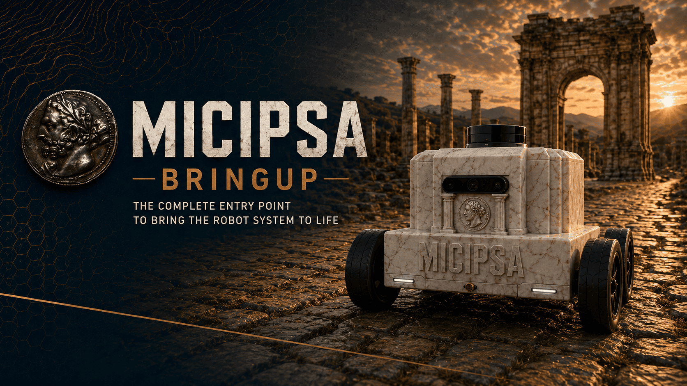
  </p>
</div>

<div style="display: flex; justify-content: center; gap: 10px;">
  <p>
    
  </p>
  <p>
    
  </p>
  <p>
    
  </p>
</div>

---

## Overview

`micipsa_bringup` is the top-level orchestration package for the Micipsa autonomous mobile robot. It provides a single configurable entry point that sequentially brings up all robot subsystems, hardware checks, sensor drivers, robot description, actuation, localization, SLAM, navigation, perception, and behavior, as a layered, timer-sequenced launch system. The package sits at the top of the Micipsa stack and depends on every other subsystem package being available at runtime.

---

## Architecture

`micipsa_bringup` is the top-level orchestration package for the Micipsa stack. Its single entry point `bringup.launch.py` reads `bringup_config.yaml`, resolves all runtime flags, and emits a sequenced list of `TimerAction` wrapped `GroupAction`s that bring up every subsystem in the correct order with the correct configs.

### Deploy vs Simulation


<div style="display: flex; justify-content: center; gap: 20px; text-align: center;">
  <div>
    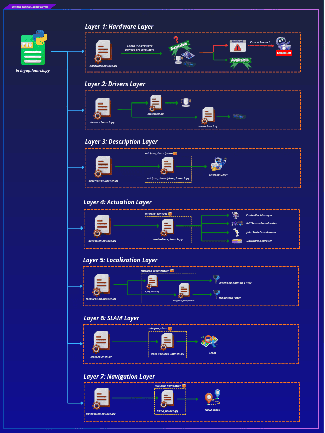
    <p><strong>Deploy</strong><br>System running on the real robot</p>
  </div>
  <div>
    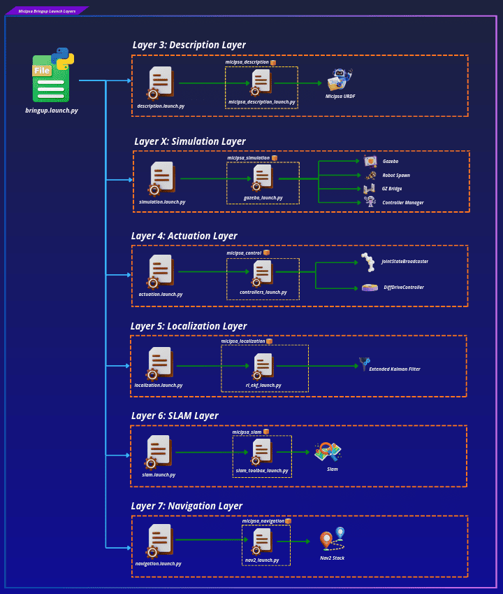
    <p><strong>Simulation</strong><br>System running in Gazebo</p>
  </div>
</div>


### Launch pipeline

<div align="center">
  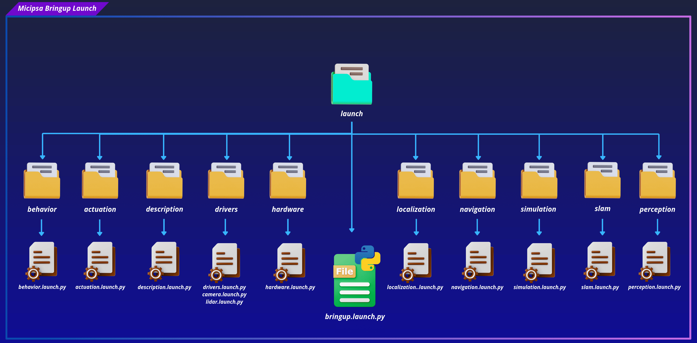
</div>

`bringup.launch.py` is structured around an `OpaqueFunction` (`setup_launch`) that executes at launch time, not at parse time. This gives it access to fully resolved `LaunchContext` values before any action is built, which is what makes runtime branching (deploy vs. simulation, mapping vs. localization) possible as plain Python conditionals rather than launch substitutions.
 
The function builds a flat list of `Action`s in three phases:
 
1. **Config loading** — reads `bringup_config.yaml` via `get_yaml_config_data()` and extracts every `settings` key into typed Python variables.
2. **Layer construction** — builds one `GroupAction` per layer, each carrying its own `IncludeLaunchDescription` and a `condition` where applicable.
3. **Timer scheduling** — wraps each `GroupAction` in a `TimerAction` at a fixed offset and appends it to the `actions` list returned to `LaunchDescription`.
```
bringup.launch.py
└── OpaqueFunction(setup_launch)
    ├── Load bringup_config.yaml
    ├── Build GroupActions (layers 1–9 + X)
    └── Wrap each in TimerAction → emit LaunchDescription
```

<div align="center">
  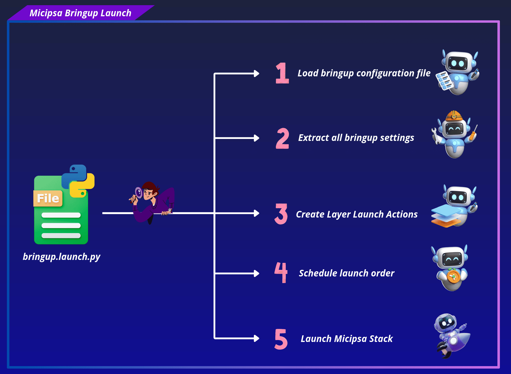
</div>

### Timer-based sequencing

Layers are not event-driven startup order is enforced by fixed wall-clock offsets hardcoded in `bringup.launch.py`. Each layer fires after its predecessor has had enough time to complete initialization:

| Timer constant | Offset (s) | Layer |
|---|---|---|
| `T_HARDWARE` | 0.0 | Layer 1 Hardware check |
| `T_DRIVERS` | 2.0 | Layer 2 Sensor drivers |
| `T_DESCRIPTION` | 4.0 | Layer 3 Robot description / RSP |
| `T_SIMULATION` | 6.0 | Layer X Gazebo |
| `T_ACTUATION` | 15.0 | Layer 4 ros2_control + twist_mux |
| `T_LOCALIZATION` | 19.0 | Layer 5 EKF sensor fusion |
| `T_SLAM` | 22.0 | Layer 6 SLAM Toolbox |
| `T_NAVIGATION` | 26.0 | Layer 7 Nav2 stack |
| `T_PERCEPTION` | 30.0 | Layer 8 AprilTag + pointcloud |
| `T_BEHAVIOR` | 35.0 | Layer 9 Behavior tree |

The gaps are sized to the slowest-starting node in each layer. The largest gap (4 s → 15 s for actuation) covers Gazebo loading and the controller manager registering its hardware interface.

> [!NOTE]
> This is intentionally a temporary solution. A future improvement would replace fixed offsets with lifecycle-managed nodes and event-driven sequencing via `RegisterEventHandler` / `OnProcessStart`.

### Layer activation model

Each layer has an **activation condition** governed by one or more runtime flags from `bringup_config.yaml`. The full set of conditions is:

| Layer | Condition | Controlled by |
|---|---|---|
| Layer 1 Hardware | `deploy_mode=true` | `deploy_mode` |
| Layer 2 Drivers | `deploy_mode=true` | `deploy_mode` |
| Layer 3 Description | Always | / |
| Layer X Simulation | `deploy_mode=false` | `deploy_mode` |
| Layer 4 Actuation | Always | / |
| Layer 5 Localization | Always | / |
| Layer 6 SLAM | `localization_mode=mapping` | `localization_mode` |
| Layer 7 Navigation | `localization_mode=localization` | `localization_mode` |
| Layer 8 Perception | `enable_perception=true` | `enable_perception` |
| Layer 9 Behavior | Always | / |

Conditions are implemented in two ways depending on the flag type:

- **`deploy_mode`**: uses `IfCondition` / `UnlessCondition` on the `GroupAction`. These are evaluated by the launch framework at action execution time.
- **`localization_mode`**: evaluated in `setup_launch` as a plain Python `if/else`. The inactive layer becomes an empty `GroupAction(actions=[])` it fires on schedule but does nothing. This avoids a double `map→odom` TF publisher conflict that would occur if both SLAM Toolbox and Nav2 AMCL ran simultaneously.
- **`enable_perception`**: uses `IfCondition` on the `GroupAction`, identical pattern to `deploy_mode`.

### Config loading and forwarding

<div align="center">
  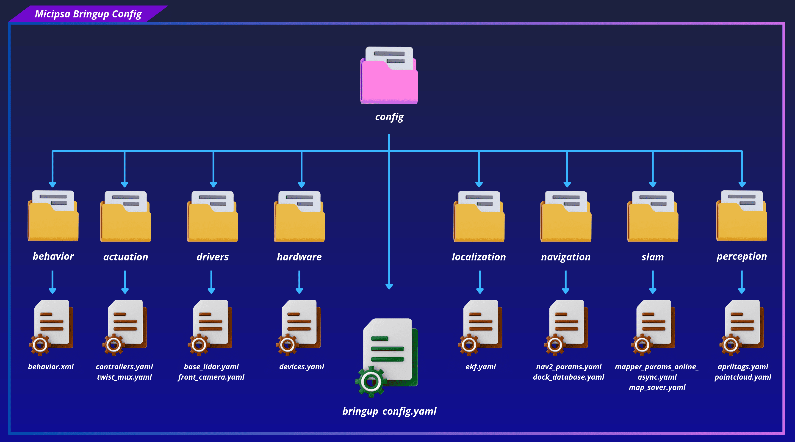
</div>

`bringup.launch.py` loads `bringup_config.yaml` directly from its own `config/` directory via `get_yaml_config_data()`, extracts every filename from the `settings` block, and forwards them as `launch_arguments` to each layer.

<div align="center">
  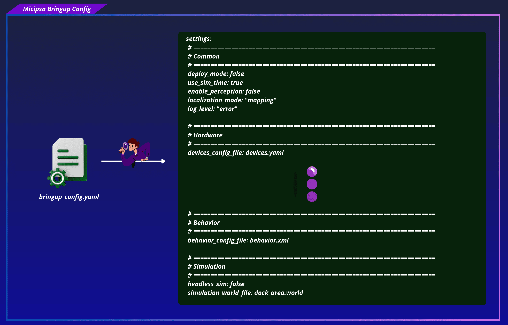
</div>

This separation means each subsystem remains independently launchable without `micipsa_bringup` present, and centralised config override (by placing files under `micipsa_bringup/config/<subsystem>/`) is still possible.

> [!TIP]
> For a detailed walkthrough of how config files are resolved at runtime, refer to the [Configuration section](#configuration).

---

### Micipsa Layers

> [!INFO]
> Detailed specifications for each layer are located in their respective package README files.

#### Layer 1 | Hardware

<div align="center">
  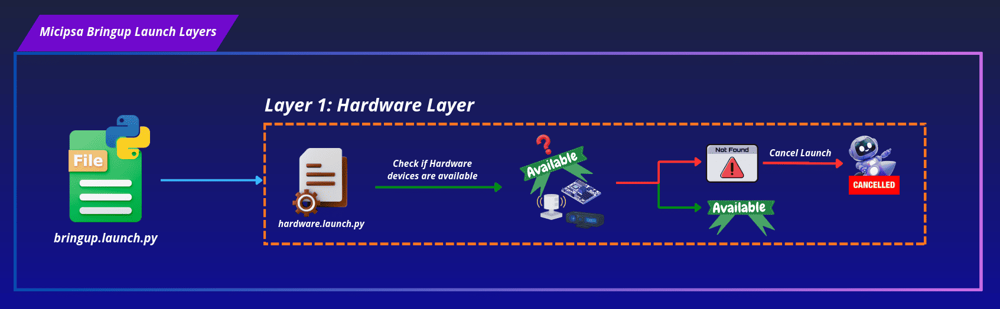
</div>

**File:** `launch/hardware/hardware.launch.py`
**Condition:** Runs only when `deploy_mode=true`.

Performs a pre-flight hardware check by iterating over every device defined in `devices.yaml` and verifying that its `port` path exists on the filesystem. Retries up to 3 times over a 30-second window before raising a fatal error. If any device is missing, the entire bringup process is aborted and the missing devices are listed in the error output.

| Parameter | Default | Description |
|---|---|---|
| `devices_config_file` | `devices.yaml` | Config filename inside `config/hardware/` |

> [!IMPORTANT]
> Ensure all USB and serial devices are physically connected and powered before launching. If the hardware check fails, no subsequent layers will start.

#### Layer 2 | Drivers

<div align="center">
  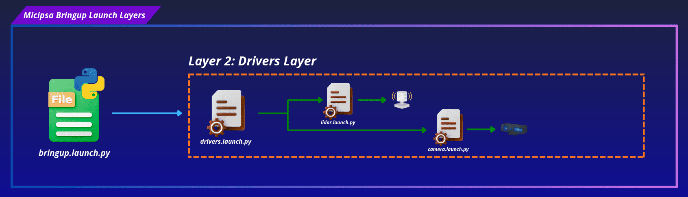
</div>

**File:** `launch/drivers/drivers.launch.py`
**Condition:** Runs only when `deploy_mode=true`.

Starts all sensor driver ROS 2 nodes. Each driver is wrapped in a `GroupAction` with a labeled log message for traceability. Currently includes:

- **YDLIDAR base lidar** via `lidar.launch.py`
- **RealSense front camera** via `camera.launch.py`

| Parameter | Default | Description |
|---|---|---|
| `devices_config_file` | `devices.yaml` | Hardware devices config file |
| `front_camera_config_file` | `front_camera.yaml` | Camera config file |
| `front_camera_device_name` | `front_camera` | Device name, should match name defined in `devices.yaml` |
| `base_lidar_config_file` | `base_lidar.yaml` | Lidar driver config file |
| `base_lidar_device_name` | `base_lidar` | Device name, should match name defined in `devices.yaml` |

#### Layer 3 | Description

<div align="center">
  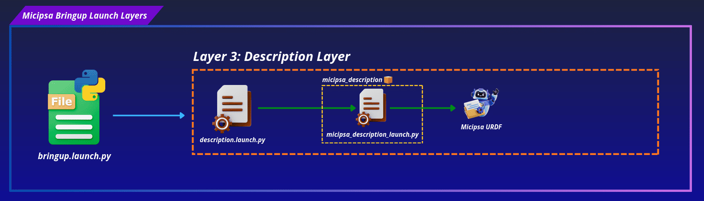
</div>

**File:** `launch/description/description.launch.py`
**Condition:** Always runs (simulation and deploy).

Reads the `mcu.stm_board` entry from `devices.yaml` to extract the serial port, baudrate, and timeout, then delegates to `micipsa_description`'s launch file to start `robot_state_publisher` and pass the extracted config values to the deploy `ros2_control` hardware interface plugin Xacro block (`RobotBaseSystem`).

| Parameter | Default | Description |
|---|---|---|
| `deploy_mode` | `false` | For using real robot, used to select the correct `ros2_control` xacro block |
| `use_sim_time` | `true` | For using simulation time |
| `devices_config_file` | `devices.yaml` | Hardware devices config file |
| `controllers_config_file` | `controllers.yaml` | Forwarded to `micipsa_description`'s launch file for the simulation Gazebo plugin |

#### Layer X | Simulation

<div align="center">
  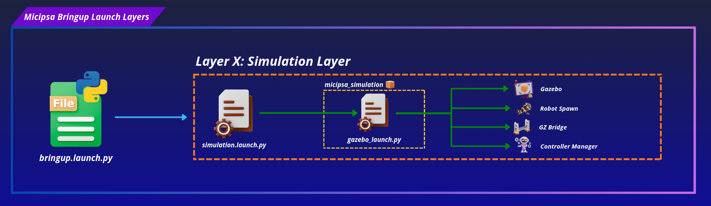
</div>

**File:** `launch/simulation/simulation.launch.py`
**Condition:** Runs only when `deploy_mode=false`.

Starts the Gazebo simulation environment. The `headless` flag suppresses the GUI when running on a headless machine.

> [!IMPORTANT]
> It will also start the controller manager as it loads the ros2_control GazeboSim hardware interface.

| Parameter | Default | Description |
|---|---|---|
| `headless` | `false` | Starts Gazebo without the GUI when `true`, sourced from `headless_sim` in `bringup_config.yaml` |
| `simulation_world_file` | `dock_area.world` | World file passed to `micipsa_simulation` |

#### Layer 4 | Actuation

**Deploy mode:**
<div align="center">
  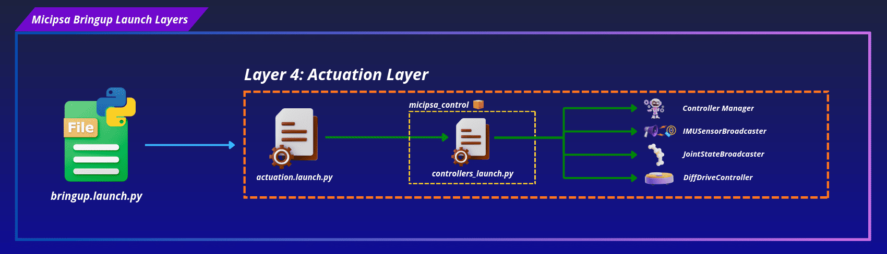
</div>

**Sim mode:**
<div align="center">
  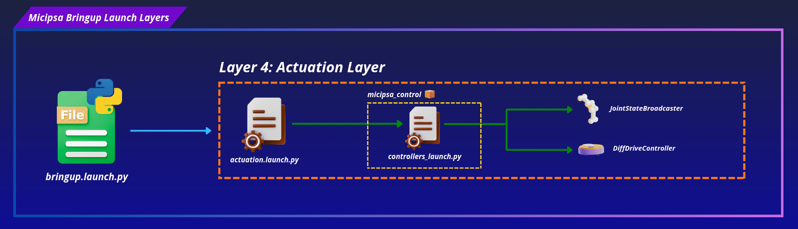
</div>

**File:** `launch/actuation/actuation.launch.py`
**Condition:** Always runs (simulation and hardware).

Delegates to `micipsa_control`'s `controllers_launch.py`, starting the full `ros2_control` stack including hardware interfaces, controllers, and the `twist_mux` velocity multiplexer.

| Parameter | Default | Description |
|---|---|---|
| `deploy_mode` | `false` | For using real robot, used to start or not the controller manager and IMU broadcaster |
| `use_sim_time` | `true` | For using simulation time |
| `ros2_control_controllers_config_file` | `controllers.yaml` | Controllers definitions and parameters |
| `twist_mux_config_file` | `twist_mux.yaml` | Velocity command priority and source mapping |

#### Layer 5 | Localization

**Deploy mode:**
<div align="center">
  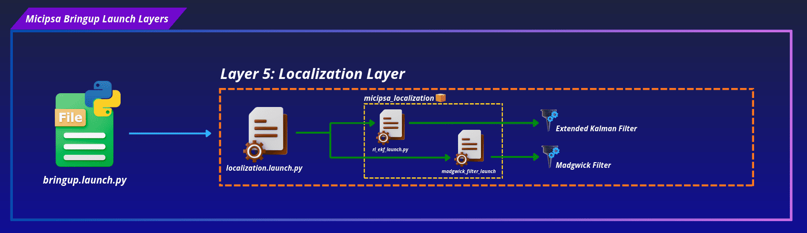
</div>

**Sim mode:**
<div align="center">
  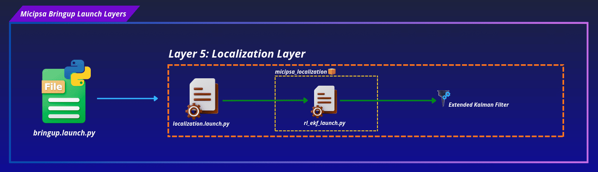
</div>

**File:** `launch/localization/localization.launch.py`
**Condition:** Always runs (simulation and hardware).

Starts the EKF sensor fusion node from the `robot_localization` package. Fuses IMU and wheel odometry data to produce a filtered odometry estimate on the `odom` frame.

| Parameter | Default | Description |
|---|---|---|
| `deploy_mode` | `false` | For using real robot, used to start or not the Madgwick filter |
| `use_sim_time` | `true` | For using simulation time |
| `ekf_config_file` | `ekf.yaml` | EKF config file |

#### Layer 6 | SLAM

<div align="center">
  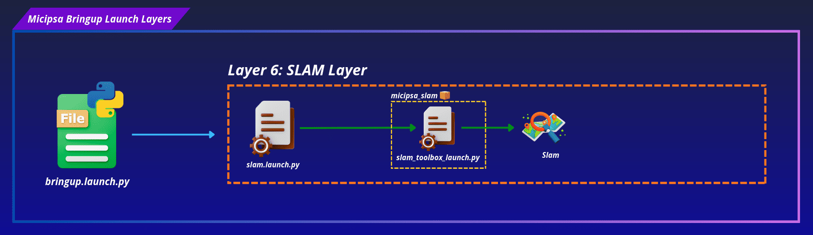
</div>

**File:** `launch/slam/slam.launch.py`
**Condition:** Runs only when `localization_mode=mapping`.

Starts SLAM Toolbox in online asynchronous mode. Subscribes to `/scan` and the TF tree to build and maintain an occupancy map, with map saving handled via `map_saver_config_file`.

| Parameter | Default | Description |
|---|---|---|
| `use_sim_time` | `true` | For using simulation time |
| `slam_toolbox_config_file` | `mapper_params_online_async.yaml` | SLAM Toolbox config file |
| `map_saver_config_file` | `map_saver.yaml` | Config used by `nav2_map_server`'s map saving node |

#### Layer 7 | Navigation

<div align="center">
  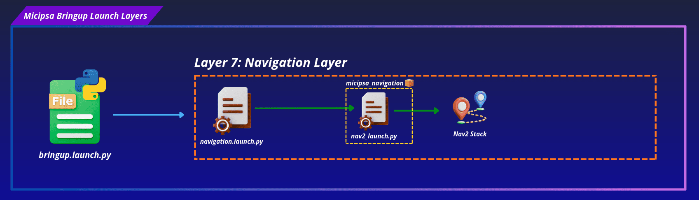
</div>

**File:** `launch/navigation/navigation.launch.py`
**Condition:** Runs only when `localization_mode=localization`.

Starts the `Nav2` navigation stack against a saved map.

| Parameter | Default | Description |
|---|---|---|
| `use_sim_time` | `true` | For using simulation time |
| `nav2_config_file` | `nav2_params.yaml` | Nav2 stack config file |
| `map_file` | `dock_area.yaml` | Saved occupancy map served by `nav2_map_server`, only meaningful in `localization` mode |

> [!IMPORTANT]
> Layers 6 and 7 are mutually exclusive. Setting `localization_mode: mapping` builds the SLAM `GroupAction` and leaves the Navigation `GroupAction` empty. Setting `localization_mode: localization` does the reverse. Running both simultaneously would cause a double `map→odom` TF publisher conflict, the layered structure prevents this by construction since only one of the two `GroupAction`s is ever populated with actions.

#### Layer 8 | Perception

<div align="center">
  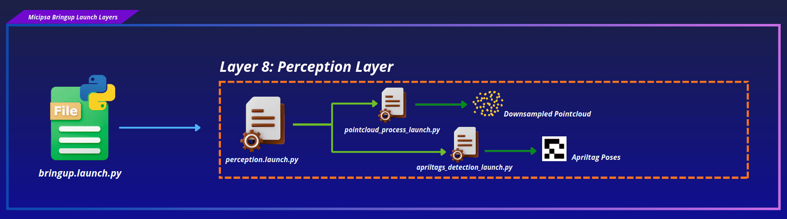
</div>

**File:** `launch/perception/perception.launch.py`
**Condition:** Runs only when `enable_perception=true`.

Delegates to `micipsa_perception`'s launch files, starting the AprilTag detection pipeline and the pointcloud filtering pipeline.

| Parameter | Default | Description |
|---|---|---|
| `pointcloud_config_file` | `pointcloud.yaml` | Pointcloud filtering pipeline config |
| `apriltags_config_file` | `apriltags.yaml` | AprilTag detection and frame mapping config |

> [!NOTE]
> `enable_perception` defaults to `false` in `bringup_config.yaml`. Perception is opt-in, unlike every other layer except Hardware/Drivers/Simulation, which are gated by `deploy_mode` rather than an independent flag.

#### Layer 9 | Behavior

<div align="center">
  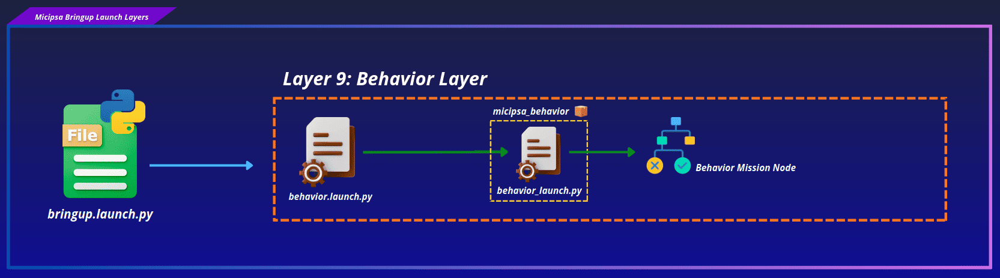
</div>

**File:** `launch/behavior/behavior.launch.py`
**Condition:** Always runs (simulation and hardware).

Delegates to `micipsa_behavior`'s launch file, starting `behavior_node` with the configured behavior tree XML.

| Parameter | Default | Description |
|---|---|---|
| `use_sim_time` | `true` | For using simulation time |
| `behavior_config_file` | `behavior.xml` | Behavior tree XML file, see `micipsa_behavior`'s README for the BT node reference |

> [!WARNING]
> Layer 9 is scheduled at `T=35.0s` and always runs, including when `enable_perception=false`. If the loaded behavior tree includes `SelectDock`/`Dock`/`UnDock` nodes that depend on the AprilTag docking pipeline's `dock_pose_publisher` node (started only in Layer 8), those BT nodes will fail at runtime when perception is disabled. Confirm `enable_perception: true` if the configured `behavior_config_file` relies on docking.

---

## Installation

> [!IMPORTANT]
> Micipsa can be run in two ways: **natively** on a ROS 2 host, or via **Docker** using pre-built containerized images. Choose your approach before proceeding:
>
> - **Native** build the package directly in a ROS 2 workspace.  Follow [requirements](#requirements) and the [Native Install](#native-install) steps below.
> - **Docker** use the Micipsa container stack, no manual workspace setup required. Follow [Docker Compose](../../micipsa_docs/docs/docker/docker_compose.md) section.

### Native Install

Source the ROS 2 environment:

```bash
source /opt/ros/jazzy/setup.bash
```

Install ROS 2 dependencies from the workspace root:

```bash
cd ~/ros2_ws
rosdep init
rosdep update
rosdep install --from-paths src --ignore-src -r -y
```

Build the packages:

```bash
colcon build
```

Source the install overlay:

```bash
source install/setup.bash
```

> [!TIP]
> Add `source /opt/ros/jazzy/setup.bash` and `source ~/ros2_ws/install/setup.bash` to your `~/.bashrc` to avoid repeating these steps in every new terminal.

---

## Configuration

The Micipsa stack is configured through a single file, `micipsa_bringup/config/bringup_config.yaml`.

<div align="center">
  
</div>

Each subsystem resolves its own config file at launch time, independently, following a fixed two-step priority implemented in that subsystem's own launch file via `resolve_config_path()`:

```
1. Look in micipsa_bringup/config/<subsystem>/ for the given filename
2. Fall back to <package>/config/ if not found in bringup
3. Warn and use the package default if neither is found
```

<div align="center">
  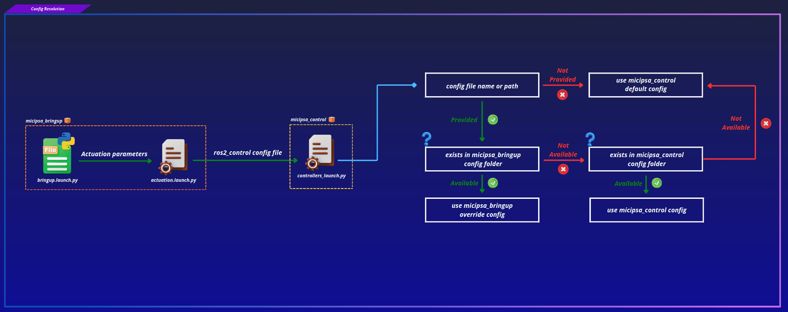
</div>

```python
config_path = resolve_config_path(
    config_file,
    bringup_pkg_share,
    package_pkg_share,
    bringup_config_subdir="config/localization",
    calling_config_subdir="config",
)
if config_path is None:
    warn(f"Config not found, using default: '{DEFAULT_CONFIG_FILE_NAME}'")
    config_path = os.path.join(package_pkg_share, "config", DEFAULT_CONFIG_FILE_NAME)
```

> [!NOTE]
> `micipsa_bringup`'s own launch file (`bringup.launch.py`) does not call `resolve_config_path()` itself. It loads `bringup_config.yaml` directly via `get_yaml_config_data()` from this package's own `config/` directory, then forwards the resolved filenames as launch arguments to each subsystem's launch file, which performs its own two-step resolution independently.

The fallback to each package's own `config/` ensures every subsystem remains runnable without `micipsa_bringup` present.

### Subsystem Configuration Files

Each subsystem loads its parameters from a dedicated YAML (or XML, for the behavior tree) file. Filename or full path can be given and is declared in `bringup_config.yaml`.

```yaml
settings:
  deploy_mode: false
  use_sim_time: true
  enable_perception: false
  localization_mode: "mapping" # Types: mapping, localization
  log_level: "error" # Types: info, warn, error

  devices_config_file: devices.yaml

  front_camera_config_file: front_camera.yaml
  front_camera_device_name: front_camera
  base_lidar_config_file: base_lidar.yaml
  base_lidar_device_name: base_lidar

  ros2_control_controllers_config_file: controllers.yaml
  twist_mux_config_file: twist_mux.yaml

  ekf_config_file: ekf.yaml

  slam_toolbox_config_file: mapper_params_online_async.yaml
  map_saver_config_file: map_saver.yaml

  nav2_config_file: nav2_params.yaml
  map_file: dock_area.yaml

  pointcloud_config_file: pointcloud.yaml
  apriltags_config_file: apriltags.yaml

  behavior_config_file: behavior.xml

  headless_sim: false
  simulation_world_file: dock_area.world
```

To use a different configuration for any subsystem, create the new file in the appropriate subdirectory of `micipsa_bringup/config/` and update the corresponding entry above.

### `devices.yaml` and Hardware Identity

`devices.yaml` maps logical device names to their physical port paths:

```yaml
devices:
  mcu:
    stm_board:
      port: /dev/micipsa/stm_mcu
      baudrate: 115200
      timeout: 2000

  lidars:
    base_lidar:
      port: /dev/micipsa/ydlidar_base_lidar

  cameras:
    front_camera:
      ports:
        depth:
          - /dev/micipsa/realsense_depth0
        color:
          - /dev/micipsa/realsense_color0
```

The paths under `/dev/micipsa/` are stable symlinks created by udev rules, they do not change between reboots or USB re-plugs. Driver launch files never hardcode a port, they receive a logical device name (e.g. `base_lidar`) from `bringup_config.yaml` and resolve the actual port at runtime from `devices.yaml`.

---

## Usage

### Simulation

Set `deploy_mode: false` and `use_sim_time: true` in `bringup_config.yaml`, then:

```bash
ros2 launch micipsa_bringup bringup.launch.py
```

To build a map, ensure `localization_mode: mapping`. Once the map is saved, switch to `localization_mode: localization` and relaunch for Nav2.

To also bring up the AprilTag and pointcloud pipelines, set `enable_perception: true`.

### Deploy

> [!WARNING]
> When `deploy_mode: true`, the hardware check runs first. All USB and serial devices must be connected and powered before launching. A failed hardware check aborts the entire bringup.

Set `deploy_mode: true` and `use_sim_time: false` in `bringup_config.yaml`, then:

```bash
ros2 launch micipsa_bringup bringup.launch.py
```

### Individual Subsystem Launch

Each layer can be launched independently for development or debugging:

```bash
# Hardware check only
ros2 launch micipsa_bringup hardware.launch.py

# Drivers only
ros2 launch micipsa_bringup drivers.launch.py

# Description only
ros2 launch micipsa_bringup description.launch.py deploy_mode:=false use_sim_time:=true

# Simulation only
ros2 launch micipsa_bringup simulation.launch.py headless:=false

# Actuation only
ros2 launch micipsa_bringup actuation.launch.py deploy_mode:=false use_sim_time:=true

# Localization only
ros2 launch micipsa_bringup localization.launch.py use_sim_time:=true

# SLAM only
ros2 launch micipsa_bringup slam.launch.py use_sim_time:=true

# Navigation only
ros2 launch micipsa_bringup navigation.launch.py use_sim_time:=true

# Perception only
ros2 launch micipsa_bringup perception.launch.py use_sim_time:=true

# Behavior only
ros2 launch micipsa_bringup behavior.launch.py use_sim_time:=true
```

---

## Additional Information

### Dependencies

#### Build Dependencies

These dependencies are required when building the package.

| Package | Role |
|---------|------|
| `ament_cmake` | Build system |
| `ament_cmake_python` | Installs the `utils` Python package from `../../common/utils` |
| `micipsa_common` | Provides `resolve_config_path()` and related launch utilities used across the stack, declared with `<depend>` |

#### Test Dependencies

Used only when running the package test suite.

| Package | Role |
|---|---|
| `ament_lint_auto` / `ament_lint_common` | Code style and copyright linting |

---

### Troubleshooting

#### Hardware check fails at startup

The hardware layer prints the missing devices and raises a `RuntimeError`, aborting the entire bringup.

Common causes:

- Device is not connected or not powered
- Device was assigned a different port than configured in `devices.yaml`

```bash
ls /dev/ttyUSB* /dev/ttyACM* /dev/video*
```

If udev rules were applied:

```bash
ls /dev/micipsa/
```

Reload udev rules without rebooting:

```bash
sudo udevadm control --reload-rules && sudo udevadm trigger
```

#### Driver fails to start

The device may have become unavailable between Layer 1 and Layer 2. Verify the device is still present with `ls /dev/micipsa/`. Also check that the driver ROS 2 package is installed:

```bash
ros2 pkg list | grep ydlidar_ros2_driver
ros2 pkg list | grep realsense2_camera
```

Launch the driver in isolation to isolate the error:

```bash
ros2 launch micipsa_bringup drivers.launch.py
```

#### A layer starts before its dependency is ready

**Symptom:** A later layer (e.g. Actuation at `T=15.0s`) fails or behaves erratically on a fresh launch, but works fine when launched standalone after the rest of the stack is already up.

**Cause:** Layer timing in `bringup.launch.py` is fixed-delay, not readiness-based. If a dependency (most commonly Gazebo physics during Layer X) takes longer to initialize than the gap before the next layer fires, the next layer starts against a not-yet-ready system.

**Fix:** There is currently no readiness-based alternative, this is a known limitation noted directly in the source as a temporary solution. If this happens consistently on your hardware, consider widening the relevant `T_*` delay constants in `bringup.launch.py` for the affected transition.

#### Behavior layer fails when perception is disabled

**Symptom:** `behavior_node` logs `dock_pose_publisher parameter service unavailable` shortly after Layer 9 starts.

**Cause:** The loaded `behavior_config_file` includes `SelectDock`/`Dock`/`UnDock` BT nodes that depend on the AprilTag docking pipeline's `dock_pose_publisher` node, which only starts when `enable_perception: true`. Layer 9 always runs regardless of `enable_perception`.

**Fix:** Set `enable_perception: true` in `bringup_config.yaml` if the configured behavior tree relies on docking, or switch `behavior_config_file` to a tree that doesn't require the perception pipeline.