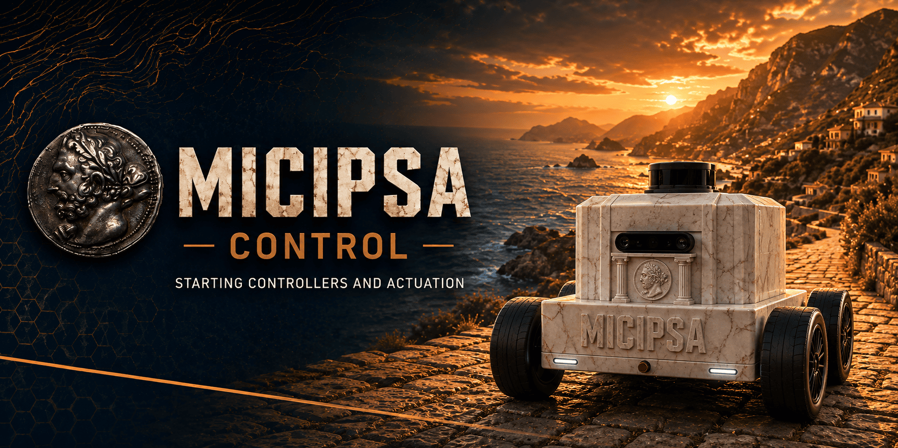
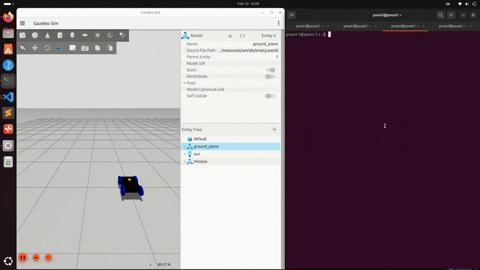
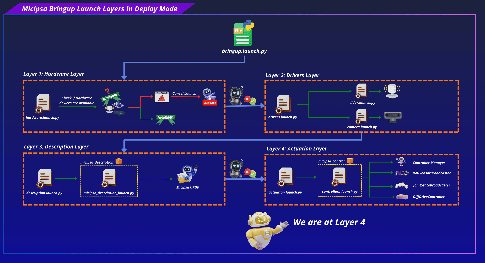
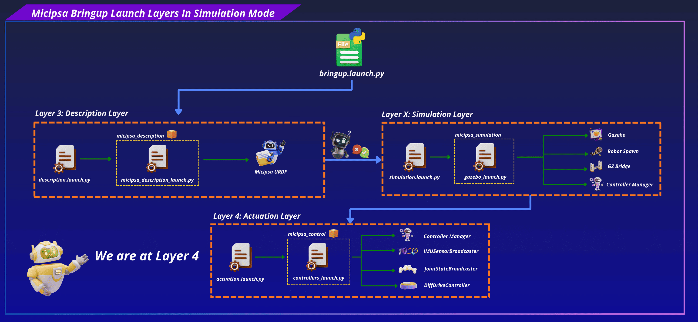
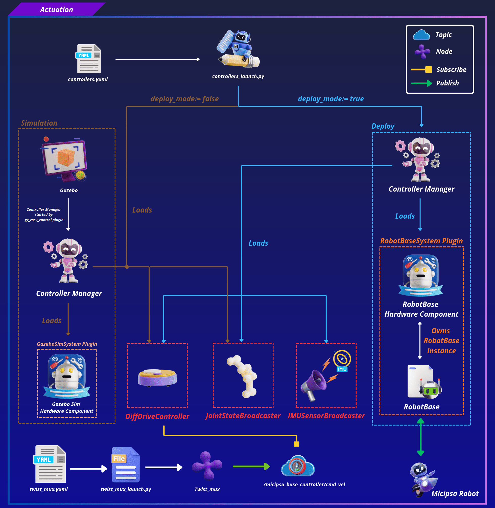
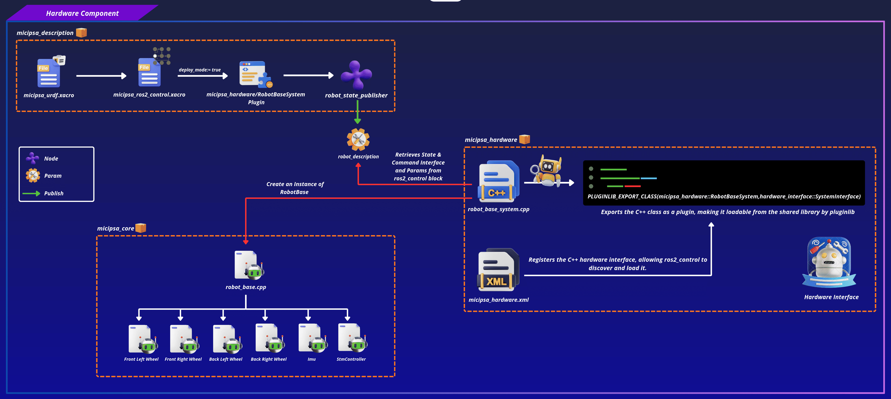
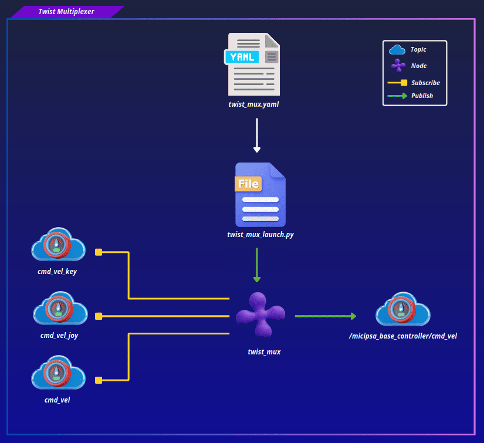
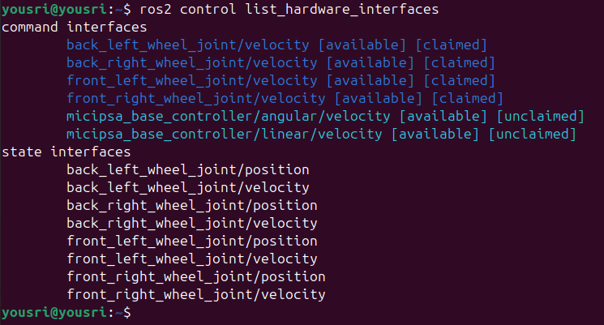
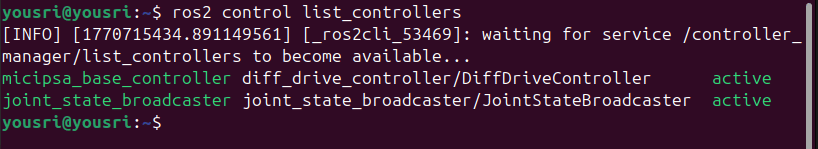
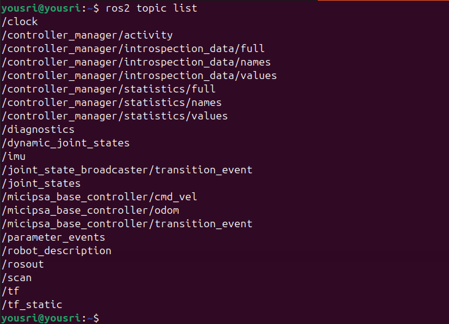

<div align="center">
  <p align="center">
    
  </p>
</div>

<div style="display: flex; justify-content: center; gap: 10px;">
  <p>
    
  </p>
  <p>
    
  </p>
  <p>
    
  </p>
</div>

---

## Overview

`micipsa_control` is a ROS 2 package that configures and launches the `ros2_control` controllers for Micipsa and a Twist multiplexer which multiplex several velocity commands (topics) and allows to priorize or disable them.

The controllers configuration file declares the three controllers that make up the Micipsa actuation stack, `DiffDriveController`, `JointStateBroadcaster`, and `IMUSensorBroadcaster` along with their parameters.

The Twist multiplexer configuration file defines velocity command topics and their priorities.

The `controllers_launch.py` launch file starts the controller manager when running on real hardware, and in simulation it only spawns the controllers as the controller manager is already started internally by the `gz_ros2_control` Gazebo plugin (defined in the robot description), and `twist_mux_launch.py` launches the twist multiplexer node in both modes.

<div align="center">
  <p align="center">
    
  </p>
</div>

---

## Architecture

`micipsa_control` runs on top of `micipsa_description` layer, and is brought up by invoking its own launch file which will start the `actuation stack`.

<div align="center">
  <p align="center">
    
  </p>
</div>

### Controllers

The `controllers_launch.py` launch file launches the controller manager with the `controllers.yaml` configuration file and spawns the controllers specified within it.

> [!IMPORTANT]
> In simulation, the controller manager is started internally by the `gz_ros2_control/GazeboSimROS2ControlPlugin`, which is declared in `micipsa_ros2_control.xacro`

In simulation, `IMUSensorBroadcaster` controllers is not started as Gazebo already provides full IMU Data including orientation.

<div align="center">
  <p align="center">
    
  </p>
</div>

<div align="center">
  <p align="center">
    
  </p>
</div>

In `deploy` mode, the controller manager loads the `RobotBaseSystem` hardware component plugin defined in `micipsa_hardware`, discoverable at runtime via the `ros2_control` block in Micipsa URDF. In simulation, it loads the `GazeboSimSystem` plugin instead.

<div align="center">
  <p align="center">
    
  </p>
</div>

### Twist Multiplexer

The `twist_mux_launch.py` launch file will start the `twist_mux` node and using its configuration file will defines which velocity command topics the robot listens to and how conflicts and priority between them are resolved.

<div align="center">
  <p align="center">
    
  </p>
</div>


---

## ROS 2 Interface

### Published Topics

| Topic | Publisher | Type | QoS |
|-------|-----------|------|-----|
| `/joint_states` | `joint_state_broadcaster` | `sensor_msgs/msg/JointState` | `RELIABLE` / `VOLATILE` |
| `/micipsa_base_controller/odom` | `micipsa_base_controller`| `nav_msgs/msg/Odometry` | `RELIABLE` / `VOLATILE` |
| `/micipsa_base/imu/data` | `imu_sensor_broadcaster` | `sensor_msgs/msg/Imu` | `RELIABLE` / `VOLATILE` |

### Subscribed Topics

| Topic | Subscriber | Type | QoS |
|-------|------------|------|-----|
| `/micipsa_base_controller/cmd_vel` | `micipsa_base_controller` | `geometry_msgs/msg/TwistStamped` | `RELIABLE` / `VOLATILE` |

### Launch Arguments

#### controllers_launch.py

| Argument | Type | Default | Description |
|----------|------|---------|-------------|
| `deploy_mode` | `bool` | `false` | `true` to generate the hardware-targeted URDF; `false` for simulation |
| `use_sim_time` | `bool` | `true` | Use Gazebo `/clock` topic instead of wall time |
| `log_level` | `string` | `info` | Log verbosity for `robot_state_publisher` (`debug`, `info`, `warn`, `error`) |
| `ros2_control_controllers_config_file` | `string` | `controllers.yaml` | `ros2_control` controllers configuration file name or absolute path |

#### twist_mux_launch.py

| Argument | Type | Default | Description |
|----------|------|---------|-------------|
| `deploy_mode` | `bool` | `false` | `true` to generate the hardware-targeted URDF; `false` for simulation |
| `use_sim_time` | `bool` | `true` | Use Gazebo `/clock` topic instead of wall time |
| `log_level` | `string` | `info` | Log verbosity for `robot_state_publisher` (`debug`, `info`, `warn`, `error`) |
| `twist_mux_config_file` | `string` | `twist_mux.yaml` | twist mux config file |

---

## Installation

> [!IMPORTANT]
> Micipsa can be run in two ways: **natively** on a ROS 2 host, or via **Docker** using pre-built containerized images. Choose your approach before proceeding:
>
> - **Native** build the package directly in a ROS 2 workspace.  Follow [requirements](#requirements) and the [Native Install](#native-install) steps below.
> - **Docker** use the Micipsa container stack, no manual workspace setup required. skip requirements section and follow [Docker](#docker) section.

### Requirements

> [!IMPORTANT]
> If you intend to run in deploy mode (on real robot), note that `micipsa_core` depends on a patched version of `wjwwood/serial`, a third-party library not managed by rosdep. If it is not already present in your workspace, make sure to follow [micipsa_core README](../micipsa_core/README.md) **before proceeding**.

Source the ROS 2 environment:

```bash
source /opt/ros/jazzy/setup.bash
```

First, make sure that the following packages are available in your workspace:

- [micipsa_common](../micipsa_common/README.md)
- [micipsa_description](../micipsa_description/README.md) (not required for building, needed in usage section)

If **deploy** only:

- [micipsa_core](../micipsa_core/README.md)
- [micipsa_hardware](../micipsa_hardware/README.md)

If **simulation** only:

- [micipsa_simulation](../micipsa_simulation/README.md) (not required for building, needed in usage section)


Install ROS dependencies from the workspace root:

```bash
cd ~/ros2_ws
rosdep init
rosdep update
rosdep install --from-paths src --ignore-src -r -y
```

### Native Install

Build the packages:

```bash
colcon build --packages-select micipsa_common
```

If **deploy**:

```bash
colcon build --packages-select micipsa_core
colcon build --packages-select micipsa_hardware
```

If **simulation**:

```bash
colcon build --packages-select micipsa_simulation
```

Now build `micipsa_control` package
```bash
colcon build --packages-select micipsa_control
```

Source the install overlay:

```bash
source install/setup.bash
```

> [!TIP]
> Add `source /opt/ros/jazzy/setup.bash` and `source ~/ros2_ws/install/setup.bash` to your `~/.bashrc` to avoid repeating these steps in every new terminal.

### Docker

`micipsa_control` package is part of Micipsa Actuation Docker image.

> [!TIP]
> Reading Micipsa Docker documentation (architecture, dockerfile, docker compose,...) is **strongly recommended**, it covers how the Dockerfiles are structured, how images are built, how containers are orchestrated, and much more.

To build and run `Micipsa Actuation` Docker image, follow Micipsa Dockerfile README [Build Section](../../micipsa_docs/docs/docker/docker_file.md#build).

---

## Configuration

For the complete list of supported launch arguments, see the [Launch Arguments](#launch-arguments) section.

> [!INFO]
> For configuration files, you can specify either the filename or the absolute path. See [Package Standards](../../micipsa_docs/docs/architecture/package_standards.md#config-resolution) for understanding config loading workflow.

### Controllers

All `ros2_control` controllers configuration lives in `config/controllers.yaml`. This file is the source of truth for which controllers are loaded and their tuning parameters, it is passed to the controller manager at launch time.

#### Simulation

In simulation, `deploy_mode` defaults to `false`. The controller manager is started by Gazebo internally, so only the controller spawners are launched. The `imu_sensor_broadcaster` is not spawned in simulation since the Gazebo IMU sensor data is bridged separately.

#### Deploy

In deploy mode, `controllers_launch.py` additionally starts the `ros2_control_node` (controller manager) and spawns the `imu_sensor_broadcaster`. The config file and all parameters are the same as in simulation. The only behavioral difference is controlled by the `deploy_mode` launch argument.

> [!NOTE]
> in diff_drive_controller `enable_odom_tf` is set to `false` because the odom → base_footprint transform is published by the EKF localization node in `micipsa_localization`, not by the diff drive controller. Enabling it here would cause a TF conflict.
> If you set `enable_odom_tf` to `true` make sure to stop the EKF localization node or any other node that might be publishing odom → base_footprint transform

> [!IMPORTANT]
> In **deploy mode**, the hardware interface needs to know which serial port the microcontroller is connected to. When using the full bringup launch workflow, this is configured via `devices.yaml`. If `micipsa_bringup` is not available, you can set the port directly in `properties.xacro` from `micipsa_description`, which serves as the fallback when no config file is provided.

### Twist Multiplexer

`twist_mux` configuration lives in `config/twist_mux.yaml`

The `topic` field identifies where velocity commands are received, `timeout` specifies how long a command source remains active after its last message (0.5 seconds in this case), and `priority` determines which source takes control when multiple sources are publishing simultaneously.

Here, autonomous navigation publishes on `cmd_vel` with priority 10, keyboard teleoperation publishes on `cmd_vel_key` with priority 90, and joystick teleoperation publishes on `cmd_vel_joy` with priority 100. Because higher numbers indicate higher priority, joystick commands override keyboard commands, and both override navigation commands whenever they are active.

The `use_stamped: true` setting indicates that the multiplexer expects timestamped velocity messages (`TwistStamped`).

---

## Usage

### Controllers

#### Simulation

Launch the robot description:

```bash
ros2 launch micipsa_description micipsa_description_launch.py
```

Launch Gazebo:

```bash
ros2 launch micipsa_simulation gazebo_launch.py
```

Launch the controllers:

```bash
ros2 launch micipsa_control controllers_launch.py
```

#### Deploy

On the physical robot, launch the robot description with deploy mode enabled:

```bash
ros2 launch micipsa_description micipsa_description_launch.py deploy_mode:=true use_sim_time:=false
```

Then launch the controllers:

```bash
ros2 launch micipsa_control controllers_launch.py deploy_mode:=true use_sim_time:=false
```

To override the default controller configuration with a custom file:

```bash
ros2 launch micipsa_control controllers_launch.py \
  deploy_mode:=true \
  use_sim_time:=false \
  ros2_control_controllers_config_file:=my_custom_controllers.yaml
```

#### Twist Multiplexer

```bash
ros2 launch micipsa_control twist_mux_launch.py
```

---

## Validation

### Hardware Interfaces

List all hardware interfaces and confirm they are available and claimed:

```bash
ros2 control list_hardware_interfaces
```

<div align="center">
  <p align="center">
    
  </p>
</div>

### Active Controllers

List all controllers and confirm they are in the `active` state:

```bash
ros2 control list_controllers
```

<div align="center">
  <p align="center">
    
  </p>
</div>

### Controllers Topics

Check that controller topics are being published:

```bash
ros2 topic list | grep micipsa_base_controller
ros2 topic echo /joint_states
```

<div align="center">
  <p align="center">
    
  </p>
</div>

### Sending Velocity

Send a test velocity command to confirm the robot responds (simulation or hardware):

> [!CAUTION]
> When running on real hardware, always verify the robot is in a safe open area and wheels are clear before sending velocity commands. The robot will start moving immediately upon receiving the message.

```bash
ros2 topic pub --rate 10 /micipsa_base_controller/cmd_vel geometry_msgs/msg/TwistStamped "
header: {}
twist:
  linear:
    x: 0.2
    y: 0.0
    z: 0.0
  angular:
    x: 0.0
    y: 0.0
    z: 0.5"
```

<div align="center">
  <p align="center">
    
  </p>
</div>

---

## Additional Information

### Dependencies

#### Build Dependencies

These dependencies are required when building the package.

| Package | Role |
|---------|------|
| `ament_cmake` | Build system |
| `ament_cmake_python` | Python package installation support within a CMake package |

#### Runtime Dependencies

These dependencies are not required to build the package but are required when running it.

| Package | Role |
|---------|------|
| `ros2_control` | Controller manager and hardware interface framework |
| `ros2_controllers` | `DiffDriveController`, `JointStateBroadcaster`, `IMUSensorBroadcaster` |
| `twist_mux` | Velocity command multiplexer node |

#### Test Dependencies

Used only when running the package test suite.

| Package | Role |
|---------|------|
| `ament_lint_auto` | Runs the standard suite of linters configured for the workspace |
| `ament_lint_common` | Provides the common lint configurations used by `ament_lint_auto` |
| `ament_cmake_pytest` | Python test runner for colcon |
| `launch_testing_ament_cmake` | Launch test integration for colcon |
| `launch_testing` | Framework for launch-based integration tests |
| `launch` | Launch API used by test descriptions |
| `launch_ros` | ROS-specific launch actions used by tests |
| `ament_cmake_ros` | Provides `run_test_isolated.py` for isolated launch tests |

#### Micipsa Packages Dependencies

The launch file and integration test require the following packages to be built and available at runtime:

| Package | Role |
|---------|------|
| `micipsa_common` | Provides `resolve_config_path()` and `utils.console_utils.warn()`, imported directly by `behavior_launch.py` |
| `micipsa_description` | Provides the URDF with the `<ros2_control>` hardware block |


##### Deploy

| Package | Role |
|---------|------|
| `micipsa_hardware` | Provides the `RobotBaseSystem` plugin |
| `micipsa_core` | Provides the `RobotBase` class |

##### Simulation

| Package | Role |
|---------|------|
| `micipsa_simulation` | Provides Gazebo world, gazebo gz bridge config file and gazebo launch file |

---

### Testing

> [!NOTE]
> The integration test runs in Gazebo headless mode and does not require physical hardware. It requires `micipsa_description` and `micipsa_simulation` to be built in the same workspace.

#### Launch Integration Tests

`test/test_controllers_integration_launch.py` launches the full simulation control stack, `micipsa_description`, `micipsa_simulation` (headless), and `micipsa_control` and validates that:

- The `/controller_manager/list_controllers` service becomes available within 90 seconds
- `joint_state_broadcaster` reaches the `active` state
- `micipsa_base_controller` reaches the `active` state
- `/micipsa_base_controller/cmd_vel` and `/micipsa_base_controller/odom` topics are exposed

The test uses a polling loop with a 90-second timeout per controller to avoid flakiness from Gazebo and `ros2_control` startup timing.

#### Running Tests

Run the integration tests:

```bash
colcon build --packages-select micipsa_control
colcon test --packages-select micipsa_control --ctest-args -L launch -V
colcon test-result --verbose
```

Run all tests:

```bash
colcon build --packages-select micipsa_control
colcon test --packages-select micipsa_control
colcon test-result --verbose
```

Clean test results between runs:

```bash
colcon test-result --delete-yes
```

---

### Troubleshooting

#### Controllers fail to spawn controller manager not available

**Symptom:** Controller spawners time out with `Waiting for controller_manager` or exit immediately with an error.

**Cause:**
In **simulation**, the controller manager has not yet been started by the Gazebo plugin. The plugin may still be loading, or Gazebo itself has not finished spawning the robot.
In **deploy mode**, the `ros2_control_node` may have failed to start, usually because the hardware interface could not load (serial port issue, URDF mismatch).

#### A controller is loaded but not active

**Symptom:** `ros2 control list_controllers` shows a controller in `inactive` or `configured` state instead of `active`.

**Cause:** The controller was loaded successfully but activation failed. This usually means a joint or interface name in `controllers.yaml` does not match the interface names exported by the hardware interface.

#### Odometry is wrong despite correct wheel motion

**Symptom:** `/micipsa_base_controller/odom` shows incorrect linear or angular displacement.

**Cause:** `wheel_separation` or `wheel_radius` in `controllers.yaml` do not match the physical robot dimensions or the values declared in the URDF.

**Fix:** Measure the actual wheel-to-wheel distance (center to center) and verify `wheel_separation: 0.342` is accurate for your robot. Verify `wheel_radius: 0.065` matches the value in `micipsa_core.xacro` and `micipsa_ros2_control.xacro`. Update `controllers.yaml` and relaunch.

#### Robot receives cmd_vel but does not move

**Symptom:** The `/micipsa_base_controller/cmd_vel` topic shows messages arriving but the robot does not respond.

**Cause:** Either the `micipsa_base_controller` is not in `active` state, the command interface is not claimed, or in deploy mode the STM32 serial write is failing.

**Fix:** Confirm the controller is active with `ros2 control list_controllers`. Confirm the velocity command interfaces show `[claimed]` in `ros2 control list_hardware_interfaces`. In deploy mode, check the `RobotBaseSystem` log for `Failed to send commands to STM MCU` messages.

#### IMU data not published in simulation

**Symptom:** `/micipsa_base/imu/data` is not present in `ros2 topic list` when running in simulation.

**Cause:** The `imu_sensor_broadcaster` is only spawned in deploy mode (`deploy_mode:=true`).
In simulation, IMU data is bridged from Gazebo through a separate topic bridge, not through this controller.

**Fix:** This is expected behavior in simulation. Check `micipsa_simulation` for the Gazebo IMU topic bridge configuration.
