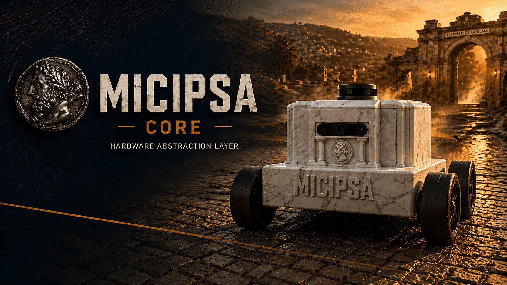
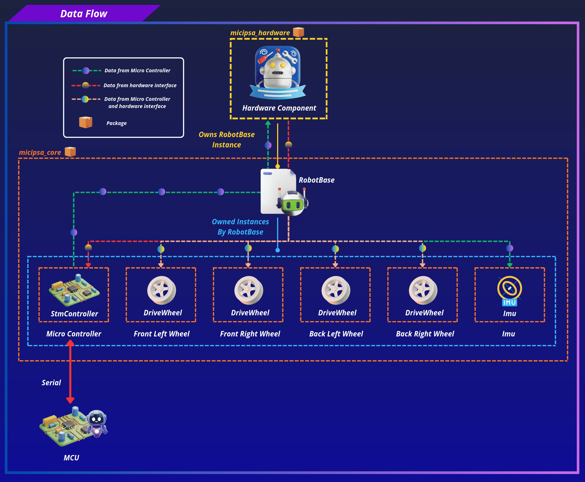
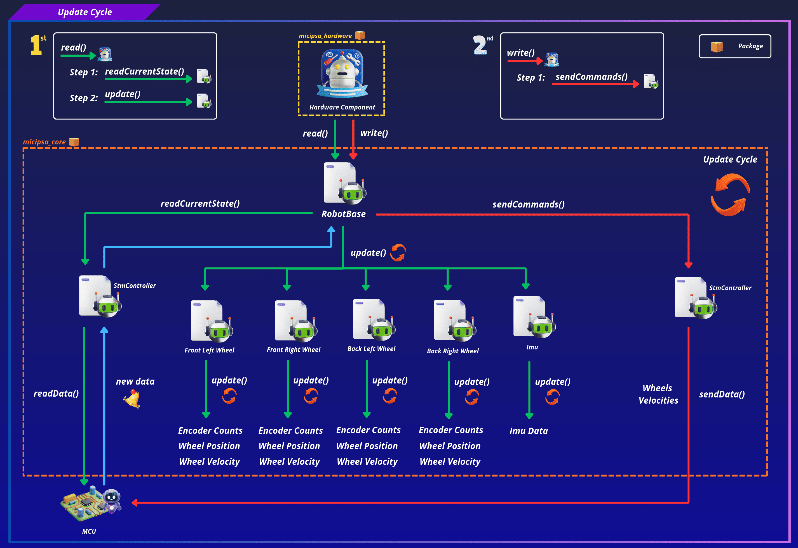
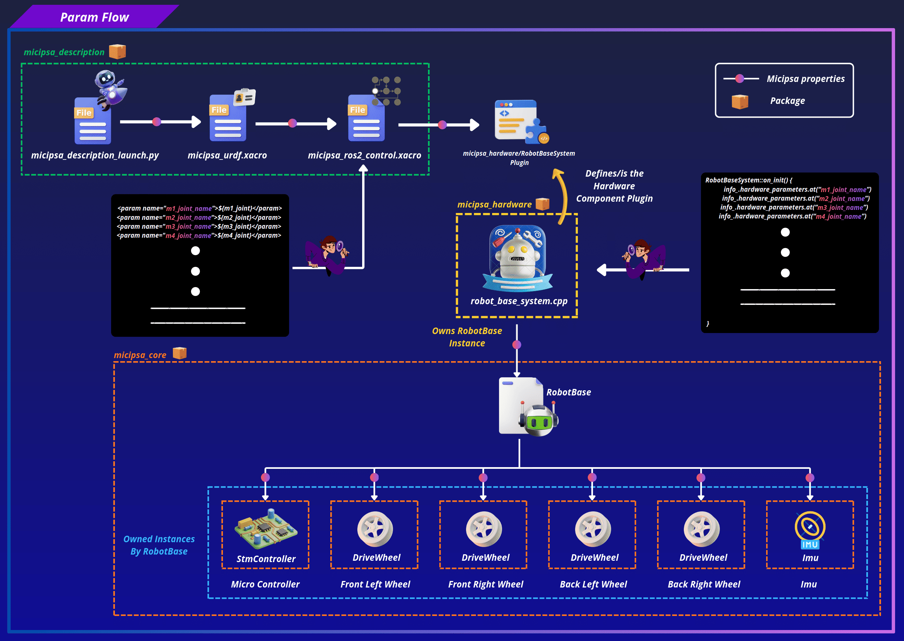

<div align="center">
  <p align="center">
    
  </p>
</div>

<div style="display: flex; justify-content: center; gap: 10px;">
  <p>
    
  </p>
  <p>
    
  </p>
  <p>
    
  </p>
</div>

---

## Overview

`micipsa_core` is a ROS-agnostic C++ library that implements the hardware abstraction layer for Micipsa. It provides all the logic needed to communicate with the microcontroller over serial, process wheel encoder counts and ingest raw IMU data without depending on any ROS 2 API. The library is designed to be linked into a `ros2_control` hardware component plugin (`micipsa_hardware`).

---

## Architecture

> [!IMPORTANT]
> The implementation of RobotBase and its components particularly the STM32 serial protocol framing in StmController, the absolute encoder count handling in DriveWheel, and the raw IMU data scaling in Imu **is tightly coupled to the behavior of the Yahboom ROS development board firmware**. The packet structure, function codes, checksum scheme, and data layout are all defined by how that board sends and receives data over serial. **If the firmware or the underlying board changes, these classes must be reviewed and updated accordingly.**

`micipsa_core` sits between the physical hardware and ROS 2 control.
The `ros2_control` hardware component plugin (from `micipsa_hardware` package) owns a `RobotBase` instance and is the only place where ROS 2 state/command interfaces are mapped onto the data structures defined here.

<div align="center">
  <p align="center">
    
  </p>
</div>

### Update Cycle

<div align="center">
  <p align="center">
    
  </p>
</div>

At every control loop, `Micipsa Hardware Component` calls the following sequence:

#### Read

`readCurrentState()` → `RobotBase` asks `StmController` to read one packet from the serial port. The packet type field determines which component is updated:

- `FUNC_REPORT_ENCODER` routes to all four `DriveWheel::update()` calls.
- `FUNC_REPORT_ICM_RAW` routes to `Imu::update()`.

#### Write

`sendCommands()` → `RobotBase::prepareWheelCommands()` clamps and mirrors each wheel's command velocity, then `StmController::formatDriveWheelsData()` encodes the four velocities as signed PWM bytes and writes the frame to the serial port.

### Design Constraints

This library enforces a strict no-ROS rule. Every class must be free of ROS headers and ROS-specific types. Any new hardware component added to this library must follow the same pattern: a self-contained class with an `init()` function, an `update()` function, and no ROS dependency.

> [!IMPORTANT]
> It is highly recommended to read `micipsa_hardware` [README](../micipsa_hardware/README.md) to understand better how the `micipsa_core` and `micipsa_hardware` packages relate to each other and how data flows to and from the robot.

---

## ROS 2 Interface

`micipsa_core` is a C++ library, it has no nodes, topics, services, or actions of its own.

---

## Installation

> [!IMPORTANT]
> Micipsa can be run in two ways: **natively** on a ROS 2 host, or via **Docker** using pre-built containerized images. Choose your approach before proceeding:
>
> - **Native** build the package directly in a ROS 2 workspace.  Follow [requirements](#requirements) and the [Native Install](#native-install) steps below.
> - **Docker** use the Micipsa container stack, no manual workspace setup required. skip requirements section and follow [Docker](#docker) section.

### Requirements

Make sure that the following packages are available in your workspace:

- [micipsa_common](../micipsa_common/README.md)

#### Patching Serial Library

> [!CAUTION]
> If the patched serial library is already present in your workspace, skip the [Patching Serial Library](#patching-serial-library) section. Note that the patch targets ROS 2 specifically and therefore without it the build will fail.

The `wjwwood/serial` library must be patched for ament before building. Clone it into your workspace:

```bash
cd ~/ros2_ws/src/micipsa/third_party/ros/
git clone https://github.com/wjwwood/serial.git
```

Then follow the instructions in [Patching the Serial Library](serial_ros2_patch.md) to replace the catkin-based CMake and test configuration with ament-compatible equivalents.

### Native Install

Source the ROS 2 environment:

```bash
source /opt/ros/jazzy/setup.bash
```

Install ROS dependencies from the workspace root:

```bash
cd ~/ros2_ws
rosdep update
rosdep install --from-paths src --ignore-src -r -y
```

Build the packages:

```bash
colcon build --packages-select micipsa_common
colcon build --packages-select serial
colcon build --packages-select micipsa_core
```

Source the install overlay:

```bash
source install/setup.bash
```

> [!TIP]
> Add `source /opt/ros/jazzy/setup.bash` and `source ~/ros2_ws/install/setup.bash` to your `~/.bashrc` to avoid repeating these steps in every new terminal.

### Docker

`micipsa_core` package is part of Micipsa Actuation Docker image.

> [!TIP]
> Reading Micipsa Docker documentation (architecture, dockerfile, docker compose,...) is **strongly recommended**, it covers how the Dockerfiles are structured, how images are built, how containers are orchestrated, and much more.

To build and run `Micipsa Actuation` Docker image, follow Micipsa Dockerfile README [Build Section](../../micipsa_docs/docs/docker/docker_file.md#build).

---

## Configuration

`micipsa_core` has no configuration files. All parameters are passed programmatically through the `init()` function of each class and ultimately sourced from the `micipsa_hardware` plugin, which reads them from the URDF `ros2_control` hardware component block defined in `micipsa_description`.

<div align="center">
  <p align="center">
    
  </p>
</div>

---

## Additional Information

### Dependencies

#### Build Dependencies

These dependencies are required when building the package.

| Package | Role |
|---------|------|
| `ament_cmake` | Build system |
| `ament_cmake_python` | Python package installation support within a CMake package |

#### Test Dependencies

Used only when running the package test suite.

| Package | Role |
|---|---|
| `ament_lint_auto` / `ament_lint_common` | Code style and copyright linting |

#### Micipsa Packages Dependencies

The launch file and integration test require the following packages to be built and available at runtime:

| Package | Role |
|---------|------|
| `micipsa_common` | Utils files used across the Micipsa stack |

#### Third Party Dependencies

| Library | Role | Source |
|---------|------|--------|
| `wjwwood/serial` | Low-level serial communication with the STM32 MCU | [github.com/wjwwood/serial](https://github.com/wjwwood/serial) |

> [!WARNING]
> The upstream `wjwwood/serial` repository is catkin-based (ROS 1) and will not build with `colcon` out of the box. It must be patched before use. See [Patching the Serial Library](serial_ros2_patch.md) below.
---

### Testing

> [!NOTE]
> All tests are hardware-independent. They validate protocol formatting, mathematical conversions, and state management without requiring a physical serial device or microcontroller connection. They run reliably in CI.

### Unit Tests

Each test file targets a single class. Test cases are documented directly in the source files with a description and explicit success criteria.

`test_drive_wheel.cpp` covers initialization to a known zero state, encoder-count-to-angle conversion, full kinematics update (position, angular velocity, linear velocity), inverted command mirroring, and command velocity clamping.

`test_imu.cpp` covers default state initialization (identity quaternion, zero vectors, correct covariance arrays), gyroscope and accelerometer ratio scaling via `applyRatios()`, Z-axis sign correction via `correctAxisSigns()`, orientation pass-through, and header field preservation.

`test_stm_controller.cpp` covers initialization and configuration storage, `velocityToPWM()` scaling and boundary values (including the zero `max_angular_velocity` safeguard), `clearOutputData()` frame structure and checksum, `clearInputData()` buffer reset, and `formatDriveWheelsData()` full motor frame encoding with correct headers, payload, length, and checksum.

`test_robot_base.cpp` covers `unpack()` signed 16-bit reconstruction from byte pairs, encoder report routing to all four wheels with correct kinematics, and IMU report routing with timestamp forwarding and value propagation.

### Running Tests

Build and run all unit tests:

```bash
colcon build --packages-select micipsa_core
colcon test --packages-select micipsa_core
colcon test-result --verbose
```

Clean test results between runs:

```bash
colcon test-result --delete-yes
```

> [!TIP]
> When adding a new class, register its test executable in `CMakeLists.txt` using `ament_add_gtest` and link it against `${PROJECT_NAME}` and any class-specific dependencies, following the pattern used for `test_drive_wheel` and `test_imu`.
