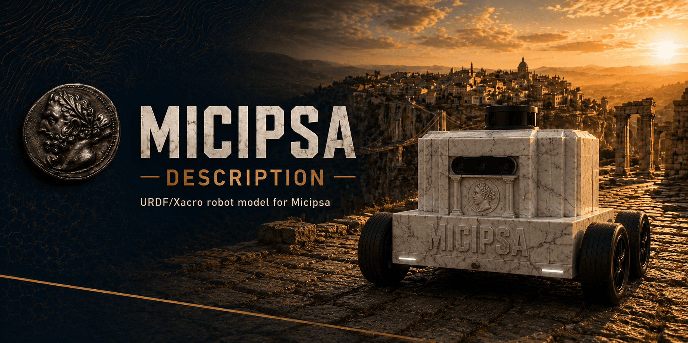
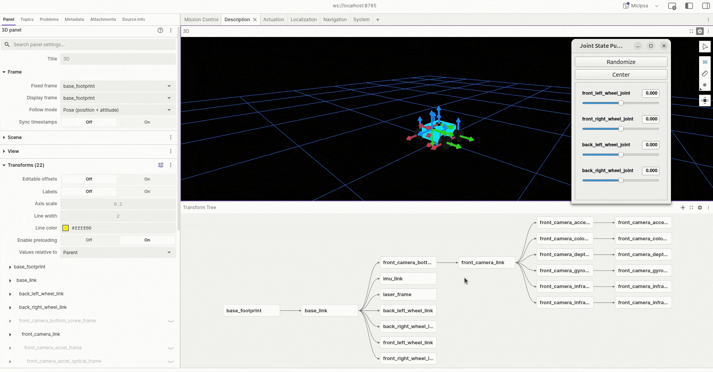
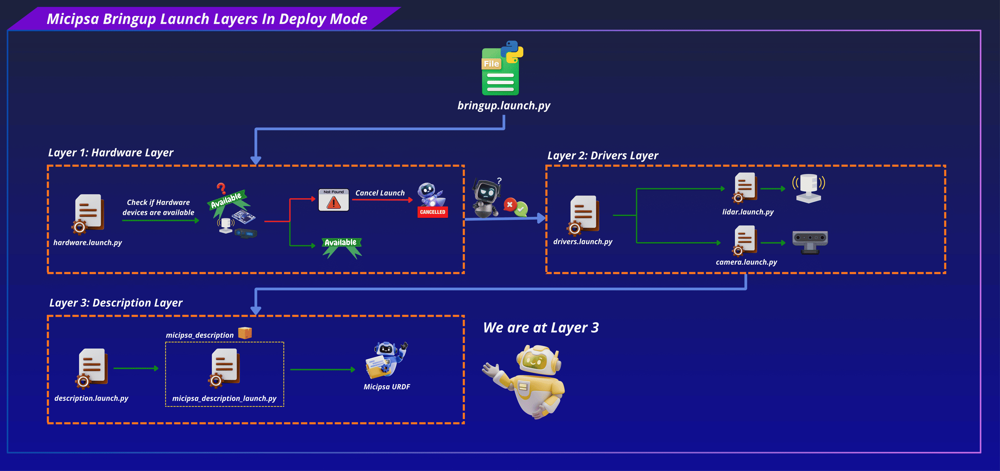
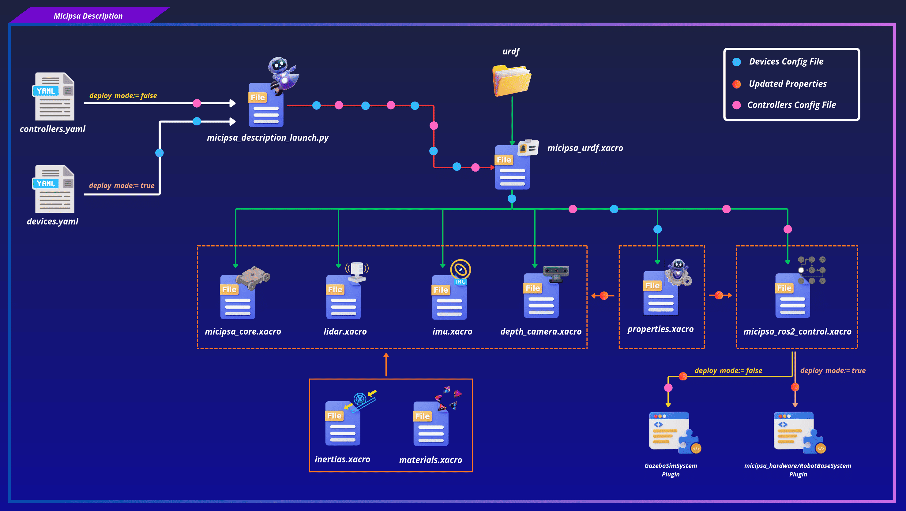
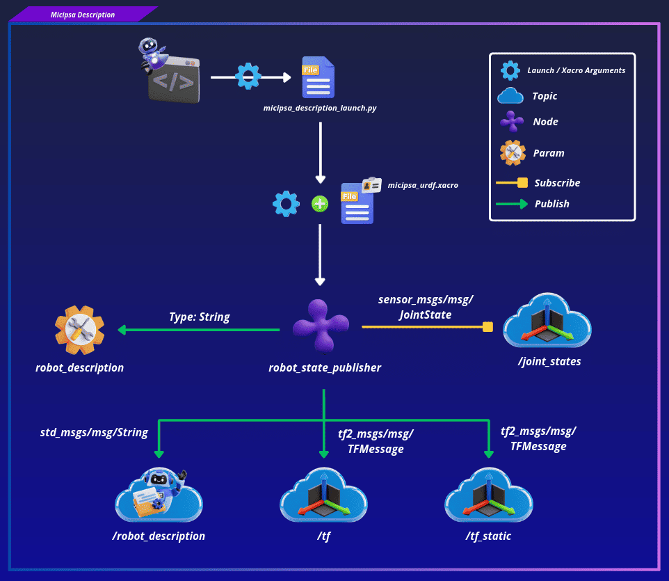
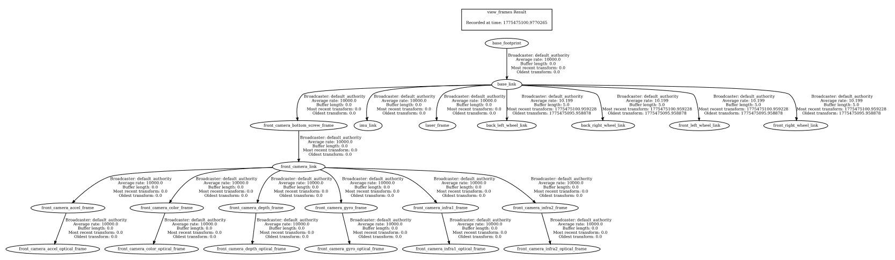
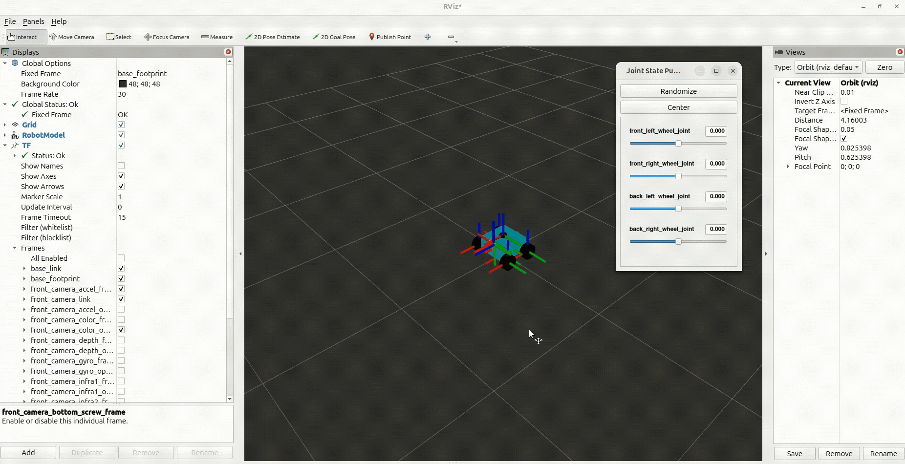

<div align="center">
  <p align="center">
    
  </p>
</div>

<div style="display: flex; justify-content: center; gap: 10px;">
  <p>
    
  </p>
  <p>
    
  </p>
  <p>
    
  </p>
</div>

---

## Overview

`micipsa_description` provides the complete URDF/Xacro robot model for Micipsa, a four-wheeled differential drive autonomous mobile robot.

`micipsa_description` package is responsible for expressing Micipsa's physical reality as a machine-readable description that every other package in the stack can consume. It defines the chassis geometry, wheel links and joints, sensor placements (LiDAR, IMU, Depth Camera), inertial properties, and the `ros2_control` hardware interface configuration.

It exposes a single launch file that starts `robot_state_publisher`, which makes the `/robot_description` topic and param as well as the `TF tree` available to the rest of the system.

<div align="center">
  <p align="center">
    
  </p>
</div>

---

## Architecture

This package sits at the base of the Micipsa stack. Every other subsystem such as `micipsa_control`, `micipsa_localization`, `micipsa_navigation` depends on the robot description being available on the `/robot_description` topic/param and a valid `TF tree` being published, **this package provides both.**

<div align="center">
  <p align="center">
    
  </p>
</div>

The model is assembled from a hierarchy of Xacro files rooted at `micipsa_urdf.xacro`. This root file declares the robot name and the `deploy_mode` argument, then includes all sub-files in order: `properties.xacro` (shared parameters), `micipsa_core.xacro` (chassis and wheels), the three sensor components (`lidar.xacro`, `imu.xacro`, `depth_camera.xacro`), and finally `micipsa_ros2_control.xacro` (hardware interface).

<div align="center">
  <p align="center">
    
  </p>
</div>

`deploy_mode` is the single switch that controls which `ros2_control` plugin and which Gazebo sensor tags are emitted:

- `deploy_mode=false` (default): `<xacro:unless>` blocks emit the `gz_ros2_control/GazeboSimSystem` plugin, the Gazebo sensor tags for the camera, LiDAR and IMU, and load the controllers configuration file into the Gazebo plugin.
- `deploy_mode=true`: `<xacro:if>` blocks emit the `micipsa_hardware/RobotBaseSystem` plugin, which carries all drive wheel parameters (joint names, encoder CPR, inversion flags, wheel radius, max angular velocity), STM32 serial communication parameters, and an IMU sensor interface exposing orientation, angular velocity, and linear acceleration state interfaces.

When launched as part of the full robot stack, the launch file receives a `devices_config_file` from `micipsa_bringup`. Device-specific values motor encoder CPR, motor inversion flags, STM32 port, baudrate and timeout are extracted from that file and passed as Xacro arguments during URDF generation. When `micipsa_bringup` is not installed, the launch file falls back to the defaults embedded in `properties.xacro`.

The controllers configuration (**simulation case only**) follows the same pattern: the launch file resolves `controllers_config_file` by looking first in `micipsa_bringup/config/actuation/`, then falling back to `micipsa_control/config/`. If `micipsa_control` is not installed, controller config injection is skipped.

The launch file **intentionally** does not start any joint state publisher. The hardware interface and Gazebo are responsible for publishing `/joint_states` when active, and starting a joint state publisher alongside them would cause conflicts.

<div align="center">
  <p align="center">
    
  </p>
</div>

---

## ROS 2 Interface

### Published Topics

| Topic | Publisher | Type | QoS |
|-------|-----------|------|-----|
| `/robot_description` | `robot_state_publisher` | `std_msgs/msg/String` | `RELIABLE` / `TRANSIENT_LOCAL` |
| `/tf_static` | `robot_state_publisher` | `tf2_msgs/msg/TFMessage` | `RELIABLE` / `TRANSIENT_LOCAL` |
| `/tf` | `robot_state_publisher` | `tf2_msgs/msg/TFMessage` | `RELIABLE` / `VOLATILE` |

### Subscribed Topics

| Topic | Subscriber | Type | QoS |
|-------|------------|------|-----|
| `/joint_states` | `robot_state_publisher` | `sensor_msgs/msg/JointState` | `BEST_EFFORT` / `VOLATILE` |

### Parameters

| Parameter | Type | Default | Description |
|-----------|------|---------|-------------|
| `robot_description` | `string` | **required** | Full URDF XML expanded from Xacro at launch time |

### Launch Arguments

| Argument | Type | Default | Description |
|----------|------|---------|-------------|
| `deploy_mode` | `bool` | `false` | `true` to generate the hardware-targeted URDF; `false` for simulation |
| `use_sim_time` | `bool` | `true` | Use Gazebo `/clock` topic instead of wall time |
| `log_level` | `string` | `info` | Log verbosity for `robot_state_publisher` (`debug`, `info`, `warn`, `error`) |
| `devices_config_file` | `string` | `devices.yaml` | Device configuration file name or absolute path (used only when `deploy_mode=true`) |
| `controllers_config_file` | `string` | `controllers.yaml` | `ros2_control` controllers configuration file name or absolute path (used only when `deploy_mode=false`) |

### TF Frames

<div align="center">
  <p align="center">
    
  </p>
</div>

The table below lists the primary frames exposed by the robot. For the complete TF tree including all camera-specific frames, see the expandable section below.

| Frame | Parent | Joint Type |
|-------|--------|------------|
| `base_footprint` | - | - |
| `base_link` | `base_footprint` | `fixed` |
| `front_left_wheel_link` | `base_link` | `continuous` |
| `front_right_wheel_link` | `base_link` | `continuous` |
| `back_left_wheel_link` | `base_link` | `continuous` |
| `back_right_wheel_link` | `base_link` | `continuous` |
| `laser_frame` | `base_link` | `fixed` |
| `imu_link` | `base_link` | `fixed` |
| `front_camera_bottom_screw_frame` | `base_link` | `fixed` |

<details>
<summary><strong>Full Camera TF Frames</strong></summary>

<br>

| Frame | Parent | Joint Type |
|-------|--------|------------|
| `front_camera_link` | `front_camera_bottom_screw_frame` | `fixed` |
| `front_camera_accel_frame` | `front_camera_link` | `fixed` |
| `front_camera_accel_optical_frame` | `front_camera_accel_frame` | `fixed` |
| `front_camera_color_frame` | `front_camera_link` | `fixed` |
| `front_camera_color_optical_frame` | `front_camera_color_frame` | `fixed` |
| `front_camera_depth_frame` | `front_camera_link` | `fixed` |
| `front_camera_depth_optical_frame` | `front_camera_depth_frame` | `fixed` |
| `front_camera_gyro_frame` | `front_camera_link` | `fixed` |
| `front_camera_gyro_optical_frame` | `front_camera_gyro_frame` | `fixed` |
| `front_camera_infra1_frame` | `front_camera_link` | `fixed` |
| `front_camera_infra1_optical_frame` | `front_camera_infra1_frame` | `fixed` |
| `front_camera_infra2_frame` | `front_camera_link` | `fixed` |
| `front_camera_infra2_optical_frame` | `front_camera_infra2_frame` | `fixed` |

</details>

---

## Installation

> [!IMPORTANT]
> Micipsa can be run in two ways: **natively** on a ROS 2 host, or via **Docker** using pre-built containerized images. Choose your approach before proceeding:
>
> - **Native**: build the package directly in a ROS 2 workspace. Follow [requirements](#requirements) and the [Native Install](#native-install) steps below.
> - **Docker**: use the Micipsa container stack, no manual workspace setup required. skip requirements section and follow the [Docker](#docker) steps below.

### Requirements

Source the ROS 2 environment:

```bash
source /opt/ros/jazzy/setup.bash
```

First, make sure that the following packages are available in your workspace:

- [micipsa_common](../micipsa_common/README.md)

Install ROS 2 dependencies from the workspace root:

```bash
cd ~/ros2_ws
rosdep init
rosdep update
rosdep install --from-paths src --ignore-src -r -y
```

#### Optional Development Tools

Useful for interactive testing and validation but not required to build or run the package.

```bash
sudo apt-get install ros-jazzy-joint-state-publisher-gui
sudo apt-get install ros-jazzy-rviz2
sudo apt-get install liburdfdom-tools
```

### Native Install

Build the package:

```bash
colcon build --packages-select micipsa_common
colcon build --packages-select micipsa_description
```

Source the install overlay:

```bash
source install/setup.bash
```

> [!TIP]
> Add `source /opt/ros/jazzy/setup.bash` and `source ~/ros2_ws/install/setup.bash` to your `~/.bashrc` to avoid repeating these steps in every new terminal. **Adjust the path and ROS distribution name as needed.**

### Docker

> [!TIP]
> Reading Micipsa Docker documentation (architecture, dockerfile, docker compose,...) is **strongly recommended**, it covers how the Dockerfiles are structured, how images are built, how containers are orchestrated, and much more.

To build and run the `micipsa_description` Docker image, follow Micipsa Dockerfile README [Build Section](../../micipsa_docs/docs/docker/docker_file.md#build).

---

## Configuration

The primary configuration switch is the `deploy_mode` launch argument, It controls which `ros2_control` plugin is emitted in the generated URDF and which set of optional Xacro arguments are resolved at launch time:

- **`deploy_mode=false`** (default):
  - `gz_ros2_control/GazeboSimSystem` plugin is emitted, along with Gazebo sensor tags for the camera, LiDAR, and IMU.
  - `controllers_config_file` argument is resolved and injected directly into the Gazebo plugin.
  - `devices_config_file` are not loaded (specific to physical hardware).

- **`deploy_mode=true`**:
  - `micipsa_hardware/RobotBaseSystem` plugin is emitted with devices parameters from `devices_config_file`.
  - Gazebo sensor tags are suppressed.
  - `controllers_config_file` argument is not used controller loading is the responsibility of `micipsa_control` in deploy mode.

In both modes, when `micipsa_bringup` is not installed, device-related Xacro arguments are not injected and the URDF falls back to the defaults embedded in `properties.xacro`.
Similarly, when `micipsa_control` is not installed, controller config injection is skipped entirely in simulation mode.

For the complete list of supported launch arguments, see the [Launch Arguments](#launch-arguments) section.

> [!INFO]
> For configuration files, you can specify either the filename or the absolute path. See [Package Standards](../../micipsa_docs/docs/architecture/package_standards.md#config-resolution) for understanding config loading workflow.

---

## Usage

### Simulation

Start `robot_state_publisher` with the Gazebo-targeted URDF (`deploy_mode=false`, `use_sim_time=true`):

```bash
ros2 launch micipsa_description micipsa_description_launch.py
```

To override the controllers configuration file:

```bash
ros2 launch micipsa_description micipsa_description_launch.py \
  controllers_config_file:=controllers.yaml
```

### Deploy

Launch the robot description targeting the physical hardware:

```bash
ros2 launch micipsa_description micipsa_description_launch.py \
  deploy_mode:=true \
  use_sim_time:=false
```

To override the device configuration file:

```bash
ros2 launch micipsa_description micipsa_description_launch.py \
  deploy_mode:=true \
  use_sim_time:=false \
  devices_config_file:=devices.yaml
```

---

## Validation

First, run the description launch file in simulation mode:

```bash
ros2 launch micipsa_description micipsa_description_launch.py \
  deploy_mode:=false \
  use_sim_time:=false
```

Then start the joint state GUI in a separate terminal to drive the wheel joints:

```bash
ros2 run joint_state_publisher_gui joint_state_publisher_gui
```

Now choose a verification method: [RViz](#rviz), [Foxglove](#foxglove), or [CLI](#cli).

### RViz

Open RViz:

```bash
rviz2
```

Set **Fixed Frame** to `base_footprint`, add a **TF** display, and add a **RobotModel** display with the **Description Topic** set to `/robot_description`.

<div align="center">
  <p align="center">
    
  </p>
</div>

Confirm the robot model renders correctly and all transforms are available.

### Foxglove

Start the Foxglove bridge:

```bash
ros2 run foxglove_bridge foxglove_bridge
```

Then open Foxglove Studio:

```bash
foxglove-studio
```

Set **Fixed Frame** and **Display Frame** to `base_footprint`.

<div align="center">
  <p align="center">
    
  </p>
</div>

### CLI

Confirm specific static transforms are present:

```bash
ros2 run tf2_ros tf2_echo base_footprint base_link
ros2 run tf2_ros tf2_echo base_link laser_frame
```

Expected output for `tf2_echo base_footprint base_link`:

```
Translation: [0.000, 0.000, 0.107]
Rotation: [0.000, 0.000, 0.000, 1.000]
```

To inspect the full TF tree:

```bash
ros2 run tf2_tools view_frames
```

<div align="center">
  <p align="center">
    
  </p>
</div>

---

## Additional Information

### Dependencies

#### Build Dependencies

These dependencies are required when building the package.

| Package | Purpose |
|---------|---------|
| `ament_cmake` | CMake build system integration for ROS 2 packages |
| `ament_cmake_python` | Python package installation support within a CMake package |

#### Runtime Dependencies

These dependencies are not required to build the package but are required when running it.

| Package | Purpose |
|---------|---------|
| `xacro` | Expands Xacro macros into plain URDF XML at launch time |
| `robot_state_publisher` | Publishes the robot TF tree from the expanded robot description |
| `micipsa_common` | Provides shared utilities used by the launch file: `resolve_config_path()` and `get_device_config()` |
| `ament_index_python` | Resolves ROS 2 package share directories at runtime |

#### Test Dependencies

Used only when running the package test suite.

| Package | Purpose |
|---------|---------|
| `ament_cmake_pytest` | Runs Python unit tests via `colcon test` |
| `launch_testing_ament_cmake` | CMake integration for launch integration tests |
| `launch_testing` | Launch test framework |
| `launch` | Launch API used by test descriptions |
| `launch_ros` | ROS-specific launch actions used by tests |
| `ament_cmake_ros` | Provides isolated ROS launch test runners (`run_test_isolated.py`) |

#### Micipsa Packages Dependencies

| Package | Role |
|---------|------|
| `micipsa_common` | Provides `resolve_config_path()` and `utils.console_utils.warn()`, imported directly by `behavior_launch.py` |

#### Development Tools Dependencies

Useful for interactive testing and validation but not required to build or run the package.

| Tool | Purpose |
|------|---------|
| `joint_state_publisher_gui` | Manually drive wheel joints for visualization when running standalone |
| `rviz2` | Visualize the robot model and TF tree |
| `check_urdf` | Validate generated URDF files for kinematic consistency |

---

### Testing

> [!NOTE]
> All tests run headless and do not require a running simulation or physical hardware. They can be executed reliably in CI environments.

#### Unit Tests

`test/test_urdf.py` verifies that `micipsa_urdf.xacro` can be processed by `xacro` and that the resulting URDF is a valid, parseable XML document with a `<robot>` root element. Tests are parametrized and run for both `deploy_mode=false` and `deploy_mode=true`. If `check_urdf` is installed, it is also invoked to validate kinematic consistency.

#### Launch Integration Tests

`test/test_urdf_integration_launch.py` launches the description stack with `deploy_mode=false` and `use_sim_time=true`, subscribes to `/tf_static` with a `TRANSIENT_LOCAL` QoS profile, and asserts that:

1. At least one `/tf_static` message is received within 3 seconds.
2. The `base_footprint ← base_link` static transform is available in the TF buffer.
3. The `base_link ← laser_frame` static transform is available in the TF buffer.

#### Running Tests

Run only the unit tests:

```bash
colcon build --packages-select micipsa_description
colcon test --packages-select micipsa_description --ctest-args -L "(gtest|pytest)" -V
colcon test-result --verbose
```

Run only the launch integration tests:

```bash
colcon build --packages-select micipsa_description
colcon test --packages-select micipsa_description --ctest-args -L launch -V
colcon test-result --verbose
```

Run all tests:

```bash
colcon build --packages-select micipsa_description
colcon test --packages-select micipsa_description
colcon test-result --verbose
```

Clean test results between runs:

```bash
colcon test-result --delete-yes
```

---

### Troubleshooting

#### Device configuration not applied

**Symptom:** The robot launches successfully but encoder CPR, inversion flags, or STM32 settings do not match the expected device configuration.

**Cause:** `micipsa_bringup` is not installed or the specified `devices_config_file` could not be resolved. Device argument injection is skipped entirely when `micipsa_bringup` is absent.

**Fix:** Verify that `micipsa_bringup` is installed:

```bash
ros2 pkg prefix micipsa_bringup
```

#### Controllers not loaded in simulation

**Symptom:** Gazebo starts but no controllers are active, `ros2 control list_controllers` returns an empty list or the controller manager reports no controllers loaded.

**Cause:** The controllers configuration file was not injected into the Gazebo plugin. This happens when `micipsa_control` is not installed (injection is skipped entirely) or when the resolved config path is empty or invalid.

**Fix:**

First confirm `micipsa_control` is installed
Then verify the resolved config path by inspecting the launch output for a warning line from `resolve_config_path()`. You can also confirm the path by checking the generated `robot_description` param:

```bash
ros2 param get /robot_state_publisher robot_description
```
