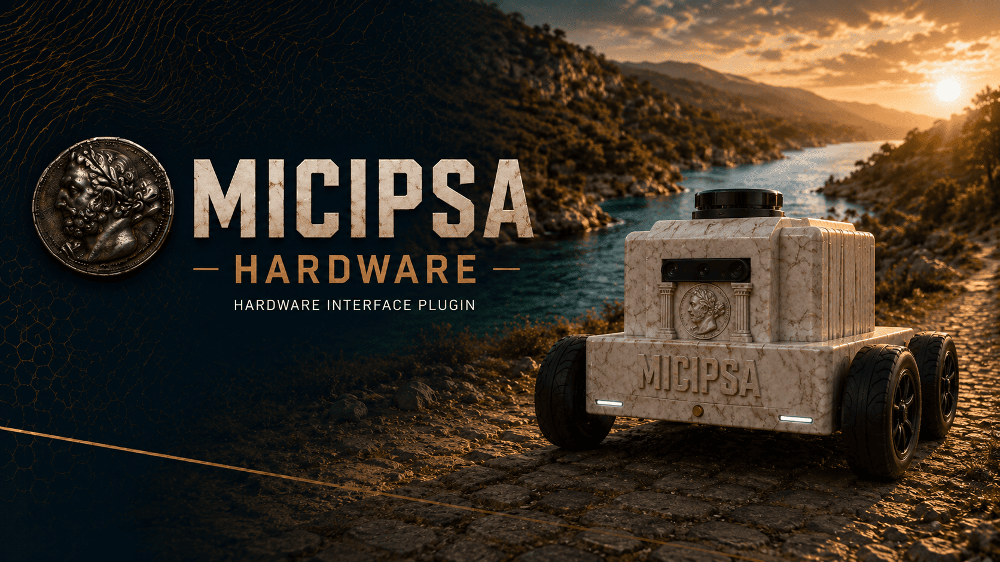
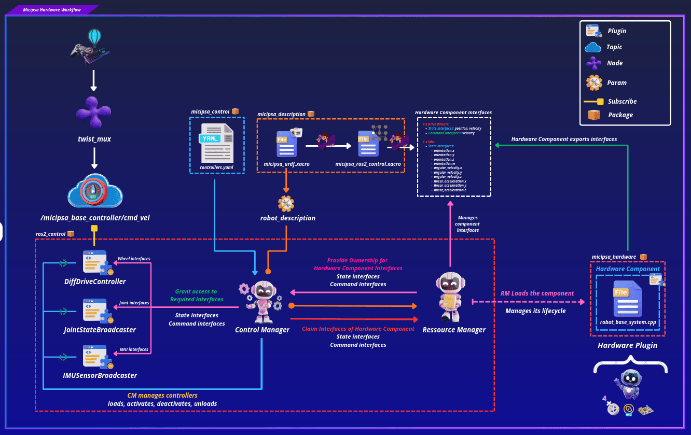
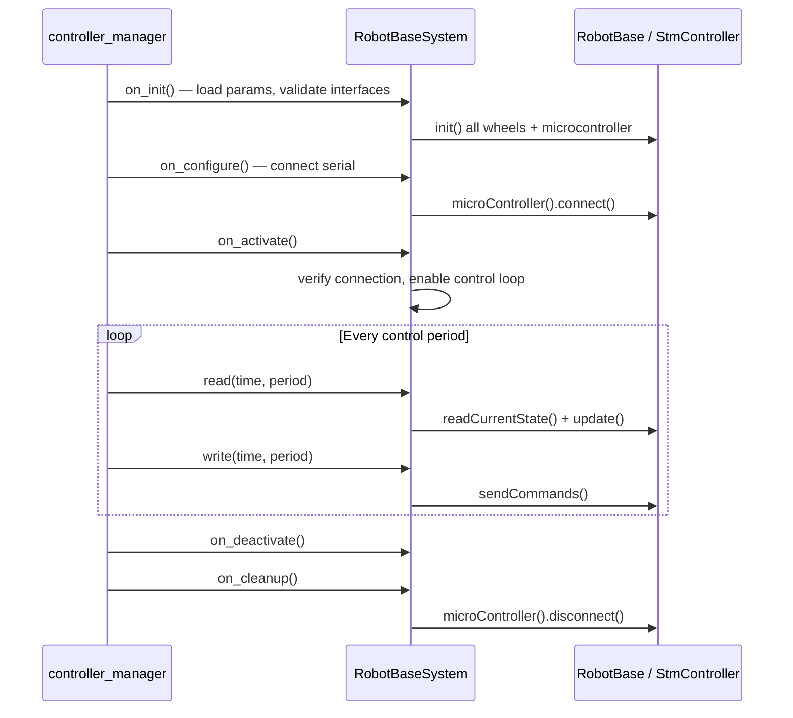
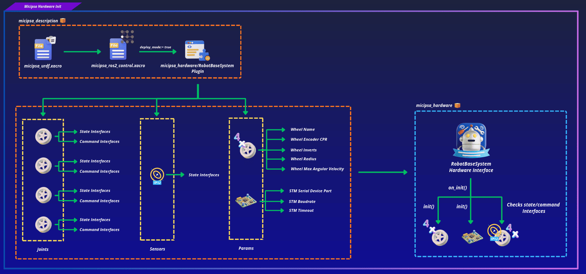

<div align="center">
  <p align="center">
    
  </p>
</div>

<div style="display: flex; justify-content: center; gap: 10px;">
  <p>
    
  </p>
  <p>
    
  </p>
  <p>
    
  </p>
</div>

---

## Overview

`micipsa_hardware` is a ROS 2 package that implements the `ros2_control` `hardware interface plugin` for Micipsa. It provides a `hardware_interface::SystemInterface` class `RobotBaseSystem`.

It owns a `RobotBase` instance from `micipsa_core`, delegates all serial communication and sensor processing to it, and exposes the resulting wheel positions, wheel velocities, and IMU data as `ros2_control` state interfaces.

Velocity commands written by the `DiffDriveController` are forwarded back through `RobotBase` to the STM32 microcontroller. The package has no nodes, no topics, and no launch files of its own, it is loaded dynamically by the controller manager.

---

## Architecture

> [!IMPORTANT]
> It is highly recommended to read `micipsa_core` [README](../micipsa_core/README.md) to understand better how the `micipsa_core` and `micipsa_hardware` packages relate to each other and how data flows to and from the robot.

`micipsa_hardware` is part of Micipsa actuation stack. It is the layer between `ros2_control` and the hardware abstraction library, `ros2_control` architecture provides a standardized way to connect robot hardware with control software.

<div align="center">
  <p align="center">
    
  </p>
</div>

### Lifecycle Flow



### State & Command Interface

Every interface exported by `export_state_interfaces()` and `export_command_interfaces()` is a direct pointer into a `micipsa_core` data structure. There is no copy, the controller manager reads and writes the same memory that `RobotBase` updates.

> [!IMPORTANT]
> If you add, remove, or rename joints or sensors in the `<ros2_control>` URDF block, you must update both `export_state_interfaces()` and `export_command_interfaces()` in `robot_base_system.cpp` to match.
>
> A mismatch between the URDF declaration and the exported interfaces will cause the controller manager to fail at startup with an interface claiming error.

---

## ROS 2 Interfaces

### State Interfaces

| Interface | Type | Source |
|-----------|------|--------|
| `<wheel_joint_name>/position` | `double` | `DriveWheel::position()` cumulative wheel angle in radians |
| `<wheel_joint_name>/velocity` | `double` | `DriveWheel::angularVelocity()` rad/s |
| `imu_sensor/orientation.x` | `double` | `Imu::imuData().orientation.x` |
| `imu_sensor/orientation.y` | `double` | `Imu::imuData().orientation.y` |
| `imu_sensor/orientation.z` | `double` | `Imu::imuData().orientation.z` |
| `imu_sensor/orientation.w` | `double` | `Imu::imuData().orientation.w` |
| `imu_sensor/angular_velocity.x` | `double` | `Imu::imuData().angular_velocity.x` rad/s |
| `imu_sensor/angular_velocity.y` | `double` | `Imu::imuData().angular_velocity.y` rad/s |
| `imu_sensor/angular_velocity.z` | `double` | `Imu::imuData().angular_velocity.z` rad/s |
| `imu_sensor/linear_acceleration.x` | `double` | `Imu::imuData().linear_acceleration.x` m/s² |
| `imu_sensor/linear_acceleration.y` | `double` | `Imu::imuData().linear_acceleration.y` m/s² |
| `imu_sensor/linear_acceleration.z` | `double` | `Imu::imuData().linear_acceleration.z` m/s² |

### Command Interfaces

| Interface | Type | Consumer |
|-----------|------|----------|
| `<wheel_joint_name>/velocity` | `double` | Written by `DiffDriveController`, rad/s target for each wheel |

### Hardware Parameters

| Parameter | Type | Default | Description |
|-----------|------|---------|-------------|
| `mcu_serial_device` | `string` | `/dev/micipsa/stm_mcu` | Serial device path for the STM32 MCU |
| `mcu_baudrate` | `int` | `115200` | Serial baudrate |
| `mcu_timeout` | `int` | `2000` | Serial communication timeout in milliseconds |
| `m1_joint_name` | `string` | `front_left_wheel_joint` | Joint name used for interface registration |
| `m2_joint_name` | `string` | `front_right_wheel_joint` | Joint name used for interface registration |
| `m3_joint_name` | `string` | `back_left_wheel_joint` | Joint name used for interface registration |
| `m4_joint_name` | `string` | `back_right_wheel_joint` | Joint name used for interface registration |
| `m1_encoder_cpr` | `int` | `2071` | Encoder counts per revolution |
| `m2_encoder_cpr` | `int` | `2071` | Encoder counts per revolution |
| `m3_encoder_cpr` | `int` | `2030` | Encoder counts per revolution |
| `m4_encoder_cpr` | `int` | `2030` | Encoder counts per revolution |
| `m1_invert` | `bool` | `true` | Invert encoder counts and command direction |
| `m2_invert` | `bool` | `false` | Invert encoder counts and command direction |
| `m3_invert` | `bool` | `true` | Invert encoder counts and command direction |
| `m4_invert` | `bool` | `false` | Invert encoder counts and command direction |
| `wheel_radius` | `double` | `0.065` m | Wheel radius used for linear velocity computation |
| `max_wheel_angular_velocity` | `double` | `5.0` rad/s | Maximum angular velocity used for PWM normalization |

---

## Installation

> [!IMPORTANT]
> Micipsa can be run in two ways: **natively** on a ROS 2 host, or via **Docker** using pre-built containerized images. Choose your approach before proceeding:
>
> - **Native** build the package directly in a ROS 2 workspace.  Follow [requirements](#requirements) and the [Native Install](#native-install) steps below.
> - **Docker** use the Micipsa container stack, no manual workspace setup required. skip requirements section and follow [Docker](#docker) section.

### Requirements

Make sure that the following packages are available in your workspace:

> [!IMPORTANT]
> Read [micipsa_core README](../micipsa_core/README.md) requirements section before proceeding as you may need to patch the serial library.

- [micipsa_common](../micipsa_common/README.md)
- [micipsa_core](../micipsa_core/README.md)

### Native Install

Source the ROS2 environment:

```bash
source /opt/ros/jazzy/setup.bash
```

Install ROS2 dependencies from the workspace root:

```bash
cd ~/ros2_ws
rosdep update
rosdep install --from-paths src --ignore-src -r -y
```

Build the package:

```bash
colcon build --packages-select micipsa_common
colcon build --packages-select micipsa_core
colcon build --packages-select micipsa_hardware
```

Source the install overlay:

```bash
source install/setup.bash
```

> [!TIP]
> Add `source /opt/ros/jazzy/setup.bash` and `source ~/ros2_ws/install/setup.bash` to your `~/.bashrc` to avoid repeating these steps in every new terminal.

### Docker

`micipsa_hardware` package is part of Micipsa Actuation Docker image.

> [!TIP]
> Reading Micipsa Docker documentation (architecture, dockerfile, docker compose,...) is **strongly recommended**, it covers how the Dockerfiles are structured, how images are built, how containers are orchestrated, and much more.

To build and run `Micipsa Actuation` Docker image, follow Micipsa Dockerfile README [Build Section](../../micipsa_docs/docs/docker/docker_file.md#build).

---

## Configuration

### Hardware Interface Parameters

All hardware interface parameters are sourced from the `ros2_control` block in Micipsa URDF (`micipsa_description`). The plugin reads them once during `on_init()` and they remain fixed for the lifetime of the controller manager process.

<div align="center">
  <p align="center">
    
  </p>
</div>

### Adding or Changing Hardware Components

If you need to add a new joint, sensor, or hardware parameter to the plugin, three files must be updated together:

- The URDF hardware block in `micipsa_ros2_control.xacro` (`micipsa_description` package) must declare the new interface or parameter inside the `<ros2_control>` tag.

- `on_init()` in `robot_base_system.cpp` must read the new parameter from `info_.hardware_parameters` and pass it to the appropriate `micipsa_core` component or in case of a new joint verify its state and command interfaces.

- `export_state_interfaces()` or `export_command_interfaces()` must register the new interface pointer so the controller manager can grant it to a controller.

> [!CAUTION]
> Never add a `<joint>` or `<sensor>` to the `<ros2_control>` URDF block without updating `robot_base_system.cpp` to match. The `on_init()` validation will reject any joint that does not expose exactly 1 velocity command interface and exactly 2 state interfaces (position, velocity), returning `CallbackReturn::ERROR` and preventing the hardware from loading.

### Plugin Registration

The plugin is registered via pluginlib. The `micipsa_hardware.xml` descriptor maps the plugin name to the C++ class:

```xml
<library path="micipsa_hardware">
  <class name="micipsa_hardware/RobotBaseSystem"
         type="micipsa_hardware::RobotBaseSystem"
         base_class_type="hardware_interface::SystemInterface">
    <description>Robot base hardware plugin for the Micipsa robot.</description>
  </class>
</library>
```

The `CMakeLists.txt` exports this descriptor so the controller manager can find it:

```cmake
pluginlib_export_plugin_description_file(hardware_interface micipsa_hardware.xml)
```

> [!NOTE]
> The plugin name `micipsa_hardware/RobotBaseSystem` in the XML must exactly match the `<plugin>` tag in the URDF `<ros2_control>` block. A mismatch will cause the controller manager to fail to load the hardware interface with a `pluginlib` lookup error.

---

## Usage

`micipsa_hardware` is a plugin, it has no executable or launch file. It is loaded automatically by the controller manager when the robot description contains the matching `<plugin>` tag.
To use your hardware component plugin, refer to the **Usage** section in deploy mode of the [`micipsa_control` README](../micipsa_control/README.md).

---

## Validation

To validate, refer to the **Validation** section of the [`micipsa_control` README](../micipsa_control/README.md).

---

## Additional Information

### Dependencies

### Build Dependencies

These dependencies are required when building the package.

| Package | Role |
|---------|------|
| `ament_cmake` | Build system |
| `ament_cmake_python` | Python package installation support within a CMake package |
| `hardware_interface` | `SystemInterface` base class and interface types |
| `pluginlib` | Plugin registration and dynamic loading |
| `rcpputils` | ROS C++ utilities |
| `rclcpp` | ROS 2 C++ client library |
| `rclcpp_lifecycle` | Lifecycle state machine |

### Runtime Dependencies

These dependencies are not required to build the package but are required when running it.

### Test Dependencies

Used only when running the package test suite.

| Package | Role |
|---------|------|
| `ament_lint_auto` | Linting test runner |
| `ament_lint_common` | Standard linting rules |

### Micipsa Packages Dependencies

| Package | Role |
|---------|------|
| `micipsa_core` | Hardware abstraction library `RobotBase`, `DriveWheel`, `Imu`, `StmController` |
| `micipsa_common` | Shared plain structs (`TimeStamp`) |

---

### Troubleshooting

### Plugin not found by controller manager

**Symptom:** The controller manager logs `Could not load class micipsa_hardware/RobotBaseSystem` or `Failed to load hardware`.

**Cause:** The pluginlib index has not been updated, or the package was not installed correctly.

**Fix:** Confirm the package is built and sourced, then verify the plugin is registered:

```bash
ros2 pkg list | grep micipsa_hardware
ros2 run pluginlib list_plugin_descriptions hardware_interface::SystemInterface
```

If `micipsa_hardware/RobotBaseSystem` does not appear in the output, rebuild and re-source:

```bash
colcon build --packages-select micipsa_hardware
source install/setup.bash
```

### `on_configure` fails serial port cannot be opened

**Symptom:** The controller manager logs `Failed to open serial port /dev/micipsa/stm_mcu` and the hardware component stays in the `unconfigured` state.

**Cause:** The STM32 serial device is not present at the configured path, the udev rule has not been applied, or another process is holding the port open.

**Fix:** Verify the device exists:

```bash
ls -la /dev/micipsa/stm_mcu
```

If the symlink is missing, re-apply the udev rules, refer to the [Micipsa Udev README](../../infra/doc/README_udev.md). 

If the device exists but cannot be opened, check for processes holding the port:

```bash
fuser /dev/micipsa/stm_mcu
```

### `on_init` fails interface count mismatch

**Symptom:** The controller manager logs a `FATAL` message such as `Joint 'front_left_wheel_joint' has N command interfaces found. 1 expected.`

**Cause:** The `<ros2_control>` block in the URDF does not match what `on_init()` expects. A joint is missing a command or state interface declaration, or an extra one has been added.

**Fix:** Compare the joint interface declarations in `micipsa_ros2_control.xacro` against the validation logic in `on_init()`. Each joint must declare exactly one `velocity` command interface and exactly two state interfaces: `position` then `velocity`, in that order.

### Wheels move but odometry is wrong

**Symptom:** `/joint_states` shows non-zero velocities and positions but the reported odometry does not match the physical motion.

**Cause:** A hardware parameter mismatch, most likely `wheel_radius`, encoder CPR, or an incorrect invert flag is causing the kinematics computation in `DriveWheel` to produce incorrect values.

**Fix:** Cross-check all hardcoded parameters in `micipsa_ros2_control.xacro` against the physical robot. Pay particular attention to `wheel_radius` (must match the value in `micipsa_core.xacro`) and the per-wheel `encoder_cpr` values.

#### IMU data is zero or not updating

**Symptom:** shows all-zero values or does not update after the robot is moving.

**Cause:** The STM32 is not sending `FUNC_REPORT_ICM_RAW` frames, or the serial read is consistently returning encoder frames instead. The `RobotBase::update()` dispatch is frame-type driven, if no IMU frame arrives, the IMU state is never updated.

**Fix:** Verify that the STM32 firmware is configured to emit IMU reports. Check the raw serial traffic by temporarily logging `receivedData().type` inside `read()`. If only `FUNC_REPORT_ENCODER` frames are arriving, the issue is in the STM32 firmware configuration, not in this package.