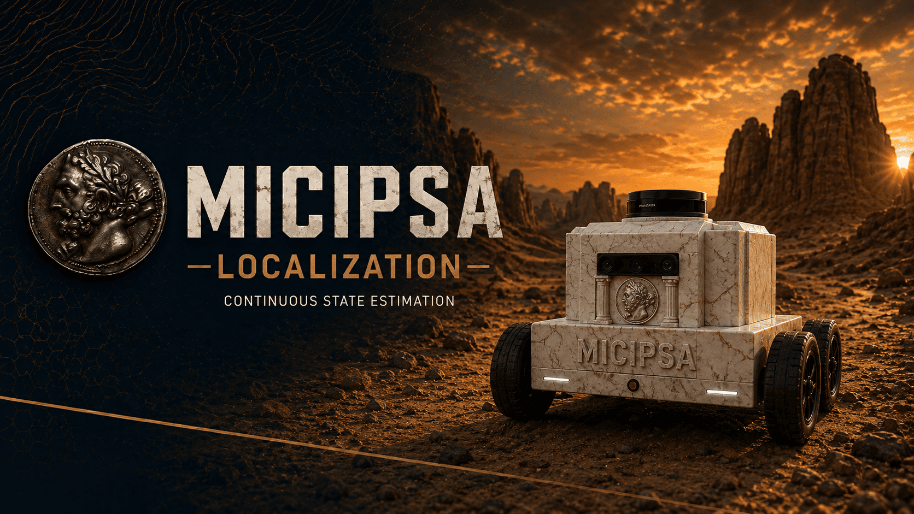
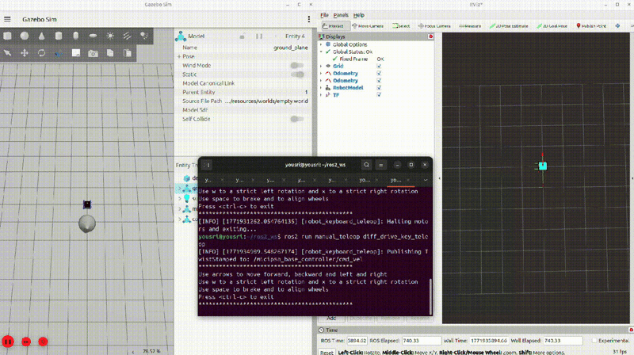
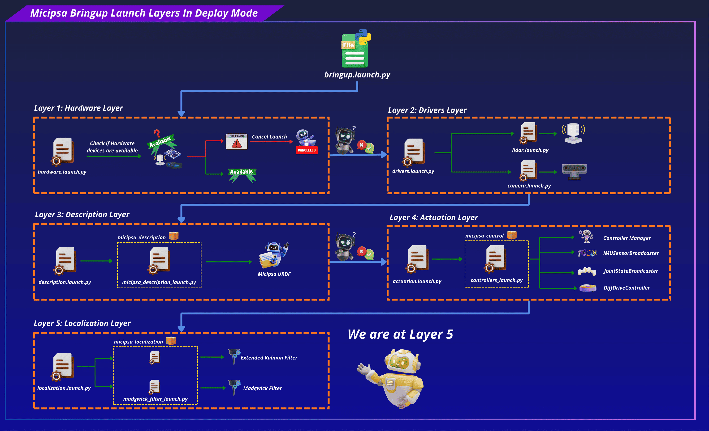
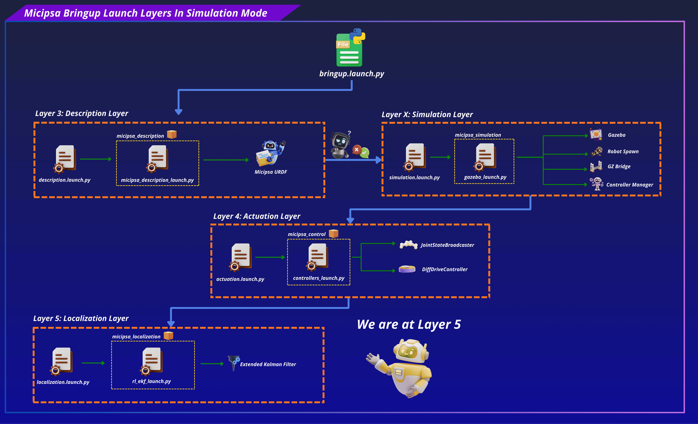
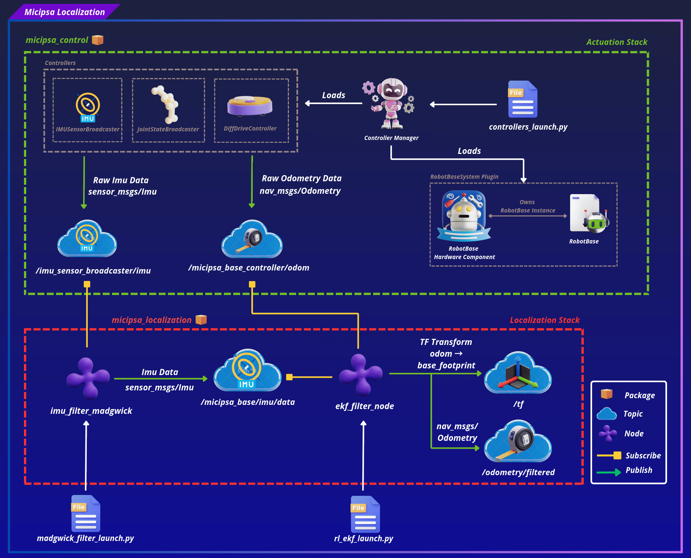

<div align="center">
  <p align="center">
    
  </p>
</div>

<div style="display: flex; justify-content: center; gap: 10px;">
  <p>
    
  </p>
  <p>
    
  </p>
  <p>
    
  </p>
</div>

---

## Overview

`micipsa_localization` is a ROS 2 package that provides continuous state estimation for Micipsa.

The package configures and launches two nodes:

- `robot_localization` Extended Kalman Filter (EKF), which fuses wheel odometry and IMU data into a smooth, continuous pose estimate published on `/odometry/filtered` and broadcast as the `odom → base_footprint` TF transform.
- `imu_filter_madgwick` node, which computes IMU orientation from raw gyroscope and accelerometer readings on real hardware in deploy mode.


<div align="center">
  <p align="center">
    
  </p>
</div>

---

## Architecture

`micipsa_localization` sits between the actuation stack and the navigation stack.

On `deploy mode` and working with real hardware, the IMU only publishes raw accelerometer and gyroscope readings without orientation, so the `Madgwick filter` must run first to compute orientation from those readings before the `EKF` can fuse them.

<div align="center">
  <p align="center">
    
  </p>
</div>

In simulation, `Layer 5` behaves differently, the `Madgwick filter` is not launched because Gazebo publishes full IMU data including orientation directly, so the `EKF` can consume it as-is.

`Layer 5` differs between simulation and hardware as follows (see `layer X`, `layer 4` and `layer 5`):

<div align="center">
  <p align="center">
    
  </p>
</div>

The `EKF` node consumes **raw odometry** and **IMU data** and produces the fused state estimate and `odom → base_footprint` TF transform.

<div align="center">
  <p align="center">
    
  </p>
</div>

---

### Sensor Fusion Strategy

The EKF fuses two inputs with complementary strengths. Wheel odometry provides reliable short-term linear velocity estimates but its heading estimate degrades over time due to wheel slip, uneven terrain, and encoder quantization all of which cause the integrated yaw to drift. The IMU gyroscope measures angular velocity directly from the physical rotation of the chassis, entirely independently of the wheels, so its heading information is unaffected by slip. Fusing both allows the EKF to use odometry for velocity while relying on the IMU to keep heading drift in check. Only the variables each sensor is best suited to provide are enabled in the fusion masks

| Sensor | Fused variables | Rationale |
|--------|----------------|-----------|
| `odom0` wheel odometry | `vx`, `vy`, `vyaw` | Velocity-only fusion, position is integrated by the EKF to avoid double-integration artifacts |
| `imu0`, IMU | `yaw` | Heading correction only, `imu0_relative: true` removes gyro bias at startup |

---

## ROS 2 Interface

### Published Topics

| Topic | Publisher | Type | QoS |
|-------|-----------|------|-----|
| `/odometry/filtered` | `ekf_filter_node` | `nav_msgs/Odometry` | `RELIABLE` / `VOLATILE` |
| `/tf` | `ekf_filter_node` | `tf2_msgs/msg/TFMessage` | `RELIABLE` / `VOLATILE` |
| `/micipsa_base/imu/data` | `imu_filter_madgwick_node` or `ros_gz_bridge` | `sensor_msgs/msg/Imu` | `RELIABLE` / `VOLATILE` |

### Subscribed Topics

| Topic | Subscriber | Type | QoS |
|-------|------------|------|-----|
| `/micipsa_base_controller/odom` | `ekf_filter_node` | `nav_msgs/Odometry` | `BEST_EFFORT` / `VOLATILE` |
| `/micipsa_base/imu/data` | `ekf_filter_node` | `sensor_msgs/Imu` | `BEST_EFFORT` / `VOLATILE` |
| `/imu_sensor_broadcaster/imu` | `imu_filter_madgwick` | `sensor_msgs/Imu` | `BEST_EFFORT` / `VOLATILE` |

> [!NOTE]
> On hardware, `imu_filter_madgwick` remaps its:
>
> - Input topic `/imu/data_raw` to `/imu_sensor_broadcaster/imu`
> - Output topic `/imu/data` to `/micipsa_base/imu/data`
>
> so the EKF receives the same topic name in both simulation and hardware without any additional remapping.

### TF Frames

| Transform | Publisher | Type |
|-----------|-----------|------|
| `odom → base_footprint` | `ekf_filter_node` | Dynamic (`/tf`) |

---

## Installation

> [!IMPORTANT]
> Micipsa can be run in two ways: **natively** on a ROS 2 host, or via **Docker** using pre-built containerized images. Choose your approach before proceeding:
>
> - **Native** build the package directly in a ROS 2 workspace.  Follow [requirements](#requirements) and the [Native Install](#native-install) steps below.
> - **Docker** use the Micipsa container stack, no manual workspace setup required. skip requirements section and follow [Docker](#docker) section.
>

### Requirements

First, make sure that the following packages are available in your workspace:

- [micipsa_common](../micipsa_common/README.md)
- [micipsa_control](../micipsa_description/README.md) (not required for building, needed in usage section)
- [micipsa_simulation](../micipsa_description/README.md) (not required for building, needed in usage section)

### Native Install

Source the ROS 2 environment:

```bash
source /opt/ros/jazzy/setup.bash
```

Install ROS dependencies from the workspace root:

```bash
cd ~/ros2_ws
rosdep update
rosdep install --from-paths src --ignore-src -r -y
```

Build the package:

```bash
colcon build --packages-select micipsa_common
colcon build --packages-select micipsa_localization
```

Source the install overlay:

```bash
source install/setup.bash
```

> [!TIP]
> Add `source /opt/ros/jazzy/setup.bash` and `source ~/ros2_ws/install/setup.bash` to your `~/.bashrc` to avoid repeating these steps in every new terminal.

### Docker

> [!TIP]
> Reading Micipsa Docker documentation (architecture, dockerfile, docker compose,...) is **strongly recommended**, it covers how the Dockerfiles are structured, how images are built, how containers are orchestrated, and much more.

To build and run `Micipsa Localization` Docker image, follow Micipsa Dockerfile README [Build Section](../../micipsa_docs/docs/docker/docker_file.md#build).

---

## Configuration

### Extended Kalman Filter

All EKF configuration lives in `config/rl_ekf.yaml`.

| Parameter | Value | Description |
|-----------|-------|-------------|
| `frequency` | `50.0` Hz | EKF prediction and publish rate |
| `two_d_mode` | `true` | Constrains estimation to x, y, yaw,  appropriate for flat-floor operation |
| `publish_tf` | `true` | Publishes `odom → base_footprint` TF |
| `odom_frame` | `odom` | Name of the odometry frame |
| `base_link_frame` | `base_footprint` | Name of the robot base frame |
| `world_frame` | `odom` | World reference frame (use `map` when AMCL or SLAM global localization is active) |
| `odom0` | `/micipsa_base_controller/odom` | Wheel odometry input topic |
| `imu0` | `/micipsa_base/imu/data` | IMU input topic |
| `imu0_relative` | `true` | Treats first IMU measurement as zero reference, removing gyro bias at startup |
| `imu0_differential` | `false` | Uses absolute IMU measurements, not differenced values |

The `odom0_config` and `imu0_config` arrays select which state variables each sensor contributes to the fusion. Variables are ordered as: `[x, y, z, roll, pitch, yaw, vx, vy, vz, vroll, vpitch, vyaw, ax, ay, az]`.

**`odom0_config`** wheel odometry contributes linear and angular velocities only:

```
[false, false, false,   # x, y, z
 false, false, false,   # roll, pitch, yaw
 true,  true,  false,   # vx, vy, vz
 false, false, true,    # vroll, vpitch, vyaw
 false, false, false]   # ax, ay, az
```

**`imu0_config`** IMU contributes heading (yaw) only:

```
[false, false, false,   # x, y, z
 false, false, true,    # roll, pitch, yaw
 false, false, false,   # vx, vy, vz
 false, false, false,   # vroll, vpitch, vyaw
 false, false, false]   # ax, ay, az
```

> [!WARNING]
> The `process_noise_covariance` and `initial_estimate_covariance` matrices in `rl_ekf.yaml` are tuned for the current Micipsa hardware and environment. Changing wheel geometry, IMU mounting, or operating surface may require re-tuning these values. Poorly tuned covariances will produce sluggish or unstable state estimates.

### Madgwick Filter

The Madgwick filter is configured entirely via launch arguments, it has no YAML file of its own.

The Madgwick filter is used on real hardware only to compute IMU orientation from raw gyroscope and accelerometer data before it reaches the EKF. It is not needed in simulation because Gazebo provides full IMU data including orientation.

All Madgwick parameters are launch arguments with the following defaults:

| Launch argument | Default | Description |
|----------------|---------|-------------|
| `madgwick_filter_use_mag` | `false` | Disable magnetometer (ICM20948 mag data is not used) |
| `madgwick_filter_gain` | `0.01` | Filter convergence gain,  lower values are smoother but slower to converge |
| `madgwick_filter_fixed_frame` | `base_footprint` | Fixed reference frame |
| `madgwick_filter_world_frame` | `enu` | World frame convention (`enu`, `ned`, or `nwu`) |
| `madgwick_filter_publish_tf` | `false` | Do not publish TF from the filter, the EKF owns the TF |

---

## Usage

### Simulation

Launch the robot description:

```bash
ros2 launch micipsa_description micipsa_description_launch.py
```

Launch Gazebo:

```bash
ros2 launch micipsa_simulation gazebo_launch.py
```

Launch the controllers:

```bash
ros2 launch micipsa_control controllers_launch.py
```

Launch the EKF:

```bash
ros2 launch micipsa_localization rl_ekf_launch.py
```

### Deploy

On real hardware, the Madgwick filter must be launched before the EKF so that `/micipsa_base/imu/data` is available when the EKF starts.

Launch the controllers:

```bash
ros2 launch micipsa_control controllers_launch.py
```

Launch the Madgwick filter first:

```bash
ros2 launch micipsa_localization madgwick_filter_launch.py
```

Then launch the EKF:

```bash
ros2 launch micipsa_localization rl_ekf_launch.py
```

To use a custom EKF config file:

```bash
ros2 launch micipsa_localization rl_ekf_launch.py ekf_config_file:=my_custom_ekf.yaml
```

---

## Validation

### Rviz

Open RViz and add the following displays:

- **Fixed Frame:** `odom`
- **Odometry** display subscribed to `/micipsa_base_controller/odom`, shows raw wheel odometry (red arrows)
- **Odometry** display subscribed to `/odometry/filtered` shows EKF-fused estimate (green arrows)
- **TF** display shows the live `odom → base_footprint` transform

Move the robot around to see the difference between raw odometry and filtered odometry.

<div align="center">
  <p align="center">
    
  </p>
</div>

> [!NOTE]
> Red arrows show raw odometry computed from wheel encoders only. Green arrows show the EKF-filtered estimate incorporating IMU heading correction.

### CLI

Confirm filtered odometry is being published:

```bash
ros2 topic echo /odometry/filtered --once
```

Confirm the `odom → base_footprint` TF is being broadcast:

```bash
ros2 run tf2_ros tf2_echo odom base_footprint
```

Check that the EKF node is running and receiving inputs:

```bash
ros2 node info /ekf_filter_node
```

---

## Additional Information

### Dependencies

#### Build Dependencies

These dependencies are required when building the package.

| Package | Role |
|---------|------|
| `ament_cmake` | Build system |
| `ament_cmake_python` | Python package installation support within a CMake package |

#### Runtime Dependencies

These dependencies are not required to build the package but are required when running it.

| Package | Role |
|---------|------|
| `robot_localization` | Provides the `ekf_node` executable |
| `imu_filter_madgwick` | Provides the `imu_filter_madgwick_node` executable for hardware IMU orientation |

#### Test Dependencies

Used only when running the package test suite.

| Package | Role |
|---------|------|
| `ament_lint_auto` | Runs the standard suite of linters configured for the workspace |
| `ament_lint_common` | Provides the common lint configurations used by `ament_lint_auto` |
| `ament_cmake_pytest` | Python test runner for colcon |
| `launch_testing_ament_cmake` | Launch test integration for colcon |
| `launch_testing` | Framework for launch-based integration tests |
| `launch` | Launch API used by test descriptions |
| `launch_ros` | ROS-specific launch actions used by tests |
| `ament_cmake_ros` | Provides `run_test_isolated.py` for isolated launch tests |

#### Micipsa Packages Dependencies

The following packages must be running before launching this package:

| Package | Role |
|---------|------|
| `micipsa_control` | Must be running so that `/micipsa_base_controller/odom` is published |
| `micipsa_hardware` or `micipsa_simulation` | Must be running so that `/micipsa_base/imu/data` is published |

---

### Testing

> [!NOTE]
> The integration test runs in Gazebo headless mode and does not require physical hardware. It requires `micipsa_description`, `micipsa_simulation`, and `micipsa_control` to be built in the same workspace.

### Launch Integration Tests

`test/test_localization_integration_launch.py` launches the full simulation localization stack, `micipsa_description`, `micipsa_simulation` (headless), `micipsa_control`, and `micipsa_localization`, and validates that:

- `/micipsa_base_controller/odom` topic becomes available within 90 seconds
- `/odometry/filtered` topic becomes available within 90 seconds
- A valid `nav_msgs/Odometry` message is received on `/odometry/filtered`
- The received message has non-empty `header.frame_id` and `child_frame_id` fields

The test uses polling loops with 90-second timeouts to account for Gazebo and controller startup timing.

### Running Tests

Run the integration tests:

```bash
colcon build --packages-select micipsa_localization
colcon test --packages-select micipsa_localization --ctest-args -L launch -V
colcon test-result --verbose
```

Run all tests:

```bash
colcon build --packages-select micipsa_localization
colcon test --packages-select micipsa_localization
colcon test-result --verbose
```

Clean test results between runs:

```bash
colcon test-result --delete-yes
```
