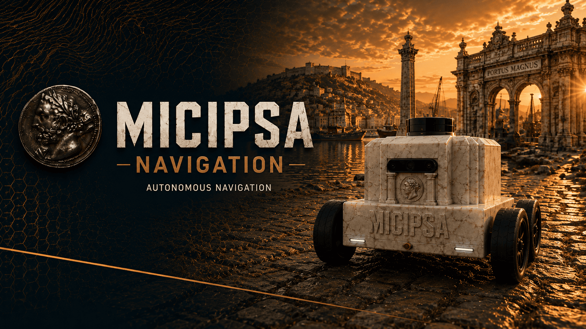
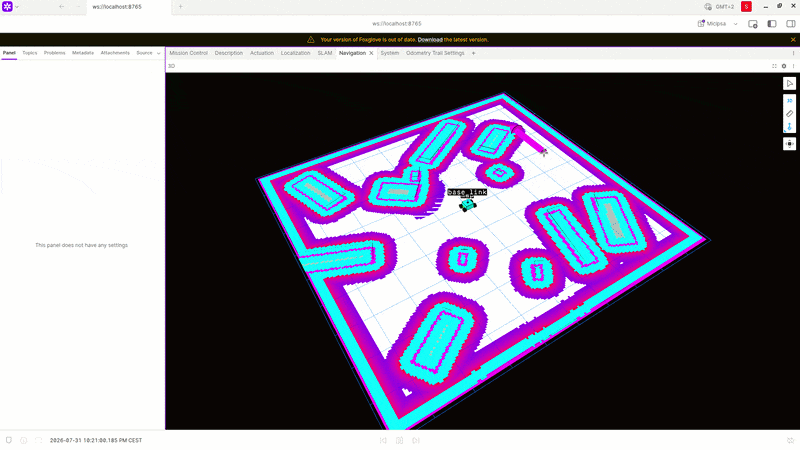
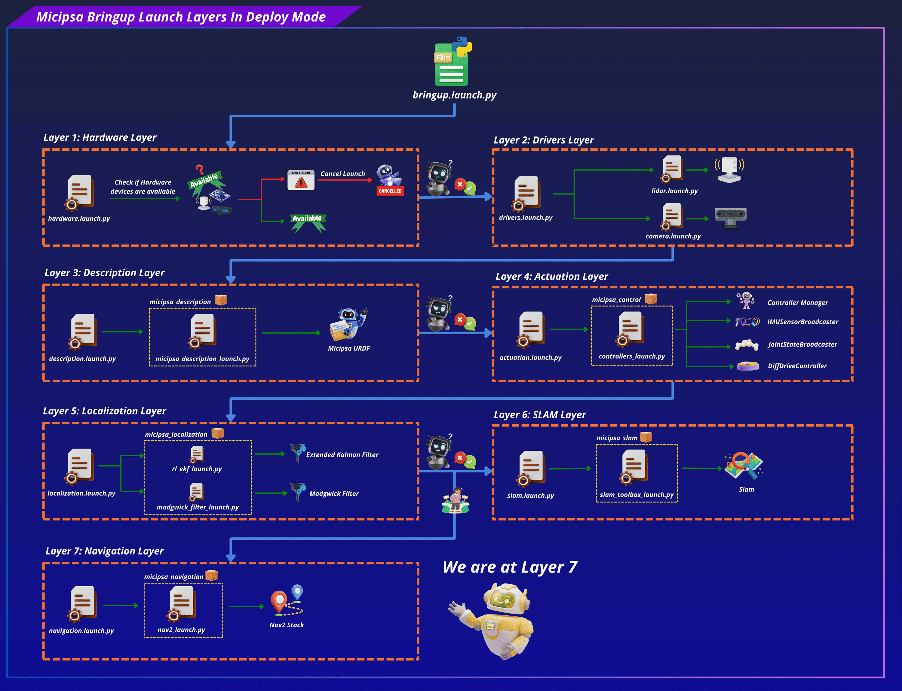
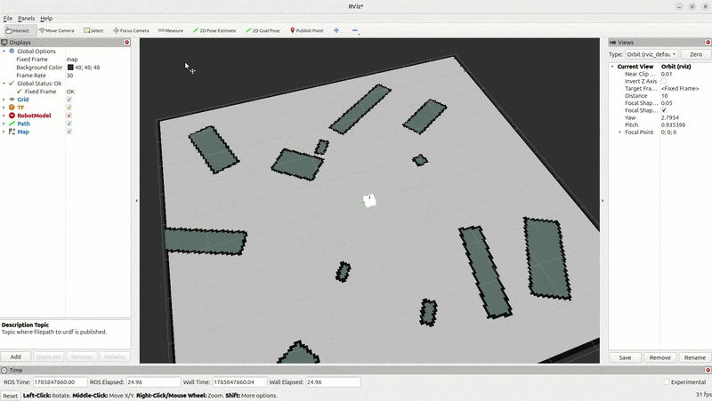

<div align="center">
  <p align="center">
    
  </p>
</div>

<div style="display: flex; justify-content: center; gap: 10px;">
  <p>
    
  </p>
  <p>
    
  </p>
  <p>
    
  </p>
</div>

---

## Overview

`micipsa_navigation` is a ROS 2 package that configures and launches the Nav2 stack to provide autonomous, collision-free navigation for Micipsa. It manages the full lifecycle of Nav2's stack.

In addition to standard navigation components, this package also launches a custom **dock pose detection node** (`dock_pose.py`) used to support docking behavior. This node uses poses of detected AprilTags in the robot’s environment, and filters these detections to identify a specific target frame defined by a `dock_frame` parameter, when the matching tag is detected, the node publishes its pose as a docking target.

<div align="center">
  <p align="center">
    
  </p>
</div>

---

## Architecture

`micipsa_navigation` sits at the top of the Micipsa autonomy stack. All underlying subsystems and layers must be running and healthy before this package can be activated. The only exception is the **SLAM layer**, if a map is already available, it can be loaded and the robot can localize against it using AMCL instead of running SLAM.

<div align="center">
  <p align="center">
    
  </p>
</div>

---

## ROS 2 Interface

### Published Topics

### TF broadcast

### Subscribed Topics

### Actions

### TF Subscriptions

---

## Installation

> [!IMPORTANT]
> Micipsa can be run in two ways: **natively** on a ROS 2 host, or via **Docker** using pre-built containerized images. Choose your approach before proceeding:
>
> - **Native** build the package directly in a ROS 2 workspace.  Follow [requirements](#requirements) and the [Native Install](#native-install) steps below.
> - **Docker** use the Micipsa container stack, no manual workspace setup required. skip requirements section and follow [Docker](#docker) section.

### Requirements

First, make sure that the following packages are available in your workspace:

- [micipsa_common](../micipsa_common/README.md)
- [micipsa_msgs](../micipsa_msgs/README.md)
- [micipsa_description](../micipsa_description/README.md) (not required for building, needed in usage section)
- [micipsa_control](../micipsa_description/README.md) (not required for building, needed in usage section)
- [micipsa_localization](../micipsa_localization/README.md) (not required for building, needed in usage section)
- [micipsa_maps](../micipsa_maps/README.md) (not required for building, needed in usage section)

If **deploy** only:

- [micipsa_core](../micipsa_core/README.md) (not required for building, needed in usage section)
- [micipsa_hardware](../micipsa_hardware/README.md) (not required for building, needed in usage section)

If **simulation** only:

- [micipsa_simulation](../micipsa_simulation/README.md) (not required for building, needed in usage section)

### Native Install

Source the ROS 2 installation:

```bash
source /opt/ros/jazzy/setup.bash
```

Install ROS2 dependencies:

```bash
cd ~/ros2_ws
rosdep update
rosdep install --from-paths src --ignore-src -r -y
```

Build the packages:

```bash
colcon build
```

Source the workspace:

```bash
source install/setup.bash
```

> [!TIP]
> Add `source /opt/ros/jazzy/setup.bash` and `source ~/ros2_ws/install/setup.bash` to your `~/.bashrc` to avoid repeating these steps in every new terminal.

### Docker

> [!TIP]
> Reading Micipsa Docker documentation (architecture, dockerfile, docker compose,...) is **strongly recommended**, it covers how the Dockerfiles are structured, how images are built, how containers are orchestrated, and much more.

To build and run `Micipsa Navigation` Docker image, follow Micipsa Dockerfile README [Build Section](../../micipsa_docs/docs/docker/docker_file.md#build).

---

## Configuration

---

## Usage

> [!IMPORTANT]
> If you want to enable docking capabilities in addition to autonomous navigation, start the `dock_pose_launch.py` launch file. Make sure to adjust its parameters according to the deployment mode.

### Simulation

Launch the full Micipsa simulation stack in order, each in a separate terminal:

```bash
ros2 launch micipsa_description micipsa_description_launch.py
```

```bash
ros2 launch micipsa_simulation gazebo_launch.py
```

```bash
ros2 launch micipsa_control controllers_launch.py
```

```bash
ros2 launch micipsa_control twist_mux_launch.py
```

```bash
ros2 launch micipsa_localization rl_ekf_launch.py
```

```bash
ros2 launch micipsa_navigation nav2_launch.py
```

To use a custom Nav2 config file:

```bash
ros2 launch micipsa_navigation nav2_launch.py nav2_config_file:=my_custom_nav2.yaml
```

### Deploy

```bash
ros2 launch micipsa_description micipsa_description_launch.py use_sim_time:=false deploy_mode:=true
```

```bash
ros2 launch micipsa_control controllers_launch.py use_sim_time:=false deploy_mode:=true
```

```bash
ros2 launch micipsa_control twist_mux_launch.py use_sim_time:=false
```

```bash
ros2 launch micipsa_localization rl_ekf_launch.py use_sim_time:=false
```

```bash
ros2 launch micipsa_navigation nav2_launch.py use_sim_time:=false
```

---

### Validation

#### Rviz

```bash
rviz2
```

In RViz Interface:

- Set **Fixed Frame** to `map`
- Add a **Map** display → topic `/map`
- Add a **Path** display → topic `/plan`
- Use the **2D Pose Estimate** tool to set the robot's initial pose on the map before sending a goal
- Use the **2D Goal Pose** tool to send a navigation goal and observe the planned path and robot motion

<div align="center">
  <p align="center">
    
  </p>
</div>

---

## Additional Information

### Dependencies

#### Build Dependencies

These dependencies are required when building the package.

| Package | Role |
|---------|------|
| `ament_cmake` | Build system |
| `ament_cmake_python` | Python package installation support within a CMake package |
| `micipsa_msgs` | Custom message/service definitions used at both build and run time |

#### Runtime Dependencies

These dependencies are not required to build the package but are required when running it.

| Package | Role |
|---|---|
| `nav2_map_server` | Serves the static occupancy grid map. |
| `nav2_amcl` | Performs localization using Adaptive Monte Carlo Localization (AMCL). |
| `nav2_planner` | Computes global paths to navigation goals. |
| `nav2_controller` | Computes local velocity commands to follow planned paths. |
| `nav2_bt_navigator` | Executes navigation behavior trees and coordinates navigation actions. |
| `nav2_smoother` | Smooths planned paths before execution. |
| `nav2_behaviors` | Provides recovery and utility behaviors (e.g., spin, backup, wait). |
| `nav2_velocity_smoother` | Filters and smooths outgoing velocity commands. |
| `nav2_collision_monitor` | Monitors sensor data and stops or slows the robot to avoid collisions. |
| `nav2_lifecycle_manager` | Manages the lifecycle state transitions of Nav2 nodes. |
| `nav2_navfn_planner` | Provides the NavFn global planner plugin used by `nav2_planner` to generate global paths. |
| `nav2_mppi_controller` | Provides the MPPI local controller plugin used by `nav2_controller` for trajectory optimization and path following. |
| `nav2_costmap_2d` | Provides the 2D costmap framework and plugins used for obstacle representation and environment modeling. |
| `opennav_docking` | Provides autonomous docking and undocking services. |

#### Test Dependencies

Used only when running the package test suite.

| Package | Role |
|---|---|
| `ament_lint_auto` / `ament_lint_common` | Code style and copyright linting |
| `ament_cmake_pytest` | Python test runner for colcon |
| `launch_testing_ament_cmake` | Launch test integration for colcon |
| `launch_testing` | Framework for launch-based integration tests |
| `launch` / `launch_ros` | Launch description construction in tests |
| `ament_cmake_ros` | Provides `run_test_isolated.py` for isolated launch tests |

#### Micipsa Packages Dependencies

The launch file and integration test require the following packages to be built and available at runtime:

| Package | Role |
|---|---|
| `micipsa_description` | Must be running so that the static TF tree (`base_footprint → laser_frame`) is published |
| `micipsa_control` | Must be running so that the robot's actuators and state interfaces are active |
| `micipsa_localization` | Must be running so that `/odometry/filtered` and `odom → base_footprint` TF are published |
| `micipsa_slam` | Must be running so that `/map` and the `map → odom` TF are published |
| `micipsa_simulation` or `micipsa_hardware, micipsa_core` | Must be running so that `/scan` is published |
| `micipsa_maps`| Must be available as generated maps are stored there |
| `micipsa_common` | Provides `resolve_config_path` and `warn` launch utilities |
| `micipsa_msgs` | Micipsa custom messages |

---

### Testing

> [!NOTE]
> All tests run headless and do not require simulation or physical hardware. They can be executed reliably in CI environments.

#### Launch Integration Tests

`test_navigation_integration_launch.py` validates the full Nav2 pipeline by launching:

- `micipsa_description` robot model and static TF
- `micipsa_simulation` Gazebo (headless)
- `micipsa_control` ros2_control controllers
- `micipsa_localization` robot_localization EKF
- `micipsa_slam` SLAM Toolbox
- `micipsa_navigation` Nav2 stack

**Success criteria:**

| # | Criterion |
|---|---|
| 1 | Nav2 action server `/navigate_to_pose` becomes available within 120 s |
| 2 | `/global_costmap/costmap` topic becomes available within 120 s |
| 3 | `/local_costmap/costmap` topic becomes available within 120 s |
| 4 | A valid `nav_msgs/OccupancyGrid` message is received on `/global_costmap/costmap` |
| 5 | A valid `nav_msgs/OccupancyGrid` message is received on `/local_costmap/costmap` |
| 6 | `global_costmap.header.frame_id == "map"` |
| 7 | `local_costmap.header.frame_id` is non-empty |
| 8 | Both costmap `width` and `height` metadata fields are non-negative |

A failure indicates one of: Nav2 lifecycle nodes failed to activate, a required TF transform is missing or delayed, SLAM or localization did not produce the expected outputs, a costmap plugin failed to initialise, or the action server was not created.

#### Running Tests

Run only the integration tests:

```bash
colcon build --packages-select micipsa_navigation
colcon test --packages-select micipsa_navigation --ctest-args -L launch -V
colcon test-result --verbose
```

Run all tests including linting:

```bash
colcon build --packages-select micipsa_navigation
colcon test --packages-select micipsa_navigation
colcon test-result --verbose
```

Clean test results between runs:

```bash
colcon test-result --delete-yes
```
