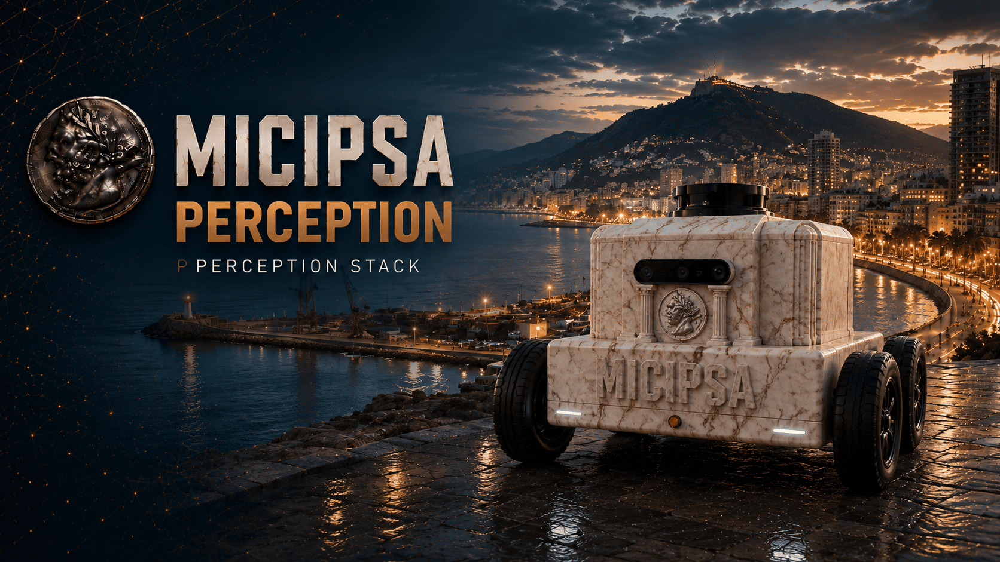
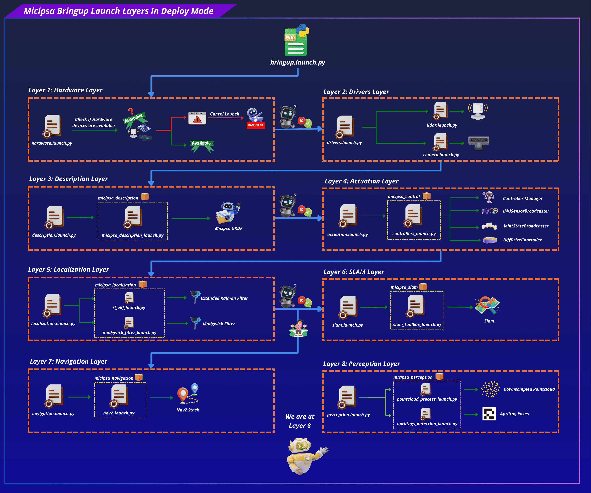
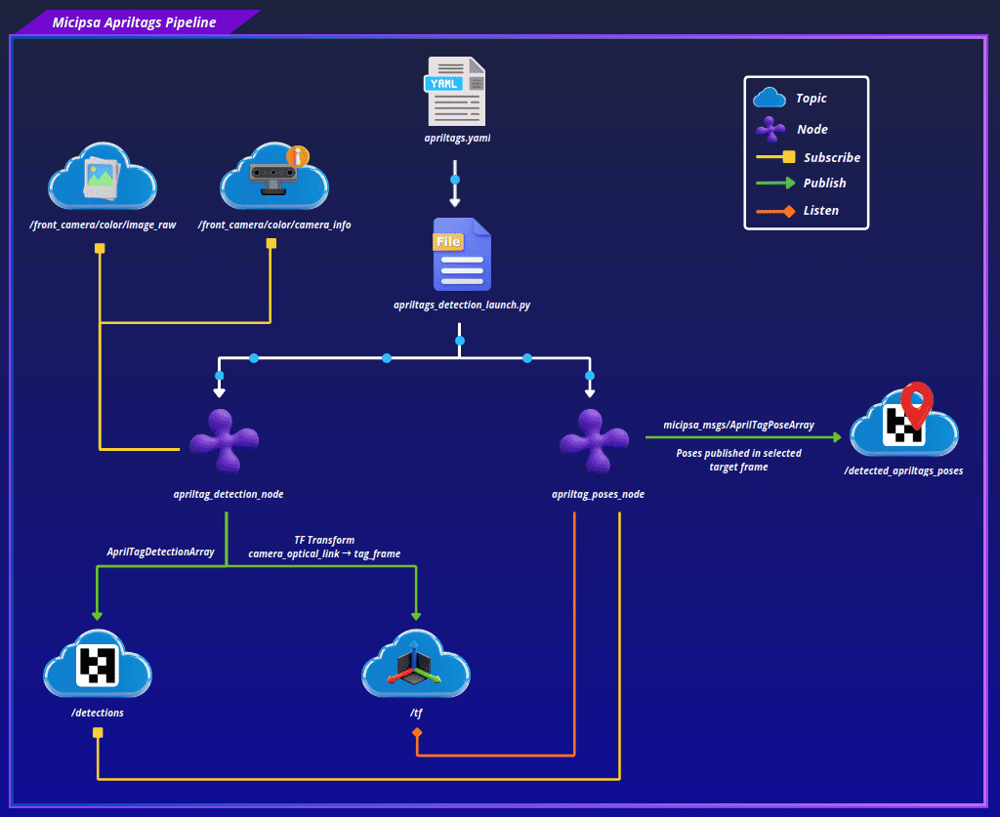
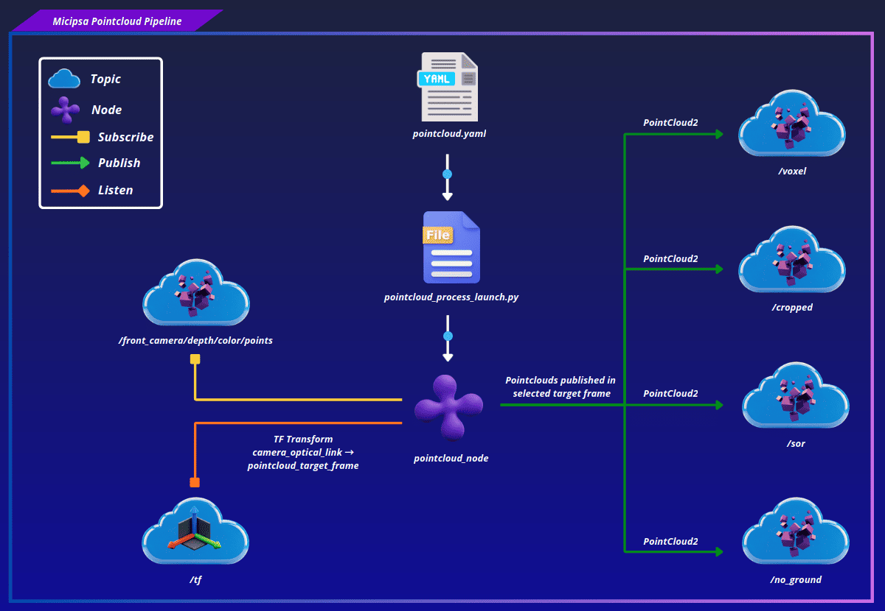

<div align="center">
  <p align="center">
    
  </p>
</div>

<div style="display: flex; justify-content: center; gap: 10px;">
  <p>
    
  </p>
  <p>
    
  </p>
  <p>
    
  </p>
</div>

---

## Overview

`micipsa_perception` is a ROS 2 package that contains a collection of modular perception pipelines for processing data from various sensors.

The **AprilTags pipeline** wraps the upstream `apriltag_ros` detector and adds a custom `apriltag_poses.py` node that transforms raw tag detections into a target frame and republishes them as `micipsa_msgs/AprilTagPoseArray`, used downstream for docking by `micipsa_navigation`.

The **pointcloud pipeline** is a custom C++ node (`pointcloud_node`) that filters the camera's depth pointcloud through a configurable crop box, voxel downsampling, statistical outlier removal, and optional ground plane segmentation, exposing each intermediate stage on its own topic.

<div align="center">
  <p align="center">
    
  </p>
</div>

---

## Architecture

`micipsa_perception` sits alongside `micipsa_localization` and `micipsa_slam` as a consumer of raw sensor data, and is itself a producer for `micipsa_navigation` (AprilTag dock poses) and any node interested in filtered, ground-segmented pointclouds.

<div align="center">
  <p align="center">
    
  </p>
</div>

### AprilTags Pipeline

`apriltags_detection_launch.py` starts two nodes in sequence:

- `apriltag_ros` node (remapped to consume `/front_camera/color/image_raw` and `/front_camera/color/camera_info`)
- `apriltag_poses.py` subscribes to `/detections` and looks up, for each detected tag ID, a corresponding frame name from the `tag.ids` / `tag.frames` arrays in `apriltags.yaml`. If a detected tag ID has no entry in that mapping, the detection is logged and dropped. For each known tag, the node looks up the transform from the tag's frame to the configured `target_frame`, builds an `AprilTagPose`, and publishes the batch as a single `AprilTagPoseArray` on `/detected_apriltags_poses`.

<div align="center">
  <p align="center">
    
  </p>
</div>

### Pointcloud Pipeline

`pointcloud_process_launch.py` starts a single node `pointcloud_node`, which subscribes to a configurable input pointcloud topic and applies a fixed-order filtering pipeline:

1. **Crop box** removes points outside a configurable bounding box (`x_crop_min/max`, `y_crop_min/max`, `z_crop_min/max`), applied in the sensor's own frame before any transform.
2. **Voxel grid downsampling** reduces point density using `voxel_leaf_size`, applied immediately after cropping and before the frame transform to keep the transform step cheap.
3. **Frame transform** reprojects the downsampled cloud into `pointcloud_world_frame`.
4. **Statistical outlier removal (SOR)** removes noise points based on `sor_mean_k` neighbors and `sor_stddev_multhresh`.
5. **Plane segmentation** (only when `pointcloud_is_3d: true`) uses PCL's `SACSegmentation` to fit a plane along a configurable axis (`plane_axis`) and removes inlier points, leaving the non-ground obstacle cloud.

<div align="center">
  <p align="center">
    
  </p>
</div>

Each stage's output is only converted back to a ROS message and published if its corresponding topic currently has at least one subscriber, avoiding unnecessary `pcl::toROSMsg` conversions when nobody is listening to a given intermediate stage.

---

## ROS 2 Interface

### Published Topics

| Topic | Publisher | Type | QoS |
|-------|-----------|------|-----|
| `/detected_apriltags_poses` | `apriltag_poses.py` | `micipsa_msgs/msg/AprilTagPoseArray` | `RELIABLE` / `VOLATILE` |
| `<pointcloud_sensor_name>/pointcloud/cropped` | `pointcloud_node` | `sensor_msgs/msg/PointCloud2` | `BEST_EFFORT` / `VOLATILE` |
| `<pointcloud_sensor_name>/pointcloud/voxel` | `pointcloud_node` | `sensor_msgs/msg/PointCloud2` | `BEST_EFFORT` / `VOLATILE` |
| `<pointcloud_sensor_name>/pointcloud/sor` | `pointcloud_node` | `sensor_msgs/msg/PointCloud2` | `BEST_EFFORT` / `VOLATILE` |
| `<pointcloud_sensor_name>/pointcloud/no_ground` | `pointcloud_node` | `sensor_msgs/msg/PointCloud2` | `BEST_EFFORT` / `VOLATILE` |

> [!NOTE]
> All four pointcloud output topics are prefixed with `pointcloud_sensor_name` (default `front_camera`), and each is only published while it has at least one active subscriber.

### Subscribed Topics

| Topic | Subscriber | Type | QoS |
|-------|------------|------|-----|
| `/detections` | `apriltag_poses.py` | `apriltag_msgs/msg/AprilTagDetectionArray` | `RELIABLE` / `VOLATILE` |
| `/front_camera/color/image_raw` | `apriltag_ros` | `sensor_msgs/msg/Image` | `RELIABLE` / `VOLATILE` |
| `/front_camera/color/camera_info` | `apriltag_ros` | `sensor_msgs/msg/CameraInfo` | `RELIABLE` / `VOLATILE` |
| `pointcloud_input_topic` | `pointcloud_node` | `sensor_msgs/msg/PointCloud2` | `BEST_EFFORT` / `VOLATILE` |

### TF Subscriptions

| Transform | Consumer | Description |
|-----------|----------|--------------|
| `<tag_frame> → target_frame` | `apriltag_poses.py` | Looked up per detected tag to express its pose in `target_frame` |
| `<sensor_frame> → pointcloud_world_frame` | `pointcloud_node` | Looked up once per incoming pointcloud message |

### Parameters

#### `apriltag_poses.py`

| Parameter | Type | Default | Description |
|-----------|------|---------|--------------|
| `config_file` | `string` | **required** | AprilTags YAML config |
| `target_frame` | `string` | `odom` | Frame to which detected tag poses are transformed into before publishing |

#### `pointcloud_node`

| Parameter | Type | Default | Description |
|-----------|------|---------|--------------|
| `pointcloud_sensor_name` | `string` | `unknown_pointcloud_sensor` | Prefix used to namespace all four output topics |
| `pointcloud_input_topic` | `string` | `/camera/depth/color/points` | Input pointcloud topic |
| `pointcloud_world_frame` | `string` | `map` | Target frame the cloud is transformed into |
| `pointcloud_is_3d` | `bool` | `true` | Enables plane segmentation (ground removal) as the final stage |
| `voxel_leaf_size` | `double` | `0.05` | Voxel grid leaf size in meters, reconfigurable at runtime |
| `x_crop_min` / `x_crop_max` | `double` | `-2.0` / `2.0` | Crop box bounds along X, reconfigurable at runtime |
| `y_crop_min` / `y_crop_max` | `double` | `-2.0` / `2.0` | Crop box bounds along Y, reconfigurable at runtime |
| `z_crop_min` / `z_crop_max` | `double` | `-1.0` / `1.0` | Crop box bounds along Z, reconfigurable at runtime |
| `sor_mean_k` | `int` | `50` | Number of neighbors analyzed for SOR, reconfigurable at runtime |
| `sor_stddev_multhresh` | `double` | `1.0` | SOR standard deviation multiplier threshold, reconfigurable at runtime |
| `plane_axis` | `string` | `UnitX` | Axis the segmented plane is expected to be perpendicular/parallel to (`UnitX`, `UnitY`, `UnitZ`) |
| `eps_angle` | `double` | `0.1745` (10°) | Allowed angular tolerance for plane segmentation, in radians |
| `optimize_coefficients` | `bool` | `true` | Refines the plane model coefficients after the initial RANSAC fit |
| `model_type` | `string` | `SACMODEL_PARALLEL_PLANE` | PCL SAC model type (`SACMODEL_PLANE`, `SACMODEL_PARALLEL_PLANE`, `SACMODEL_PERPENDICULAR_PLANE`) |
| `method_type` | `string` | `SAC_RANSAC` | PCL SAC method (`SAC_RANSAC`, `SAC_LMEDS`, `SAC_MSAC`, `SAC_RRANSAC`) |
| `plane_max_iterations` | `int` | `100` | Maximum RANSAC iterations for plane fitting |
| `plane_distance_threshold` | `double` | `0.02` | Maximum distance from the plane model for a point to be considered an inlier |

> [!NOTE]
> The defaults shown above are the C++ struct defaults in `pointcloud_processor.h`. The shipped `pointcloud.yaml` config overrides several of these (e.g. `plane_axis: "UnitZ"`, `model_type: "SACMODEL_PERPENDICULAR_PLANE"`) for Micipsa's actual sensor mounting.

### Launch Arguments

#### `apriltags_detection_launch.py`

| Argument | Type | Default | Description |
|----------|------|---------|--------------|
| `use_sim_time` | `bool` | `false` | Use simulation clock if true |
| `log_level` | `string` | `info` | ROS 2 log level (`info`, `warn`, `error`) |
| `apriltags_config_file` | `string` | `apriltags.yaml` | Name or path of the AprilTags YAML config |
| `apriltags_pose_target_frame` | `string` | `odom` | Frame the detected tag poses are transformed into |

#### `pointcloud_process_launch.py`

| Argument | Type | Default | Description |
|----------|------|---------|--------------|
| `use_sim_time` | `bool` | `false` | Use simulation clock if true |
| `log_level` | `string` | `info` | ROS 2 log level (`info`, `warn`, `error`) |
| `pointcloud_config_file` | `string` | `pointcloud.yaml` | Name or path of the pointcloud YAML config |

---

## Installation

> [!IMPORTANT]
> Micipsa can be run in two ways: **natively** on a ROS 2 host, or via **Docker** using pre-built containerized images. Choose your approach before proceeding:
>
> - **Native** build the package directly in a ROS 2 workspace.  Follow [requirements](#requirements) and the [Native Install](#native-install) steps below.
> - **Docker** use the Micipsa container stack, no manual workspace setup required. skip requirements section and follow [Docker](#docker) section.

### Requirements

First, make sure that the following packages are available in your workspace:

- [micipsa_common](../micipsa_common/README.md)
- [micipsa_msgs](../micipsa_msgs/README.md)
- [micipsa_description](../micipsa_description/README.md) (not required for building, needed in usage section)

If **deploy** only (and if you are using the same realsense d435i camera):

- [realsense_ros packages](../../third_party/ros/realsense-ros/README.md)
- RealSense SDK (librealsense) v2.58.x, see [RealSense SDK Installation](../../doc/README_realsense_sdk.md)

If **simulation** only:

- [micipsa_simulation](../micipsa_simulation/README.md) (not required for building, needed in usage section)

### Native Install

Source the ROS 2 environment:

```bash
source /opt/ros/jazzy/setup.bash
```

Install ROS 2 dependencies from the workspace root:

```bash
cd ~/ros2_ws
rosdep update
rosdep install --from-paths src --ignore-src -r -y
```

Build the package:

```bash
colcon build --packages-select micipsa_common
colcon build --packages-select micipsa_msgs
colcon build --packages-select micipsa_perception
```

> [!IMPORTANT]
> If you are running in deploy mode, ensure that the camera-related packages are also built and installed.

Source the install overlay:

```bash
source install/setup.bash
```

> [!TIP]
> Add `source /opt/ros/jazzy/setup.bash` and `source ~/ros2_ws/install/setup.bash` to your `~/.bashrc` to avoid repeating these steps in every new terminal.

### Docker

> [!TIP]
> Reading Micipsa Docker documentation (architecture, dockerfile, docker compose,...) is **strongly recommended**, it covers how the Dockerfiles are structured, how images are built, how containers are orchestrated, and much more.

To build and run `Micipsa Perception` Docker image, follow Micipsa Dockerfile README [Build Section](../../micipsa_docs/docs/docker/docker_file.md#build).

---

## Configuration

### AprilTags (`apriltags.yaml`)

The `tag` block defines the known tags as three parallel arrays, `ids`, `frames`, and `sizes`, indexed positionally. A tag ID with no corresponding entry is treated as unknown by `apriltag_poses.py` and its detections are dropped.

```yaml
tag:
  ids: [0, 1, 2]
  frames: [home_dock, fruit_dock, store_dock]
  sizes: [0.1, 0.1, 0.1]
```

> [!WARNING]
> `ids`, `frames`, and `sizes` must stay the same length and in the same order. A mismatch between `ids` and `frames` is not validated by `apriltag_poses.py` at load time (only the detector itself reads `sizes`), so a misaligned entry will silently associate the wrong frame name with a tag ID.

The detector block controls the upstream `apriltag_ros` node directly: `family`, `size`, `max_hamming`, and the `detector.*` tuning parameters (`threads`, `decimate`, `blur`, `refine`, `sharpening`, `debug`).

### Pointcloud (`pointcloud.yaml`)

Pointcloud parameters are also reconfigurable at runtime through a single `rclcpp` parameter callback. Each parameter group (crop, voxel, SOR, plane) has its own validation function; an invalid value (e.g. `x_crop_min >= x_crop_max`, a negative `voxel_leaf_size`, or an unrecognized `plane_axis`) is rejected with a reason string, and the update is applied to `PointCloudProcessor` only if every changed parameter in the batch passes validation.

---

## Usage

### AprilTags Detection

```bash
ros2 launch micipsa_perception apriltags_detection_launch.py
```

To change the target frame detections are transformed into:

```bash
ros2 launch micipsa_perception apriltags_detection_launch.py \
  apriltags_pose_target_frame:=odom
```

To use a custom AprilTags config file:

```bash
ros2 launch micipsa_perception apriltags_detection_launch.py \
  apriltags_config_file:=my_custom_apriltags.yaml
```

### Pointcloud Processing

```bash
ros2 launch micipsa_perception pointcloud_process_launch.py
```

To use a custom pointcloud config file:

```bash
ros2 launch micipsa_perception pointcloud_process_launch.py \
  pointcloud_config_file:=my_custom_pointcloud.yaml
```

---

## Validation

Confirm AprilTag poses are being published once a tag is visible to the camera:

```bash
ros2 topic echo /detected_apriltags_poses --once
```

Confirm raw detections are arriving from `apriltag_ros` (useful to isolate whether a missing pose is a detection issue or a frame-mapping issue):

```bash
ros2 topic echo /detections --once
```

Confirm pointcloud filtering stages are publishing (each only appears once it has a subscriber, so this requires a tool like RViz or `ros2 topic echo` actively subscribed):

```bash
ros2 topic list | grep pointcloud
ros2 topic echo /front_camera/pointcloud/no_ground --once
```

For visual validation, open RViz and add a **PointCloud2** display for each pipeline stage of interest, and a **TF** display to confirm the AprilTag-to-`target_frame` transform chain is intact.

---

## Additional Information

### Dependencies

#### Build Dependencies

These dependencies are required when building the package.

| Package | Role |
|---------|------|
| `ament_cmake` | Build system |
| `pcl_conversions` | Conversions between PCL point clouds and ROS `PointCloud2` messages |
| `pcl_ros` | PCL/ROS integration utilities used by the pointcloud pipeline |

#### Runtime Dependencies

These dependencies are not required to build the package but are required when running it.

| Package | Role |
|---------|------|
| `rclcpp` | ROS 2 C++ client library, used by `pointcloud_node` |
| `sensor_msgs` | `PointCloud2`, `Image`, `CameraInfo` message types |
| `geometry_msgs` | `Pose` and related types |
| `visualization_msgs` | `Marker` message type, included by `pointcloud_node.h` |
| `tf2_ros` | TF lookups for both pipelines |
| `tf2_sensor_msgs` | TF-aware conversions for sensor messages, used by `pointcloud_node` |
| `apriltag_ros` | Provides the upstream `apriltag_node` executable |
| `apriltag_msgs` | `AprilTagDetectionArray` message type consumed by `apriltag_poses.py` |

#### Test Dependencies

Used only when running the package test suite.

| Package | Role |
|---|---|
| `ament_lint_auto` / `ament_lint_common` | Code style and copyright linting |

#### Micipsa Packages Dependencies

The launch files for both pipelines import shared launch utilities that are not currently declared as `exec_depend` in `package.xml`:

| Package | Role |
|---------|------|
| `micipsa_common` | Provides `resolve_config_path()` (both launch files) and `utils.console_utils.warn()` |
| `micipsa_msgs` | Provides `AprilTagPose` / `AprilTagPoseArray`, used at both build and run time |

---

### Troubleshooting

#### AprilTag detected but no pose published

**Symptom:** `/detections` shows tag detections, but `/detected_apriltags_poses` never publishes for that tag.

**Cause:** The detected tag's ID has no matching entry in `tag.ids` / `tag.frames` in the resolved AprilTags config, so `apriltag_poses.py` logs it as an unknown tag and drops it. This can also happen if the TF lookup from the tag's frame to `target_frame` fails (missing or stale transform).

**Fix:** Confirm the tag ID is listed in `apriltags.yaml`'s `tag.ids` array with a matching `frames` entry at the same index. Confirm the transform chain is healthy:

```bash
ros2 run tf2_ros tf2_echo <tag_frame> <target_frame>
```

#### Pointcloud output topics never appear

**Symptom:** None of the `pointcloud_node` output topics show up in `ros2 topic list`, or they appear but never publish data.

**Cause:** Each output topic is only published while it has at least one active subscriber. If nothing is subscribed (e.g. RViz isn't open, or no downstream node is consuming it), the topic exists but produces no messages.

**Fix:** Subscribe to the topic to trigger publication:

```bash
ros2 topic echo <pointcloud_sensor_name>/pointcloud/voxel --once
```

#### Pointcloud is empty or heavily clipped

**Symptom:** The filtered pointcloud topics publish messages, but they contain very few or no points.

**Cause:** The crop box bounds (`x_crop_min/max`, `y_crop_min/max`, `z_crop_min/max`) are too tight for the sensor's actual field of view, or the configured `pointcloud_world_frame` transform places the cloud outside the crop region after reprojection.

**Fix:** Temporarily widen the crop bounds via a runtime parameter update to confirm the issue:

```bash
ros2 param set /pointcloud_node x_crop_min -5.0
ros2 param set /pointcloud_node x_crop_max 5.0
```

If points reappear, narrow the bounds back down deliberately rather than leaving them wide.

#### Parameter update rejected at runtime

**Symptom:** `ros2 param set` on a pointcloud parameter returns `successful: False` with a reason message.

**Cause:** The new value failed validation in one of the parameter callback's update functions, for example `x_crop_min >= x_crop_max`, a non-positive `voxel_leaf_size` or `sor_mean_k`, or a `plane_axis` / `model_type` / `method_type` value outside the accepted set.

**Fix:** Check the returned reason string and adjust the value accordingly; valid `plane_axis` values are `UnitX`, `UnitY`, `UnitZ`; valid `model_type` values are `SACMODEL_PLANE`, `SACMODEL_PARALLEL_PLANE`, `SACMODEL_PERPENDICULAR_PLANE`; valid `method_type` values are `SAC_RANSAC`, `SAC_LMEDS`, `SAC_MSAC`, `SAC_RRANSAC`.