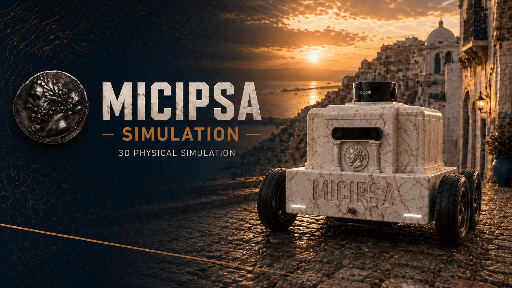
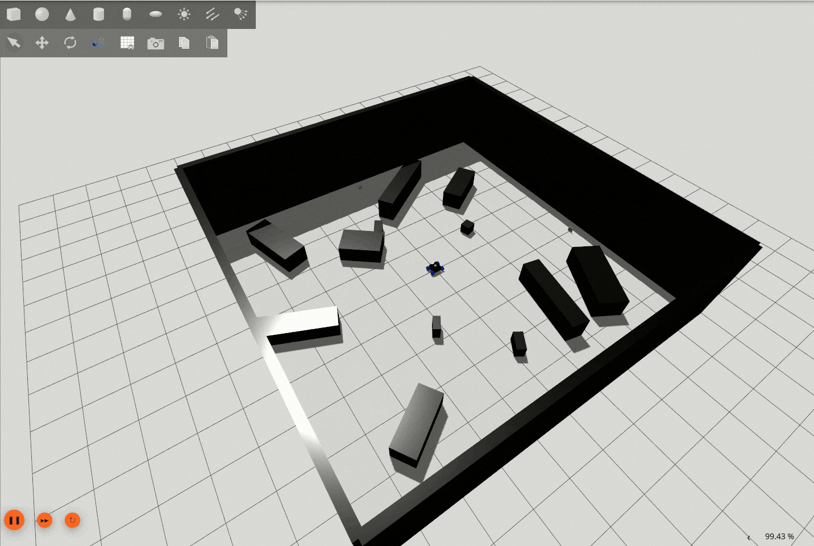
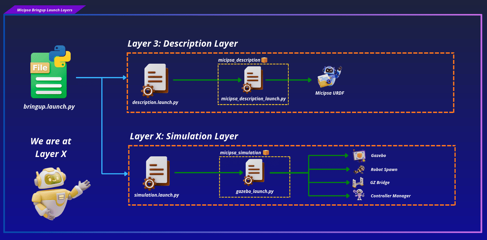
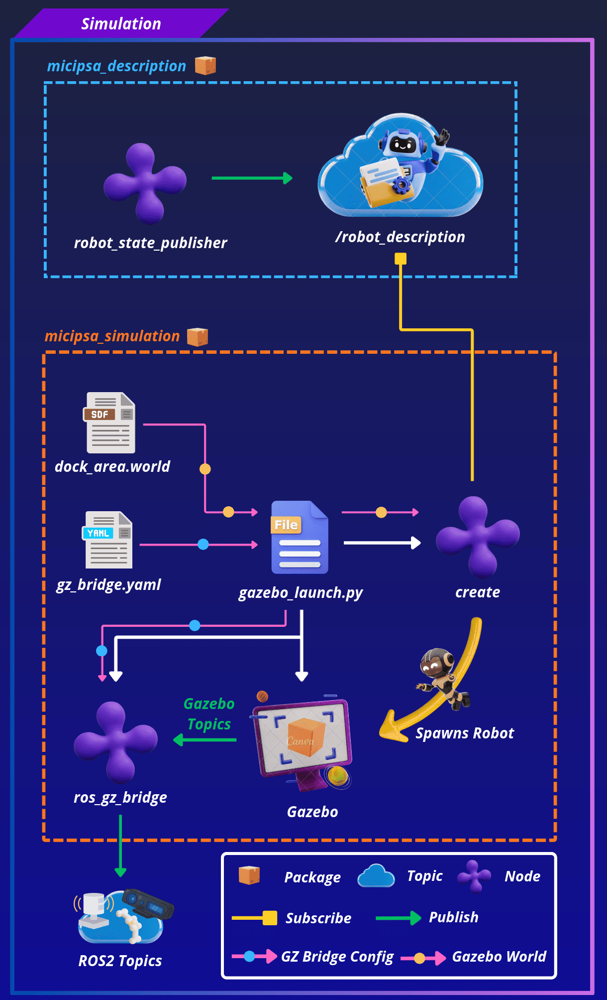
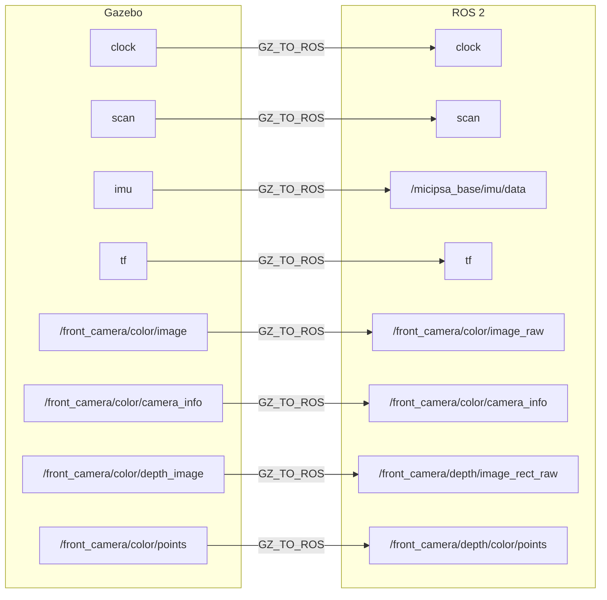
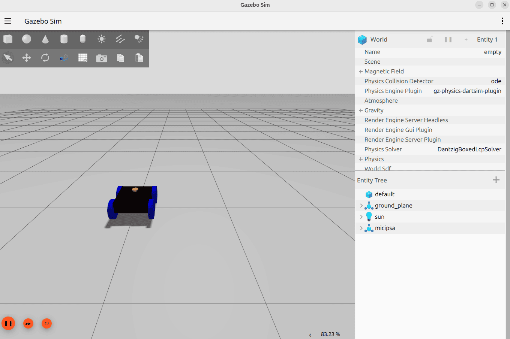

<p align="center">
  
</p>

<div style="display: flex; justify-content: center; gap: 10px;">
  <p>
    
  </p>
  <p>
    
  </p>
  <p>
    
  </p>
</div>

---

## Overview

`micipsa_simulation` is a ROS 2 package that provides the Gazebo simulation environment for Micipsa. It launches Gazebo Harmonic, spawns the robot model from the `/robot_description` topic published by `micipsa_description`, and starts the `ros_gz_bridge` node that forwards sensor data and simulation clock from Gazebo to ROS 2. This package is the simulation counterpart to the physical hardware stack, it replaces `micipsa_hardware` with Gazebo physics and virtual sensors.

<div align="center">
  <p align="center">
    
  </p>
</div>

---

## Architecture

`micipsa_simulation` replaces the physical hardware layer for development and testing.

<div align="center">
  <p align="center">
    
  </p>
</div>

<div align="center">
  <p align="center">
    
  </p>
</div>

`gazebo_launch.py` is responsible for three things:
- Starting Gazebo
- Spawning the robot
- Starting gz bridge.

The controller manager is started internally by the `gz_ros2_control` plugin loaded from the robot description (URDF).

> [!NOTE]
> Controllers such as `DiffDriveController`, `JointStateBroadcaster`,`IMUSensorBroadcaster` are managed and launched by `micipsa_control`, to control and move the robot the controllers must be launched separately after the robot is loaded in gazebo.

### Bridge Architecture

All sensor data flows from Gazebo to ROS 2 through `ros_gz_bridge`. The bridge configuration in `gz_bridge.yaml` is the authoritative mapping between Gazebo topic names and ROS 2 topic names:



---

## ROS 2 Interface

### Published Topics

All topics below are published by `ros_gz_bridge` after being bridged from Gazebo. All bridges are `GZ_TO_ROS` direction.

| Topic | Publisher | Type | QoS |
|-------|-----------|------|-----|
| `/clock` | `ros_gz_bridge` | `rosgraph_msgs/Clock` | `RELIABLE` / `TRANSIENT_LOCAL` |
| `/scan` | `ros_gz_bridge` | `sensor_msgs/LaserScan` | `BEST_EFFORT` / `VOLATILE` |
| `/front_camera/color/image_raw` | `ros_gz_bridge` | `sensor_msgs/Image` | `RELIABLE` / `VOLATILE` |
| `/front_camera/color/camera_info` | `ros_gz_bridge` | `sensor_msgs/CameraInfo` | `RELIABLE` / `VOLATILE` |
| `/front_camera/depth/image_rect_raw` | `ros_gz_bridge` | `sensor_msgs/Image` | `RELIABLE` / `VOLATILE` |
| `/front_camera/depth/color/points` | `ros_gz_bridge` | `sensor_msgs/PointCloud2` | `RELIABLE` / `VOLATILE` |
| `/micipsa_base/imu/data` | `ros_gz_bridge` | `sensor_msgs/Imu` | `RELIABLE` / `VOLATILE` |
| `/tf` | `ros_gz_bridge` | `tf2_msgs/TFMessage` | `RELIABLE` / `VOLATILE` |


### Launch Arguments

| Argument | Type | Default | Description |
|----------|------|---------|-------------|
| `log_level` | `string` | `info` | Log verbosity for `robot_state_publisher` (`debug`, `info`, `warn`, `error`) |
| `headless` | `bool` | `false` | `true` gazebo runs without a gui |
| `simulation_world_file` | `string` | `dock_area.world` | Name of the simulation world |

---

## Installation

> [!IMPORTANT]
> Micipsa can be run in two ways: **natively** on a ROS 2 host, or via **Docker** using pre-built containerized images. Choose your approach before proceeding:
>
> - **Native** build the package directly in a ROS 2 workspace.  Follow [requirements](#requirements) and the [Native Install](#native-install) steps below.
> - **Docker** use the Micipsa container stack, no manual workspace setup required. skip requirements section and follow [Docker](#docker) section.

### Requirements

First, make sure that the following packages are available in your workspace:

- [micipsa_common](../micipsa_common/README.md)
- [micipsa_description](../micipsa_description/README.md) (not required for building, needed in usage section)

#### Optional System Dependencies

If Gazebo fails to render (black screen or EGL errors):

```bash
sudo apt-get install libgl1-mesa-dri
```

### Native Install

Source the ROS 2 environment:

```bash
source /opt/ros/jazzy/setup.bash
```

Install ROS2 dependencies from the workspace root:

```bash
cd ~/ros2_ws
rosdep update
rosdep install --from-paths src --ignore-src -r -y
```

Build the package:

```bash
colcon build --packages-select micipsa_common
colcon build --packages-select micipsa_simulation
```

Source the install overlay:

```bash
source install/setup.bash
```

> [!TIP]
> Add `source /opt/ros/jazzy/setup.bash` and `source ~/ros2_ws/install/setup.bash` to your `~/.bashrc` to avoid repeating these steps in every new terminal.

### Docker

> [!TIP]
> Reading Micipsa Docker documentation (architecture, dockerfile, docker compose,...) is **strongly recommended**, it covers how the Dockerfiles are structured, how images are built, how containers are orchestrated, and much more.

To build and run `Micipsa Simulation` Docker image, follow Micipsa Dockerfile README [Build Section](../../micipsa_docs/docs/docker/docker_file.md#build).

---

## Configuration

### World File

> [!NOTE]
> World file resolution in this package does not follow the standard `resolve_config_path()` pattern used elsewhere in the Micipsa workspace. `simulation_world_file` is resolved via `find_file()`, which looks only inside this package's own `resources/worlds/` directory , there is no `micipsa_bringup` lookup or fallback chain.
> Custom worlds must be placed directly in `resources/worlds/` or referenced by absolute path.

The default world is `resources/worlds/dock_area.world`, to add a new world permanently place the `.world` file in `resources/worlds/`.

To use the new created world pass its path or name to the `simulation_world_file` launch argument when running the simulation launch file, see [Usage](#usage) section for more details.

> [!NOTE]
> The `GZ_SIM_RESOURCE_PATH` environment variable is extended at launch time to include the package's `resources/` directory. Gazebo will find models and worlds placed there automatically without any manual environment configuration.

### Topic Bridge

`config/gz_bridge.yaml` is the single file that controls which Gazebo topics are forwarded to ROS 2. Each entry specifies the ROS 2 topic name, the Gazebo topic name, the message types on both sides, and the bridge direction. All current bridges are `GZ_TO_ROS` (Gazebo → ROS 2).

To add a new sensor or topic bridge, add an entry to `gz_bridge.yaml` following the existing pattern and rebuild:

> [!WARNING]
> -  `/scan` and `/front_camera/depth/color/points` topicss QoS are overridden in `gazebo_launch.py` to `BEST_EFFORT` reliability as at the current moment this can not be set from within the `gz_bridge` file.
> - Downstream nodes subscribing to `/scan` or `/front_camera/depth/color/points` must use a compatible QoS profile

### Robot Spawn Pose

The default spawn pose is defined in `gazebo_launch.py` as `x=0.0`, `y=0.0`, `z=0.2` with zero rotation.
All six pose components can be overridden at launch time without modifying the file.

---

## Usage

> [!NOTE]
> This package does not start Micipsa controllers. In order to teleoperate the robot you have to launch `micipsa_control` once the simulation is running to spawn the `DiffDriveController`.
> Refer to the `micipsa_control` [README](../micipsa_control/README.md#usage) for instructions.

This package requires `micipsa_description` to be running first so that `/robot_description` is available for the robot spawner.

Launch the robot description:

```bash
ros2 launch micipsa_description micipsa_description_launch.py
```

Launch Gazebo simulation:

```bash
ros2 launch micipsa_simulation gazebo_launch.py
```

<p align="center">
  
</p>

To use a custom world:

```bash
ros2 launch micipsa_simulation gazebo_launch.py \
  simulation_world_file:=/path/to/your/custom.world
```

To run headlessly (no GUI, for CI or remote servers):

```bash
ros2 launch micipsa_simulation gazebo_launch.py headless:=true
```

To spawn the robot at a custom pose:

```bash
ros2 launch micipsa_simulation gazebo_launch.py \
  x_pose:=0.0 y_pose:=0.0 z_pose:=0.3 yaw:=1.57
```

---

## Validation

Confirm all bridged topics are being published:

```bash
ros2 topic list
```

Check that the LiDAR scan is arriving:

```bash
ros2 topic echo /scan --once
```

Check that the simulation clock is running:

```bash
ros2 topic echo /clock --once
```

Confirm the robot is visible in Gazebo and that the model loaded without errors in the Gazebo terminal output.

---

## Additional Information

### Dependencies

#### Build Dependencies

These dependencies are required when building the package.

| Package | Role |
|---------|------|
| `ament_cmake` | Build system |

#### Runtime Dependencies

These dependencies are not required to build the package but are required when running it.

| Package | Role |
|---------|------|
| `ros_gz_sim` | Provides `gz_sim.launch.py` and the `ros_gz_sim create` node for robot spawning |
| `gz_ros2_control` | Gazebo plugin that starts the `ros2_control` controller manager inside Gazebo |
| `ros_gz_bridge` | ROS 2 ↔ Gazebo topic bridge node |

#### Test Dependencies

Used only when running the package test suite.

| Package | Role |
|---------|------|
| `ament_lint_auto` | Runs the standard suite of linters configured for the workspace |
| `ament_lint_common` | Provides the common lint configurations (copyright, cpplint, etc.) used by `ament_lint_auto` |

#### Micipsa Packages Dependencies

The launch file and integration test require the following packages to be built and available at runtime:

| Package | Role |
|---------|------|
| `micipsa_common` | Provides `resolve_config_path()` and `utils.console_utils.warn()`, imported directly by `behavior_launch.py` |
| `micipsa_description` | Provides the URDF with the `<ros2_control>` hardware block |
