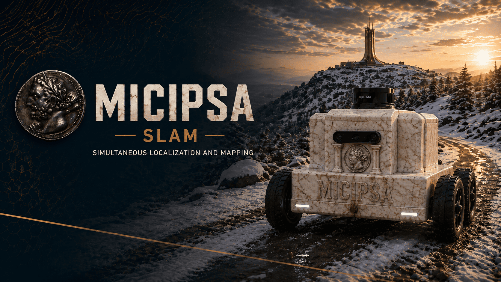
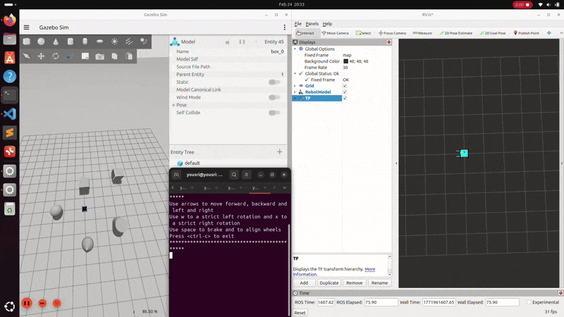
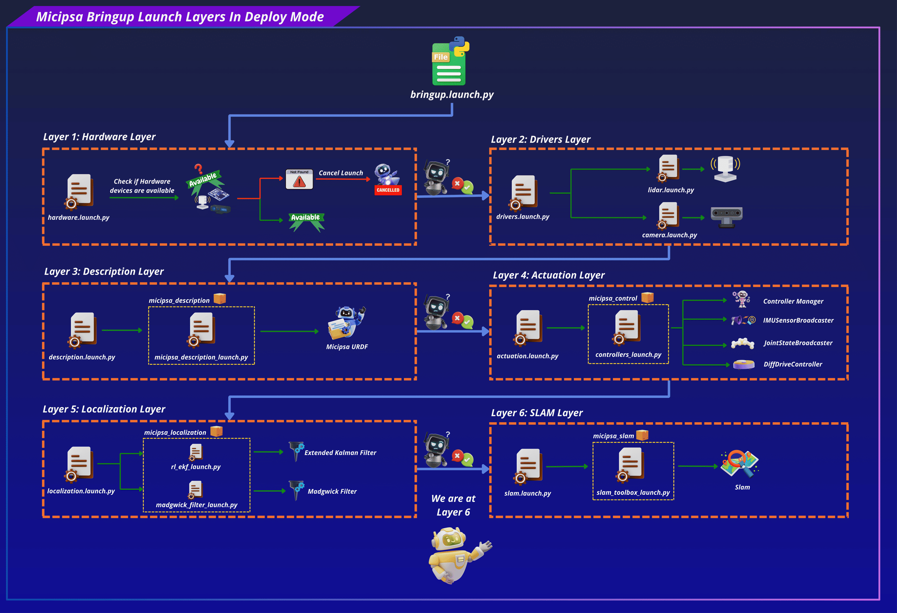
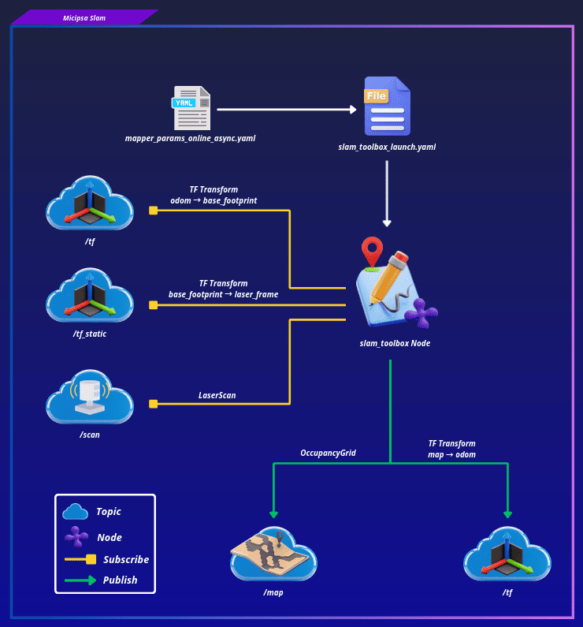
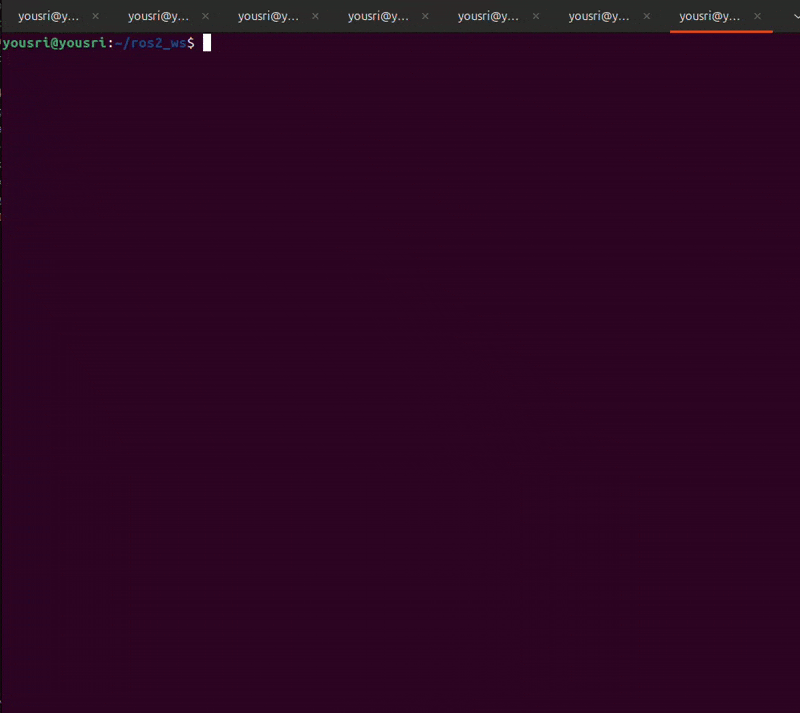

<div align="center">
  <p align="center">
    
  </p>
</div>

<div style="display: flex; justify-content: center; gap: 10px;">
  <p>
    
  </p>
  <p>
    
  </p>
  <p>
    
  </p>
</div>

---

## Overview

`micipsa_slam` is a ROS 2 package that configures and launches `slam_toolbox` in online asynchronous mode to perform 2D SLAM. It subscribes to 2D LiDAR scans on `/scan` and consumes the `odom → base_footprint` transform provided by `micipsa_localization` to build a live occupancy grid map published on `/map` and continuously estimate the `map → odom` transform.

In addition to mapping, the package also includes a **map saving** feature based on `nav2_map_server`’s `map_saver_server`. This node is responsible for exporting the currently generated occupancy grid map to disk when triggered.

<div align="center">
  <p align="center">
    
  </p>
</div>

---

## Architecture

`micipsa_slam` sits between the localization stack and the navigation stack.

`micipsa_slam` is a **pure configuration and launch package**, it contains no custom nodes or C++ source. Its single responsibility is to configure and launch the upstream `slam_toolbox` with the correct parameters and frame conventions for Micipsa as well as the `map_saver`.

<div align="center">
  <p align="center">
    
  </p>
</div>

<div align="center">
  <p align="center">
    
  </p>
</div>

---

## ROS 2 Interface

### Published Topics

| Topic | Publisher | Type | QoS |
|---|---|---|---|
| `/map` | `async_slam_toolbox_node` | `nav_msgs/OccupancyGrid` | `RELIABLE` / `TRANSIENT_LOCAL` |
| `/tf` | `async_slam_toolbox_node` | `tf2_msgs/msg/TFMessage` | `RELIABLE` / `VOLATILE` |

### TF Broadcast

| Transform | Broadcaster | Rate |
|---|---|---|
| `map → odom` | `async_slam_toolbox_node` | 50 Hz |

### Subscribed Topics

| Topic | Subscriber | Type | QoS |
|---|---|---|---|
| `/scan` | `async_slam_toolbox_node` | `sensor_msgs/LaserScan` | `RELIABLE` / `VOLATILE` |
| `/tf` | `async_slam_toolbox_node` | `tf2_msgs/TFMessage` | `RELIABLE` / `VOLATILE` |
| `/tf_static` | `async_slam_toolbox_node` | `tf2_msgs/TFMessage` | `RELIABLE` / `TRANSIENT_LOCAL` |

### TF Subscriptions

| Transform | Consumer | Description |
|---|---|---|
| `odom → base_footprint` | `async_slam_toolbox_node` | Local odometry from `micipsa_localization` EKF required before map generation starts |
| `base_footprint → laser_frame` | `async_slam_toolbox_node` | Required to project scans into the robot frame |

---

## Installation

> [!IMPORTANT]
> Micipsa can be run in two ways: **natively** on a ROS 2 host, or via **Docker** using pre-built containerized images. Choose your approach before proceeding:
>
> - **Native** build the package directly in a ROS 2 workspace.  Follow [requirements](#requirements) and the [Native Install](#native-install) steps below.
> - **Docker** use the Micipsa container stack, no manual workspace setup required. skip requirements section and follow [Docker](#docker) section.

### Requirements

First, make sure that the following packages are available in your workspace:

- [micipsa_common](../micipsa_common/README.md)
- [micipsa_description](../micipsa_description/README.md) (not required for building, needed in usage section)
- [micipsa_control](../micipsa_description/README.md) (not required for building, needed in usage section)
- [micipsa_localization](../micipsa_localization/README.md) (not required for building, needed in usage section)

If **simulation**:

- [micipsa_simulation](../micipsa_simulation/README.md) (not required for building, needed in usage section)

### Native Install

Source the ROS 2 installation:

```bash
source /opt/ros/jazzy/setup.bash
```

Install ROS dependencies:

```bash
cd ~/ros2_ws
rosdep update
rosdep install --from-paths src --ignore-src -r -y
```

Build the package:

```bash
colcon build --packages-select micipsa_common
colcon build --packages-select micipsa_slam
```

Source the workspace:

```bash
source install/setup.bash
```

> [!TIP]
> Add `source /opt/ros/jazzy/setup.bash` and `source ~/ros2_ws/install/setup.bash` to your `~/.bashrc` to avoid repeating these steps in every new terminal.

### Docker

> [!TIP]
> Reading Micipsa Docker documentation (architecture, dockerfile, docker compose,...) is **strongly recommended**, it covers how the Dockerfiles are structured, how images are built, how containers are orchestrated, and much more.

To build and run `Micipsa Slam` Docker image, follow Micipsa Dockerfile README [Build Section](../../micipsa_docs/docs/docker/docker_file.md#build).

---

## Configuration

---

## Usage

> [!CAUTION]
> Do not run AMCL simultaneously with SLAM Toolbox. Both nodes publish the `map → odom` transform, which causes TF conflicts and unpredictable localisation behaviour.

> [!IMPORTANT]
> SLAM Toolbox requires both `/scan` and a valid `odom → base_footprint` transform before it can produce a map.

### Simulation

Launch robot description:

```bash
ros2 launch micipsa_description micipsa_description_launch.py use_sim_time:=true deploy_mode:=false
```

Launch gazebo simulator:

```bash
ros2 launch micipsa_simulation gazebo_launch.py use_sim_time:=true
```

Launch controllers:

```bash
ros2 launch micipsa_control controllers_launch.py use_sim_time:=true deploy_mode:=false
```

Launch localization:

```bash
ros2 launch micipsa_localization rl_ekf_launch.py use_sim_time:=true
```

Launch slam:

```bash
ros2 launch micipsa_slam slam_toolbox_launch.py use_sim_time:=true
```

To use a custom configuration file:

```bash
ros2 launch micipsa_slam slam_toolbox_launch.py slam_toolbox_config_file:=my_custom_params.yaml
```

### Deploy

```bash
ros2 launch micipsa_description micipsa_description_launch.py use_sim_time:=false deploy_mode:=true
```

```bash
ros2 launch micipsa_control controllers_launch.py use_sim_time:=false deploy_mode:=true
```

```bash
ros2 launch micipsa_localization rl_ekf_launch.py use_sim_time:=false
```

```bash
ros2 launch micipsa_slam slam_toolbox_launch.py use_sim_time:=false
```

---

## Validation

### Rviz

```bash
rviz2
```

In RViz:
- Set **Fixed Frame** to `map`
- Add a **Map** display → topic `/map`
- Add a **LaserScan** display → topic `/scan`
- Add a **TF** display and verify the chain: `map → odom → base_footprint → laser_frame`

> [!IMPORTANT]
> As the robot moves, LaserScan points should align tightly with the black obstacle borders in the map. If the map blurs or smears, it typically indicates degraded wheel odometry or IMU data feeding the EKF.

<div align="center">
  <p align="center">
    
  </p>
</div>

### CLI

Confirm the `odom → base_footprint` chain exists (SLAM input dependency):

```bash
ros2 run tf2_ros tf2_echo odom base_footprint
```

Confirm the `map → odom` transform is being broadcast:

```bash
ros2 run tf2_ros tf2_echo map odom
```

Confirm the map topic is being published:

```bash
ros2 topic echo /map --once
```

<div align="center">
  <p align="center">
    
  </p>
</div>

---

## Additional Information

### Dependencies

#### Build Dependencies

These dependencies are required when building the package.

| Package | Role |
|---------|------|
| `ament_cmake` | Build system |
| `ament_cmake_python` | Python package installation support within a CMake package |

#### Runtime Dependencies

These dependencies are not required to build the package but are required when running it.

| Package | Role |
|---|---|
| `slam_toolbox` | Provides the `async_slam_toolbox_node` executable |
| `nav2_map_server` | Provides map saving/loading (`map_saver_cli`, `map_server`) |
| `nav2_lifecycle_manager` | Manages the lifecycle (configure/activate) of SLAM Toolbox's lifecycle node |

#### Test Dependencies

Used only when running the package test suite.

| Package | Role |
|---|---|
| `ament_lint_auto` / `ament_lint_common` | Code style and copyright linting |
| `ament_cmake_pytest` | Python test runner for colcon |
| `launch_testing_ament_cmake` | Launch test integration for colcon |
| `launch_testing` | Framework for launch-based integration tests |
| `launch` | Launch API used by test descriptions |
| `launch_ros` | ROS-specific launch actions used by tests |
| `ament_cmake_ros` | Provides `run_test_isolated.py` for isolated launch tests |

#### Micipsa Packages Dependencies

The launch file and integration test require the following packages to be built and available at runtime:

| Package | Role |
|---|---|
| `micipsa_description` | Must be running so that the `base_footprint → laser_frame` static TF is published |
| `micipsa_control` | Must be running so that the robot's actuators and state interfaces are active |
| `micipsa_localization` | Must be running so that the `odom → base_footprint` transform is published |
| `micipsa_simulation` or `micipsa_hardware` | Must be running so that `/scan` is published |
| `micipsa_common` | Provides `resolve_config_path` and `warn` launch utilities |

---

### Testing

> [!NOTE]
> All tests run headless and do not require simulation or physical hardware. They can be executed reliably in CI environments.

#### Launch Integration Tests

**`test_slam_integration_launch.py`** validates the full SLAM pipeline by launching:

- `micipsa_description` robot model and static TF
- `micipsa_simulation` Gazebo (headless)
- `micipsa_control` ros2_control controllers
- `micipsa_localization` robot_localization EKF
- `micipsa_slam` SLAM Toolbox

**Success criteria:**

| # | Criterion |
|---|---|
| 1 | `/scan` topic becomes available within 90 s |
| 2 | `/tf` topic becomes available within 90 s |
| 3 | `/map` topic becomes available within 120 s |
| 4 | TF `base_footprint ← laser_frame` resolves within 90 s |
| 5 | TF `odom ← base_footprint` resolves within 90 s |
| 6 | A `nav_msgs/OccupancyGrid` message is received on `/map` |
| 7 | `msg.header.frame_id == "map"` |

A failure indicates one of: missing scan publisher, broken TF chain, EKF not providing odometry, or SLAM Toolbox failing to initialise.

#### Running Tests

Run only the integration tests:

```bash
colcon build --packages-select micipsa_slam
colcon test --packages-select micipsa_slam --ctest-args -L launch -V
colcon test-result --verbose
```

Run all tests:

```bash
colcon build --packages-select micipsa_slam
colcon test --packages-select micipsa_slam
colcon test-result --verbose
```

Clean test results between runs:

```bash
colcon test-result --delete-yes
```
